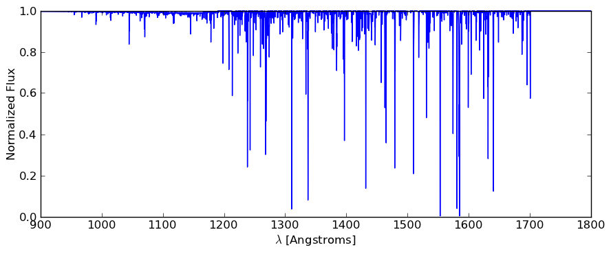
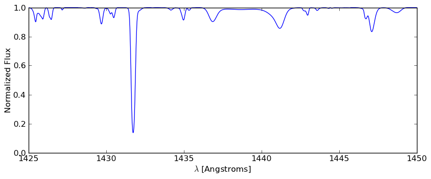

.. _absorption_spectrum:

.. note::

    Development of the AbsorptionSpectrum module has been moved to the
    Trident package. This version is deprecated and will be removed from yt
    in a future release. See https://github.com/trident-project/trident
    for further information.

Creating Absorption Spectra
===========================

.. sectionauthor:: Britton Smith <brittonsmith@gmail.com>

Absorption line spectra are spectra generated using bright background sources
to illuminate tenuous foreground material and are primarily used in studies
of the circumgalactic medium and intergalactic medium.  These spectra can
be created using the
:class:`~yt.analysis_modules.absorption_spectrum.absorption_spectrum.AbsorptionSpectrum`
and
:class:`~yt.analysis_modules.cosmological_observation.light_ray.light_ray.LightRay`
analysis modules.

The 
:class:`~yt.analysis_modules.absorption_spectrum.absorption_spectrum.AbsorptionSpectrum` class
and its workhorse method
:meth:`~yt.analysis_modules.absorption_spectrum.absorption_spectrum.AbsorptionSpectrum.make_spectrum`
return two arrays, one with wavelengths, the other with the normalized
flux values at each of the wavelength values.  It can also output a text file
listing all important lines.

For example, here is an absorption spectrum for the wavelength range from 900 
to 1800 Angstroms made with a light ray extending from z = 0 to z = 0.4:

And a zoom-in on the 1425-1450 Angstrom window:

Method for Creating Absorption Spectra
--------------------------------------

Once a
:class:`~yt.analysis_modules.cosmological_observation.light_ray.light_ray.LightRay`
has been created traversing a dataset using the :ref:`light-ray-generator`,
a series of arrays store the various fields of the gas parcels (represented
as cells) intersected along the ray.
:class:`~yt.analysis_modules.absorption_spectrum.absorption_spectrum.AbsorptionSpectrum`
steps through each element of the
:class:`~yt.analysis_modules.cosmological_observation.light_ray.light_ray.LightRay`'s
arrays and calculates the column density for desired ion by multiplying its
number density with the path length through the cell.  Using these column
densities along with temperatures to calculate thermal broadening, voigt
profiles are deposited on to a featureless background spectrum.  By default,
the peculiar velocity of the gas is included as a doppler redshift in addition
to any cosmological redshift of the data dump itself.

Subgrid Deposition
^^^^^^^^^^^^^^^^^^

For features not resolved (i.e. possessing narrower width than the spectral
resolution),
:class:`~yt.analysis_modules.absorption_spectrum.absorption_spectrum.AbsorptionSpectrum`
performs subgrid deposition.  The subgrid deposition algorithm creates a number
of smaller virtual bins, by default the width of the virtual bins is 1/10th
the width of the spectral feature.  The Voigt profile is then deposited
into these virtual bins where it is resolved, and then these virtual bins
are numerically integrated back to the resolution of the original spectral bin
size, yielding accurate equivalent widths values.
:class:`~yt.analysis_modules.absorption_spectrum.absorption_spectrum.AbsorptionSpectrum`
informs the user how many spectral features are deposited in this fashion.

Tutorial on Creating an Absorption Spectrum
-------------------------------------------

Initializing `AbsorptionSpectrum` Class
^^^^^^^^^^^^^^^^^^^^^^^^^^^^^^^^^^^^^^^

To instantiate an
:class:`~yt.analysis_modules.absorption_spectrum.absorption_spectrum.AbsorptionSpectrum`
object, the arguments required are the
minimum and maximum wavelengths (assumed to be in Angstroms), and the number
of wavelength bins to span this range (including the endpoints)

.. code-block:: python

  from yt.analysis_modules.absorption_spectrum.api import AbsorptionSpectrum

  sp = AbsorptionSpectrum(900.0, 1800.0, 10001)

Adding Features to the Spectrum
^^^^^^^^^^^^^^^^^^^^^^^^^^^^^^^

Absorption lines and continuum features can then be added to the spectrum.
To add a line, you must know some properties of the line: the rest wavelength,
f-value, gamma value, and the atomic mass in amu of the atom.  That line must
be tied in some way to a field in the dataset you are loading, and this field
must be added to the LightRay object when it is created.  Below, we will
add the H Lyman-alpha line, which is tied to the neutral hydrogen field
('H_number_density').

.. code-block:: python

  my_label = 'HI Lya'
  field = 'H_number_density'
  wavelength = 1215.6700 # Angstroms
  f_value = 4.164E-01
  gamma = 6.265e+08
  mass = 1.00794

  sp.add_line(my_label, field, wavelength, f_value, gamma, mass, label_threshold=1.e10)

In the above example, the *field* argument tells the spectrum generator which
field from the ray data to use to calculate the column density.  The
``label_threshold`` keyword tells the spectrum generator to add all lines
above a column density of 10 :superscript:`10` cm :superscript:`-2` to the
text line list output at the end.  If None is provided, as is the default,
no lines of this type will be added to the text list.

Continuum features with optical depths that follow a power law can also be
added.  Like adding lines, you must specify details like the wavelength
and the field in the dataset and LightRay that is tied to this feature.
The wavelength refers to the location at which the continuum begins to be 
applied to the dataset, and as it moves to lower wavelength values, the 
optical depth value decreases according to the defined power law.  The 
normalization value is the column density of the linked field which results
in an optical depth of 1 at the defined wavelength.  Below, we add the hydrogen 
Lyman continuum.

.. code-block:: python

  my_label = 'HI Lya'
  field = 'H_number_density'
  wavelength = 912.323660 # Angstroms
  normalization = 1.6e17
  index = 3.0

  sp.add_continuum(my_label, field, wavelength, normalization, index)

Making the Spectrum
^^^^^^^^^^^^^^^^^^^

Once all the lines and continuua are added, it is time to make a spectrum out
of some light ray data.

.. code-block:: python

  wavelength, flux = sp.make_spectrum('lightray.h5',
                                      output_file='spectrum.fits',
                                      line_list_file='lines.txt')

A spectrum will be made using the specified ray data and the wavelength and
flux arrays will also be returned.  If you set the optional
``use_peculiar_velocity`` keyword to False, the lines will not incorporate
doppler redshifts to shift the deposition of the line features.

Three output file formats are supported for writing out the spectrum: fits,
hdf5, and ascii.  The file format used is based on the extension provided
in the ``output_file`` keyword: ``.fits`` for a fits file,
``.h5`` for an hdf5 file, and anything else for an ascii file.

.. note:: To write out a fits file, you must install the `astropy <http://www.astropy.org>`_ python library in order to access the astropy.io.fits module.  You can usually do this by simply running `pip install astropy` at the command line.

Generating Spectra in Parallel
^^^^^^^^^^^^^^^^^^^^^^^^^^^^^^

The `AbsorptionSpectrum` analysis module can be run in parallel simply by
following the procedures laid out in :ref:`parallel-computation` for running
yt scripts in parallel.  Spectrum generation is parallelized using a multi-level
strategy where each absorption line is deposited by a different processor.
If the number of available processors is greater than the number of lines,
then the deposition of individual lines will be divided over multiple
processors.

Fitting Absorption Spectra
==========================

.. sectionauthor:: Hilary Egan <hilary.egan@colorado.edu>

This tool can be used to fit absorption spectra, particularly those
generated using the (``AbsorptionSpectrum``) tool. For more details
on its uses and implementation please see (`Egan et al. (2013)
<http://arxiv.org/abs/1307.2244>`_). If you find this tool useful we
encourage you to cite accordingly.

Loading an Absorption Spectrum
------------------------------

To load an absorption spectrum created by
(:class:`~yt.analysis_modules.absorption_spectrum.absorption_spectrum.AbsorptionSpectrum``),
we specify the output file name. It is advisable to use either an .h5
or .fits file, rather than an ascii file to save the spectrum as rounding
errors produced in saving to a ascii file will negatively impact fit quality.

.. code-block:: python

    f = h5py.File('spectrum.h5')
    wavelength = f["wavelength"][:]
    flux = f['flux'][:]
    f.close()

Specifying Species Properties
-----------------------------

Before fitting a spectrum, you must specify the properties of all the
species included when generating the spectrum.

The physical properties needed for each species are the rest wavelength,
f-value, gamma value, and atomic mass. These will be the same values
as used to generate the initial absorption spectrum. These values are
given in list form as some species generate multiple lines (as in the
OVI doublet). The number of lines is also specified on its own.

To fine tune the fitting procedure and give results in a minimal
number of optimizing steps, we specify expected maximum and minimum
values for the column density, doppler parameter, and redshift. These
values can be well outside the range of expected values for a typical line
and are mostly to prevent the algorithm from fitting to negative values
or becoming numerically unstable.

Common initial guesses for doppler parameter and column density should also
be given. These values will not affect the specific values generated by
the fitting algorithm, provided they are in a reasonably appropriate range
(ie: within the range given by the max and min values for the parameter).

For a spectrum containing both the H Lyman-alpha line and the OVI doublet,
we set up a fit as shown below.

.. code-block:: python

    HI_parameters = {'name':'HI',
            'f': [.4164],
            'Gamma':[6.265E8],
            'wavelength':[1215.67],
            'numLines':1,
            'maxN': 1E22, 'minN':1E11,
            'maxb': 300, 'minb':1,
            'maxz': 6, 'minz':0,
            'init_b':30,
            'init_N':1E14}

    OVI_parameters = {'name':'OVI',
            'f':[.1325,.06580],
            'Gamma':[4.148E8,4.076E8],
            'wavelength':[1031.9261,1037.6167],
            'numLines':2,
            'maxN':1E17,'minN':1E11,
            'maxb':300, 'minb':1,
            'maxz':6, 'minz':0,
            'init_b':20,
            'init_N':1E12}

    speciesDicts = {'HI':HI_parameters,'OVI':OVI_parameters}

Generating Fit of Spectrum
--------------------------

After loading a spectrum and specifying the properties of the species
used to generate the spectrum, an appropriate fit can be generated.

.. code-block:: python

    orderFits = ['OVI','HI']

    fitted_lines, fitted_flux = generate_total_fit(wavelength,
        flux, orderFits, speciesDicts)

The orderFits variable is used to determine in what order the species
should be fitted. This may affect the results of the resulting fit,
as lines may be fit as an incorrect species. For best results, it is
recommended to fit species the generate multiple lines first, as a fit
will only be accepted if all of the lines are fit appropriately using
a single set of parameters. At the moment no cross correlation between
lines of different species is performed.

The parameters of the lines that are needed to fit the spectrum are contained
in the ``fitted_lines`` variable. Each species given in ``orderFits`` will
be a key in the ``fitted_lines`` dictionary. The entry for each species
key will be another dictionary containing entries for 'N','b','z', and
'group#' which are the column density, doppler parameter, redshift,
and associate line complex respectively. The i :superscript:`th` line
of a given species is then given by the parameters ``N[i]``, ``b[i]``,
and ``z[i]`` and is part of the same complex (and was fitted at the same time)
as all lines with the same group number as ``group#[i]``.

The ``fitted_flux`` is an ndarray of the same size as ``flux`` and
``wavelength`` that contains the cumulative absorption spectrum generated
by the lines contained in ``fitted_lines``.

Saving a Spectrum Fit
---------------------

Saving the results of a fitted spectrum for further analysis is
accomplished automatically using the h5 file format. A group
is made for each species that is fit, and each species group has
a group for the corresponding N, b, z, and group# values.

.. _fitting_procedure:

Procedure for Generating Fits
-----------------------------

.. sectionauthor:: Hilary Egan <hilary.egan@colorado.edu>

To generate a fit for a spectrum
:func:`~yt.analysis_modules.absorption_spectrum.absorption_spectrum_fit.generate_total_fit`
is called.
This function controls the identification of line complexes, the fit
of a series of absorption lines for each appropriate species, checks of
those fits, and returns the results of the fits.

Finding Line Complexes
----------------------

Line complexes are found using the
:func:`~yt.analysis_modules.absorption_spectrum.absorption_spectrum_fit.find_complexes`
function. The process by which line complexes are found involves walking
through the array of flux in order from minimum to maximum wavelength, and
finding series of spatially contiguous cells whose flux is less than some
limit.  These regions are then checked in terms of an additional flux limit
and size.  The bounds of all the passing regions are then listed and returned.
Those bounds that cover an exceptionally large region of wavelength space will
be broken up if a suitable cut point is found. This method is only appropriate
for noiseless spectra.

The optional parameter ``complexLim`` (default = 0.999), controls the limit
that triggers the identification of a spatially contiguous region of flux
that could be a line complex. This number should be very close to 1 but not
exactly equal. It should also be at least an order of magnitude closer to 1
than the later discussed ``fitLim`` parameter, because a line complex where
the flux of the trough is very close to the flux of the edge can be incredibly
unstable when optimizing.

The ``fitLim`` parameter controls what is the maximum flux that the trough
of the region can have and still be considered a line complex. This
effectively controls the sensitivity to very low column absorbers. Default
value is ``fitLim`` = 0.99. If a region is identified where the flux of the
trough is greater than this value, the region is simply ignored.

The ``minLength`` parameter controls the minimum number of array elements
that an identified region must have. This value must be greater than or
equal to 3 as there are a minimum of 3 free parameters that must be fit.
Default is ``minLength`` = 3.

The ``maxLength`` parameter controls the maximum number of array elements
that an identified region can have before it is split into separate regions.
Default is ``maxLength`` = 1000. This should be adjusted based on the
resolution of the spectrum to remain appropriate. The value correspond
to a wavelength of roughly 50 angstroms.

The ``splitLim`` parameter controls how exceptionally large regions are split.
When such a region is identified by having more array elements than
``maxLength``, the point of maximum flux (or minimum absorption) in the
middle two quartiles is identified. If that point has a flux greater than
or equal to ``splitLim``, then two separate complexes are created: one from
the lower wavelength edge to the minimum absorption point and the other from
the minimum absorption point to the higher wavelength edge. The default
value is ``splitLim`` =.99, but it should not drastically affect results, so
long as the value is reasonably close to 1.

Fitting a Line Complex
----------------------

After a complex is identified, it is fitted by iteratively adding and
optimizing a set of Voigt Profiles for a particular species until the
region is considered successfully fit. The optimizing is accomplished
using scipy's least squares optimizer. This requires an initial estimate
of the parameters to be fit (column density, b-value, redshift) for each
line.

Each time a line is added, the guess of the parameters is based on
the difference between the line complex and the fit so far. For the first line
this just means the initial guess is based solely on the flux of the line
complex. The column density is given by the initial column density given
in the species parameters dictionary. If the line is saturated (some portion
of the flux with a value less than .1) than the larger initial column density
guess is chosen. If the flux is relatively high (all values >.9) than the
smaller initial guess is given. These values are chosen to make optimization
faster and more stable by being closer to the actual value, but the final
results of fitting should not depend on them as they merely provide a
starting point.

After the parameters for a line are optimized for the first time, the
optimized parameters are then used for the initial guess on subsequent
iterations with more lines.

The complex is considered successfully fit when the sum of the squares of
the difference between the flux generated from the fit and the desired flux
profile is less than ``errBound``. ``errBound`` is related to the optional
parameter to
:meth:`~yt.analysis_modules.cosmological_observation.light_ray.light_ray.LightRay.generate_total_fit`,
``maxAvgError`` by the number of array elements in the region such that
``errBound`` = number of elements * ``maxAvgError``.

There are several other conditions under which the cycle of adding and
optimizing lines will halt. If the error of the optimized fit from adding
a line is an order of magnitude worse than the error of the fit without
that line, then it is assumed that the fitting has become unstable and
the latest line is removed. Lines are also prevented from being added if
the total number of lines is greater than the number of elements in the flux
array being fit divided by 3. This is because there must not be more free
parameters in a fit than the number of points to constrain them.

Checking Fit Results
--------------------

After an acceptable fit for a region is determined, there are several steps
the algorithm must go through to validate the fits.

First, the parameters must be in a reasonable range. This is a check to make
sure that the optimization did not become unstable and generate a fit that
diverges wildly outside the region where the fit was performed. This way, even
if particular complex cannot be fit, the rest of the spectrum fitting still
behaves as expected. The range of acceptability for each parameter is given
in the species parameter dictionary. These are merely broad limits that will
prevent numerical instability rather than physical limits.

In cases where a single species generates multiple lines (as in the OVI
doublet), the fits are then checked for higher wavelength lines. Originally
the fits are generated only considering the lowest wavelength fit to a region.
This is because we perform the fitting of complexes in order from the lowest
wavelength to the highest, so any contribution to a complex being fit must
come from the lower wavelength as the higher wavelength contributions would
already have been subtracted out after fitting the lower wavelength.

Saturated Lyman Alpha Fitting Tools
-----------------------------------

In cases where a large or saturated line (there exists a point in the complex
where the flux is less than .1) fails to be fit properly at first pass, a
more robust set of fitting tools is used to try and remedy the situation.
The basic approach is to simply try a much wider range of initial parameter
guesses in order to find the true optimization minimum, rather than getting
stuck in a local minimum. A set of hard coded initial parameter guesses
for Lyman alpha lines is given by the function
:func:`~yt.analysis_modules.absorption_spectrum.absorption_spectrum_fit.get_test_lines`.
Also included in these parameter guesses is an initial guess of a high
column cool line overlapping a lower column warm line, indicative of a
broad Lyman alpha (BLA) absorber.
