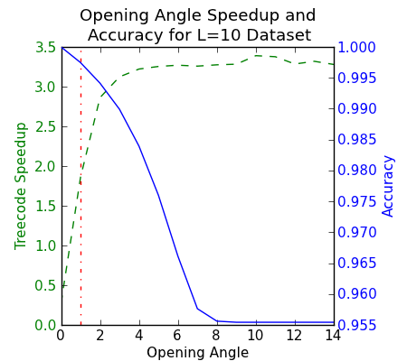
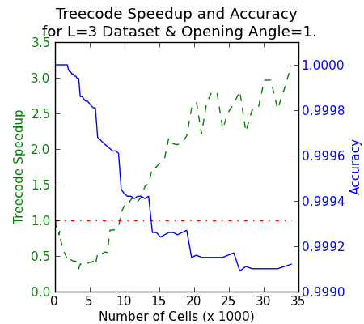
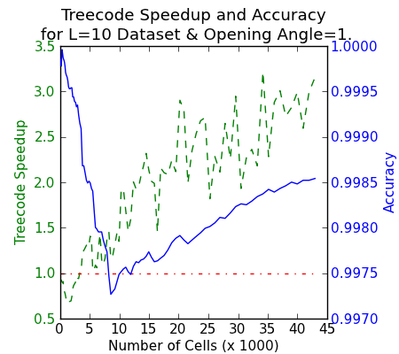

.. _clump_finding:

Clump Finding
=============
.. sectionauthor:: Britton Smith <britton.smith@colorado.edu>

``yt`` has the ability to identify topologically disconnected structures based in a dataset using 
any field available.  This is powered by a contouring algorithm that runs in a recursive 
fashion.  The user specifies the initial data object in which the clump-finding will occur, 
the field over which the contouring will be done, the upper and lower limits of the 
initial contour, and the contour increment.

The clump finder begins by creating a single contour of the specified field over the entire 
range given.  For every isolated contour identified in the initial iteration, contouring is 
repeated with the same upper limit as before, but with the lower limit increased by the 
specified increment.  This repeated for every isolated group until the lower limit is equal 
to the upper limit.

Often very tiny clumps can appear as groups of only a few cells that happen to be slightly 
overdense (if contouring over density) with respect to the surrounding gas.  The user may 
specify criteria that clumps must meet in order to be kept.  The most obvious example is 
selecting only those clumps that are gravitationally bound.

Once the clump-finder has finished, the user can write out a set of quantities for each clump in the 
index.  Additional info items can also be added.  We also provide a recipe
for finding clumps in :ref:`cookbook-find_clumps`.

Treecode Optimization
---------------------

.. sectionauthor:: Stephen Skory <s@skory.us>
.. versionadded:: 2.1

As mentioned above, the user has the option to limit clumps to those that are
gravitationally bound.
The correct and accurate way to calculate if a clump is gravitationally
bound is to do the full double sum:

.. math::

  PE = \Sigma_{i=1}^N \Sigma_{j=i}^N \frac{G M_i M_j}{r_{ij}}

where :math:`PE` is the gravitational potential energy of :math:`N` cells,
:math:`G` is the
gravitational constant, :math:`M_i` is the mass of cell :math:`i`, 
and :math:`r_{ij}` is the distance
between cell :math:`i` and :math:`j`.
The number of calculations required for this calculation
grows with the square of :math:`N`. Therefore, for large clumps with many cells, the
test for boundedness can take a significant amount of time.

An effective way to greatly speed up this calculation with minimal error
is to use the treecode approximation pioneered by
`Barnes and Hut (1986) <http://adsabs.harvard.edu/abs/1986Natur.324..446B>`_.
This method of calculating gravitational potentials works by
grouping individual masses that are located close together into a larger conglomerated
mass with a geometric size equal to the distribution of the individual masses.
For a mass cell that is sufficiently distant from the conglomerated mass,
the gravitational calculation can be made using the conglomerate, rather than
each individual mass, which saves time.

The decision whether or not to use a conglomerate depends on the accuracy control
parameter ``opening_angle``. Using the small-angle approximation, a conglomerate
may be used if its geometric size subtends an angle no greater than the
``opening_angle`` upon the remote mass. The default value is
``opening_angle = 1``, which gives errors well under 1%. A value of 
``opening_angle = 0`` is identical to the full O(N^2) method, and larger values
will speed up the calculation and sacrifice accuracy (see the figures below).

The treecode method is iterative. Conglomerates may themselves form larger
conglomerates. And if a larger conglomerate does not meet the ``opening_angle``
criterion, the smaller conglomerates are tested as well. This iteration of 
conglomerates will
cease once the level of the original masses is reached (this is what happens
for all pair calculations if ``opening_angle = 0``).

Below are some examples of how to control the usage of the treecode.

This example will calculate the ratio of the potential energy to kinetic energy
for a spherical clump using the treecode method with an opening angle of 2.
The default opening angle is 1.0:

.. code-block:: python
  
  from yt.mods import *
  
  ds = load("DD0000")
  sp = ds.sphere([0.5, 0.5, 0.5], radius=0.1)
  
  ratio = sp.quantities["IsBound"](truncate=False, include_thermal_energy=True,
      treecode=True, opening_angle=2.0)

This example will accomplish the same as the above, but will use the full
N^2 method.

.. code-block:: python
  
  from yt.mods import *
  
  ds = load("DD0000")
  sp = ds.sphere([0.5, 0.5, 0.5], radius=0.1)
  
  ratio = sp.quantities["IsBound"](truncate=False, include_thermal_energy=True,
      treecode=False)

Here the treecode method is specified for clump finding (this is default).
Please see the link above for the full example of how to find clumps (the
trailing backslash is important!):

.. code-block:: python
  
  function_name = 'self.data.quantities["IsBound"](truncate=True, \
      include_thermal_energy=True, treecode=True, opening_angle=2.0) > 1.0'
  master_clump = amods.level_sets.Clump(data_source, None, field,
      function=function_name)

To turn off the treecode, of course one should turn treecode=False in the
example above.

Treecode Speedup and Accuracy Figures
^^^^^^^^^^^^^^^^^^^^^^^^^^^^^^^^^^^^^

Two datasets are used to make the three figures below. Each is a zoom-in
simulation with high resolution in the middle with AMR, and then lower
resolution static grids on the periphery. In this way they are very similar to
a clump in a full-AMR simulation, where there are many AMR levels stacked
around a density peak. One dataset has a total of 3 levels of AMR, and
the other has 10 levels, but in other ways are very similar.

The first figure shows the effect of varying the opening angle on the speed
and accuracy of the treecode. The tests were performed using the L=10 
dataset on a clump with approximately 118,000 cells. The speedup of up the
treecode is in green, and the accuracy in blue, with the opening angle
on the x-axis.

With an ``opening_angle`` = 0, the accuracy is perfect, but the treecode is
less than half as fast as the brute-force method. However, by an
``opening_angle`` of 1, the treecode is now nearly twice as fast, with
about 0.2% error. This trend continues to an ``opening_angle`` 8, where
large opening angles have no effect due to geometry.

Note that the accuracy is always below 1. The treecode will always underestimate
the gravitational binding energy of a clump.

In this next figure, the ``opening_angle`` is kept constant at 1, but the
number of cells is varied on the L=3 dataset by slowly expanding a spherical
region of analysis. Up to about 100,000 cells,
the treecode is actually slower than the brute-force method. This is due to
the fact that with fewer cells, smaller geometric distances,
and a shallow AMR index, the treecode
method has very little chance to be applied. The calculation is overall
slower due to the overhead of the treecode method & startup costs. This
explanation is further strengthened by the fact that the accuracy of the
treecode method stay perfect for the first couple thousand cells, indicating
that the treecode method is not being applied over that range.

Once the number of cells gets high enough, and the size of the region becomes
large enough, the treecode method can work its magic and the treecode method
becomes advantageous.

The saving grace to the figure above is that for small clumps, a difference of
50% in calculation time is on the order of a second or less, which is tiny
compared to the minutes saved for the larger clumps where the speedup can
be greater than 3.

The final figure is identical to the one above, but for the L=10 dataset.
Due to the higher number of AMR levels, which translates into more opportunities
for the treecode method to be applied, the treecode becomes faster than the
brute-force method at only about 30,000 cells. The accuracy shows a different
behavior, with a dip and a rise, and overall lower accuracy. However, at all
times the error is still well under 1%, and the time savings are significant.

The figures above show that the treecode method is generally very advantageous,
and that the error introduced is minimal.
