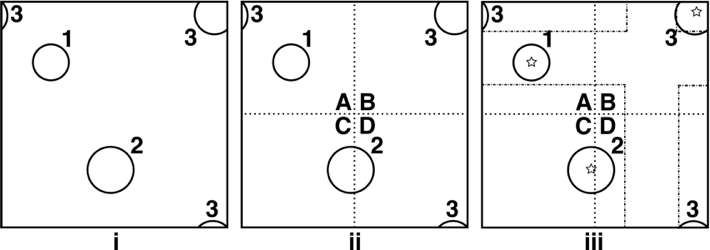

.. _halo_finding:

Halo Finding
============

There are three methods of finding particle haloes in yt. The 
default method is called HOP, a method described 
in `Eisenstein and Hut (1998) 
<http://adsabs.harvard.edu/abs/1998ApJ...498..137E>`_. A basic 
friends-of-friends (e.g. `Efstathiou et al. (1985) 
<http://adsabs.harvard.edu/abs/1985ApJS...57..241E>`_) halo 
finder is also implemented. Finally Rockstar (`Behroozi et a. 
(2011) <http://adsabs.harvard.edu/abs/2011arXiv1110.4372B>`_) is 
a 6D-phase space halo finder developed by Peter Behroozi that 
excels in finding subhalos and substrcture, but does not allow 
multiple particle masses.

.. _hop:

HOP
---

The version of HOP used in yt is an upgraded version of the 
`publicly available HOP code 
<http://cmb.as.arizona.edu/~eisenste/hop/hop.html>`_. Support 
for 64-bit floats and integers has been added, as well as 
parallel analysis through spatial decomposition. HOP builds 
groups in this fashion:

#. Estimates the local density at each particle using a 
   smoothing kernel.

#. Builds chains of linked particles by 'hopping' from one 
   particle to its densest neighbor. A particle which is 
   its own densest neighbor is the end of the chain.

#. All chains that share the same densest particle are 
   grouped together.

#. Groups are included, linked together, or discarded 
   depending on the user-supplied over density
   threshold parameter. The default is 160.0.

Please see the `HOP method paper 
<http://adsabs.harvard.edu/abs/1998ApJ...498..137E>`_ for 
full details and the 
:class:`~yt.analysis_modules.halo_finding.halo_objects.HOPHalo` and
:class:`~yt.analysis_modules.halo_finding.halo_objects.Halo` classes.

.. _fof:

FOF
---

A basic friends-of-friends halo finder is included.  See the
:class:`~yt.analysis_modules.halo_finding.halo_objects.FOFHalo` and
:class:`~yt.analysis_modules.halo_finding.halo_objects.Halo` classes.

.. _rockstar:

Rockstar Halo Finding
---------------------

Rockstar uses an adaptive hierarchical refinement of friends-of-friends 
groups in six phase-space dimensions and one time dimension, which 
allows for robust (grid-independent, shape-independent, and noise-
resilient) tracking of substructure. The code is prepackaged with yt, 
but also `separately available <http://code.google.com/p/rockstar>`_. The lead 
developer is Peter Behroozi, and the methods are described in `Behroozi
et al. 2011 <http://rockstar.googlecode.com/files/rockstar_ap101911.pdf>`_. 
In order to run the Rockstar halo finder in yt, make sure you've 
:ref:`installed it so that it can integrate with yt <rockstar-installation>`.

At the moment, Rockstar does not support multiple particle masses, 
instead using a fixed particle mass. This will not affect most dark matter 
simulations, but does make it less useful for finding halos from the stellar
mass. In simulations where the highest-resolution particles all have the 
same mass (ie: zoom-in grid based simulations), one can set up a particle
filter to select the lowest mass particles and perform the halo finding
only on those.  See the this cookbook recipe for an example: 
:ref:`cookbook-rockstar-nested-grid`.

To run the Rockstar Halo finding, you must launch python with MPI and 
parallelization enabled. While Rockstar itself does not require MPI to run, 
the MPI libraries allow yt to distribute particle information across multiple 
nodes.

.. warning:: At the moment, running Rockstar inside of yt on multiple compute nodes
   connected by an Infiniband network can be problematic. Therefore, for now
   we recommend forcing the use of the non-Infiniband network (e.g. Ethernet)
   using this flag: ``--mca btl ^openib``.
   For example, here is how Rockstar might be called using 24 cores:
   ``mpirun -n 24 --mca btl ^openib python ./run_rockstar.py --parallel``.

The script above configures the Halo finder, launches a server process which 
disseminates run information and coordinates writer-reader processes. 
Afterwards, it launches reader and writer tasks, filling the available MPI 
slots, which alternately read particle information and analyze for halo 
content.

The RockstarHaloFinder class has these options that can be supplied to the 
halo catalog through the ``finder_kwargs`` argument:

* ``dm_type``, the index of the dark matter particle. Default is 1. 
* ``outbase``, This is where the out*list files that Rockstar makes should be
  placed. Default is 'rockstar_halos'.
* ``num_readers``, the number of reader tasks (which are idle most of the 
  time.) Default is 1.
* ``num_writers``, the number of writer tasks (which are fed particles and
  do most of the analysis). Default is MPI_TASKS-num_readers-1. 
  If left undefined, the above options are automatically 
  configured from the number of available MPI tasks.
* ``force_res``, the resolution that Rockstar uses for various calculations
  and smoothing lengths. This is in units of Mpc/h.
  If no value is provided, this parameter is automatically set to
  the width of the smallest grid element in the simulation from the
  last data snapshot (i.e. the one where time has evolved the
  longest) in the time series:
  ``ds_last.index.get_smallest_dx() * ds_last['mpch']``.
* ``total_particles``, if supplied, this is a pre-calculated
  total number of dark matter
  particles present in the simulation. For example, this is useful
  when analyzing a series of snapshots where the number of dark
  matter particles should not change and this will save some disk
  access time. If left unspecified, it will
  be calculated automatically. Default: ``None``.
* ``dm_only``, if set to ``True``, it will be assumed that there are
  only dark matter particles present in the simulation.
  This option does not modify the halos found by Rockstar, however
  this option can save disk access time if there are no star particles
  (or other non-dark matter particles) in the simulation. Default: ``False``.

Rockstar dumps halo information in a series of text (halo*list and 
out*list) and binary (halo*bin) files inside the ``outbase`` directory. 
We use the halo list classes to recover the information. 

Inside the ``outbase`` directory there is a text file named ``datasets.txt``
that records the connection between ds names and the Rockstar file names.

For more information, see the 
:class:`~yt.analysis_modules.halo_finding.halo_objects.RockstarHalo` and
:class:`~yt.analysis_modules.halo_finding.halo_objects.Halo` classes.

.. _parallel-hop-and-fof:

Parallel HOP and FOF
--------------------

Both the HOP and FoF halo finders can run in parallel using simple 
spatial decomposition. In order to run them in parallel it is helpful 
to understand how it works. Below in the first plot (i) is a simplified 
depiction of three haloes labeled 1,2 and 3:

Halo 3 is twice reflected around the periodic boundary conditions.

In (ii), the volume has been sub-divided into four equal subregions, 
A,B,C and D, shown with dotted lines. Notice that halo 2 is now in 
two different subregions, C and D, and that halo 3 is now in three, 
A, B and D. If the halo finder is run on these four separate subregions,
halo 1 is be identified as a single halo, but haloes 2 and 3 are split 
up into multiple haloes, which is incorrect. The solution is to give 
each subregion padding to oversample into neighboring regions.

In (iii), subregion C has oversampled into the other three regions, 
with the periodic boundary conditions taken into account, shown by 
dot-dashed lines. The other subregions oversample in a similar way.

The halo finder is then run on each padded subregion independently 
and simultaneously. By oversampling like this, haloes 2 and 3 will 
both be enclosed fully in at least one subregion and identified 
completely.

Haloes identified with centers of mass inside the padded part of a 
subregion are thrown out, eliminating the problem of halo duplication. 
The centers for the three haloes are shown with stars. Halo 1 will
belong to subregion A, 2 to C and 3 to B.

To run with parallel halo finding, you must supply a value for 
padding in the finder_kwargs argument. The ``padding`` parameter 
is in simulation units and defaults to 0.02. This parameter is how 
much padding is added to each of the six sides of a subregion. 
This value should be 2x-3x larger than the largest expected halo 
in the simulation. It is unlikely, of course, that the largest 
object in the simulation will be on a subregion boundary, but there 
is no way of knowing before the halo finder is run.

.. code-block:: python

  import yt
  from yt.analysis_modules.halo_analysis.api import *
  ds = yt.load("data0001")

  hc = HaloCatalog(data_ds = ds, finder_method = 'hop', finder_kwargs={'padding':0.02})
  # --or--
  hc = HaloCatalog(data_ds = ds, finder_method = 'fof', finder_kwargs={'padding':0.02})

In general, a little bit of padding goes a long way, and too much 
just slows down the analysis and doesn't improve the answer (but 
doesn't change it).  It may be worth your time to run the parallel 
halo finder at a few paddings to find the right amount, especially 
if you're analyzing many similar datasets.

.. _rockstar-installation:

Rockstar Installation
---------------------

Because of changes in the Rockstar API over time, yt only currently works with
a slightly older version of Rockstar.  This version of Rockstar has been 
slightly patched and modified to run as a library inside of yt. By default it 
is not installed with yt, but installation is very easy.  The 
:ref:`install-script` used to install yt from source has a line: 
``INST_ROCKSTAR=0`` that must be changed to ``INST_ROCKSTAR=1``.  You can
rerun this installer script over the top of an existing installation, and
it will only install components missing from the existing installation.  
You can do this as follows.  Put your freshly modified install_script in
the parent directory of the yt installation directory (e.g. the parent of 
``$YT_DEST``, ``yt-x86_64``, ``yt-i386``, etc.), and rerun the installer:

.. code-block:: bash

    cd $YT_DEST
    cd ..
    vi install_script.sh  // or your favorite editor to change INST_ROCKSTAR=1
    bash < install_script.sh

This will download Rockstar and install it as a library in yt.  You should now
be able to use Rockstar and yt together.
