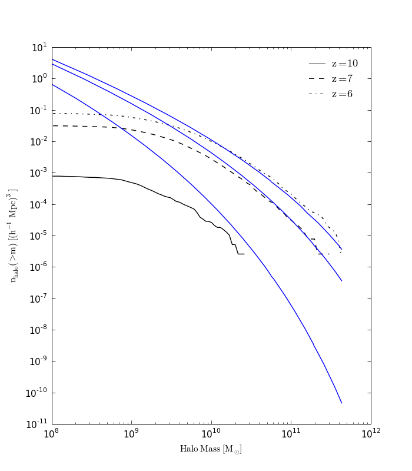

.. _halo_mass_function:

Halo Mass Function
==================
.. sectionauthor:: Stephen Skory <sskory@physics.ucsd.edu>
.. versionadded:: 1.6

The Halo Mass Function extension is capable of outputting the halo mass function
for a collection haloes (input), and/or an analytical fit over a given mass range
for a set of specified cosmological parameters.

This extension is based on code generously provided by Brian O'Shea.

General Overview
----------------

In order to run this extension on a dataset, the haloes need to be located
(using HOP, FOF or Parallel HOP, see :ref:`halo_finding`),
and their virial masses determined using the
HaloProfiler.
Please see the step-by-step how-to which puts these steps together
(:ref:`hmf_howto`).
If an optional analytical fit is desired, the correct initial
cosmological parameters will need to be input as well. These initial parameters
are not stored in an Enzo dataset, so they must be set by hand.
An analytical fit can be found without referencing a particular dataset or
set of haloes, but all the cosmological parameters need to be set by hand.

Analytical Fits
---------------

There are five analytical fits to choose from.

  1. `Press-Schechter (1974) <http://adsabs.harvard.edu/abs/1974ApJ...187..425P>`_
  2. `Jenkins (2001) <http://adsabs.harvard.edu/abs/2001MNRAS.321..372J>`_
  3. `Sheth-Tormen (2002) <http://adsabs.harvard.edu/abs/2002MNRAS.329...61S>`_
  4. `Warren (2006) <http://adsabs.harvard.edu/abs/2006ApJ...646..881W>`_
  5. `Tinker (2008) <http://adsabs.harvard.edu/abs/2008ApJ...688..709T>`_

We encourage reading each of the primary sources.
In general, we recommend the Warren fitting function because it matches
simulations over a wide range of masses very well.
The Warren fitting function is the default (equivalent to not specifying
``fitting_function`` in ``HaloMassFcn()``, below).
The Tinker fit is for the :math:`\Delta=300` fits given in the paper, which
appears to fit HOP threshold=80.0 fairly well.

Analyze Simulated Haloes
------------------------

If an analytical fit is not needed, it is simple to analyze a set of 
haloes. The ``halo_file`` needs to be specified, and
``fitting_function`` does not need to be specified.
``num_sigma_bins`` is how many bins the halo masses are sorted into.
The default is 360. ``mass_column`` is the zero-indexed column of the
``halo_file`` file that contains the halo masses. The default is 5, which
corresponds to the sixth column of data in the file.

.. code-block:: python

  from yt.mods import *
  from yt.analysis_modules.halo_mass_function.api import *
  ds = load("data0030")
  hmf = HaloMassFcn(ds, halo_file="FilteredQuantities.out", num_sigma_bins=200,
  mass_column=5)

Attached to ``hmf`` is the convenience function ``write_out``, which saves
the halo mass function to a text file. By default, both the halo analysis (``haloes``) and
fit (``fit``) are written to (different) text files, but they can be turned on or off
explicitly. ``prefix`` sets the name used for the file(s). The haloes file
is named ``prefix-haloes.dat``, and the fit file ``prefix-fit.dat``.
Continued from above, invoking this command:

.. code-block:: python

  hmf.write_out(prefix='hmf', fit=False, haloes=True)

will save the haloes data to a file named ``hmf-haloes.dat``. The contents
of the ``-haloes.dat`` file is three columns:

  1. log10 of mass (Msolar, NOT Msolar/h) for this bin.
  2. mass (Msolar/h) for this bin.
  3. cumulative number density of halos (per Mpc^3, NOT h^3/Mpc^3) in this bin.

Analytical Halo Mass Function Fit
---------------------------------

When an analytical fit is desired, in nearly all cases several cosmological
parameters will need to be specified by hand. These parameters are not
stored with Enzo datasets. In the case where both the haloes and an analytical
fit are desired, the analysis is instantiated as below.
``sigma8input``, ``primordial_index`` and ``omega_baryon0`` should be set to
the same values as
``PowerSpectrumSigma8``, ``PowerSpectrumPrimordialIndex`` and
``CosmologyOmegaBaryonNow`` from the
`inits <http://lca.ucsd.edu/projects/enzo/wiki/UserGuide/RunningInits>`_
parameter file used to set up the simulation.
``fitting_function`` is set to values 1 through 4 from the list of available
fits above.

.. code-block:: python

  from yt.mods import *
  from yt.analysis_modules.halo_mass_function.api import *
  ds = load("data0030")
  hmf = HaloMassFcn(ds, halo_file="FilteredQuantities.out", 
  sigma8input=0.9, primordial_index=1., omega_baryon0=0.06,
  fitting_function=4)
  hmf.write_out(prefix='hmf')

Both the ``-haloes.dat`` and ``-fit.dat`` files are written to disk.
The contents of the ``-fit.dat`` file is four columns:

  1. log10 of mass (Msolar, NOT Msolar/h) for this bin.
  2. mass (Msolar/h) for this bin.
  3. (dn/dM)*dM (differential number density of halos, per Mpc^3 (NOT h^3/Mpc^3) in this bin.
  4. cumulative number density of halos (per Mpc^3, NOT h^3/Mpc^3) in this bin.

Below is an example of the output for both the haloes and the (Warren)
analytical fit, for three datasets. The black lines are the calculated
halo mass functions, and the blue lines the analytical fit set by initial
conditions. This simulation shows typical behavior, in that there are too
few small haloes compared to the fit due to lack of mass and gravity resolution
for small haloes. But at higher mass ranges, the simulated haloes are quite close
to the analytical fit.

The analytical fit can be found without referencing a particular dataset. In this
case, all the various cosmological parameters need to be specified by hand.
``omega_matter0`` is the fraction of universe that is made up of matter
(baryons and dark matter). ``omega_lambda0`` is the fractional proportion due
to dark energy. In a flat universe, ``omega_matter0`` + ``omega_lambda0`` = 1.
``this_redshift`` is the redshift for which you wish to generate a fit.
``log_mass_min`` and ``log_mass_max`` are the logarithmic ends of the mass range for which
you wish to calculate the fit.

.. code-block:: python

  from yt.mods import *
  from yt.analysis_modules.halo_mass_function.api import *
  hmf = HaloMassFcn(None, omega_matter0=0.3, omega_lambda0=0.7,
  omega_baryon0=0.06, hubble0=.7, this_redshift=0., log_mass_min=8.,
  log_mass_max=13., sigma8input=0.9, primordial_index=1.,
  fitting_function=1)
  hmf.write_out(prefix="hmf-press-schechter", fit=True, haloes=False)

It is possible to access the output of the halo mass function without saving
to disk. The content is stored in arrays hanging off the ``HaloMassFcn``
object:

  * ``hmf.logmassarray`` for log10 of mass bin.
  * ``hmf.massarray`` for mass bin.
  * ``hmf.dn_M_z`` for (dn/dM)*dM (analytical fit).
  * ``hmf.nofmz_cum`` for cumulative number density of halos (analytical fit).
  * ``hmf.dis`` for cumulative number density of halos (from provided halo
    halo information).
