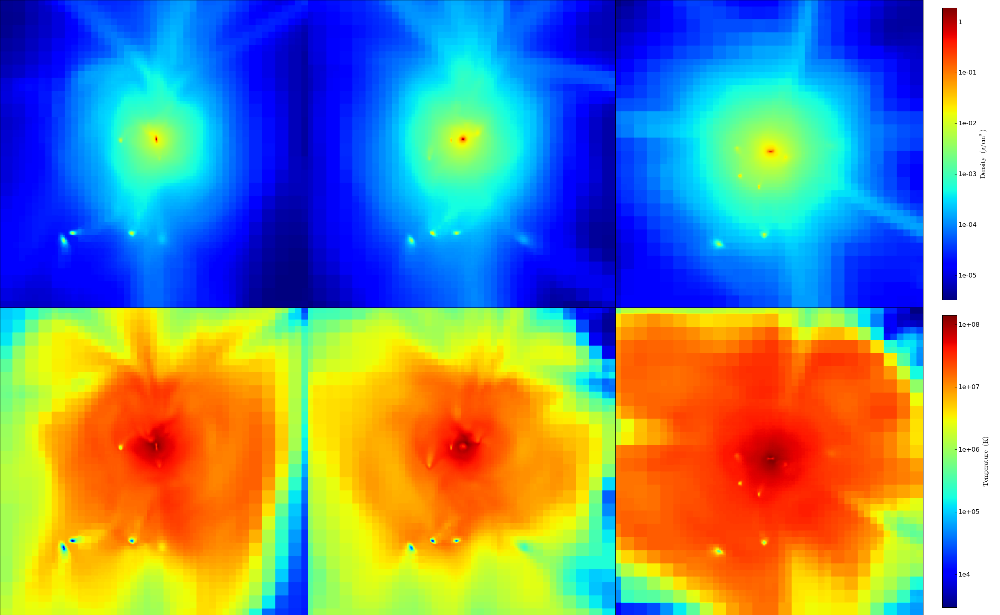

.. _halo_profiling:

Halo Profiling
==============
.. sectionauthor:: Britton Smith <brittonsmith@gmail.com>,
   Stephen Skory <s@skory.us>

The ``HaloProfiler`` provides a means of performing analysis on multiple halos 
in a parallel-safe way.

The halo profiler performs three primary functions: radial profiles, 
projections, and custom analysis.  See the cookbook for a recipe demonstrating 
all of these features.

Configuring the Halo Profiler
-----------------------------

The only argument required to create a ``HaloProfiler`` object is the path 
to the dataset.

.. code-block:: python

  from yt.analysis_modules.halo_profiler.api import *
  hp = HaloProfiler("enzo_tiny_cosmology/DD0046/DD0046")

Most of the halo profiler's options are configured with additional keyword 
arguments:

 * **output_dir** (*str*): if specified, all output will be put into this path
   instead of in the dataset directories.  Default: None.

 * **halos** (*str*): "multiple" for profiling more than one halo.  In this mode
   halos are read in from a list or identified with a
   `halo finder <../cookbook/running_halofinder.html>`_.  In "single" mode, the
   one and only halo center is identified automatically as the location of the
   peak in the density field.  Default: "multiple".

 * **halo_list_file** (*str*): name of file containing the list of halos.
   The halo profiler will look for this file in the data directory.
   Default: "HopAnalysis.out".

 * **halo_list_format** (*str* or *dict*): the format of the halo list file.
   "yt_hop" for the format given by yt's halo finders.  "enzo_hop" for the
   format written by enzo_hop.  This keyword can also be given in the form of a
   dictionary specifying the column in which various properties can be found.
   For example, {"id": 0, "center": [1, 2, 3], "mass": 4, "radius": 5}.
   Default: "yt_hop".

 * **halo_finder_function** (*function*): If halos is set to multiple and the
   file given by halo_list_file does not exit, the halo finding function
   specified here will be called.  Default: HaloFinder (yt_hop).

 * **halo_finder_args** (*tuple*): args given with call to halo finder function.
   Default: None.

 * **halo_finder_kwargs** (*dict*): kwargs given with call to halo finder
   function. Default: None.

 * **recenter** (*string* or function name): The name of a function
   that will be used to move the center of the halo for the purposes of
   analysis. See explanation and examples, below. Default: None, which
   is equivalent to the center of mass of the halo as output by the halo
   finder.

 * **halo_radius** (*float*): if no halo radii are provided in the halo list
   file, this parameter is used to specify the radius out to which radial
   profiles will be made.  This keyword is also used when halos is set to
   single.  Default: 0.1.

 * **radius_units** (*str*): the units of **halo_radius**. 
   Default: "1" (code units).

 * **n_profile_bins** (*int*): the number of bins in the radial profiles.
   Default: 50.

 * **profile_output_dir** (*str*): the subdirectory, inside the data directory,
   in which radial profile output files will be created.  The directory will be
   created if it does not exist.  Default: "radial_profiles".

 * **projection_output_dir** (*str*): the subdirectory, inside the data
   directory, in which projection output files will be created.  The directory
   will be created if it does not exist.  Default: "projections".

 * **projection_width** (*float*): the width of halo projections.
   Default: 8.0.

 * **projection_width_units** (*str*): the units of projection_width.
   Default: "mpc".

 * **project_at_level** (*int* or "max"): the maximum refinement level to be
   included in projections.  Default: "max" (maximum level within the dataset).

 * **velocity_center** (*list*): the method in which the halo bulk velocity is
   calculated (used for calculation of radial and tangential velocities.  Valid
   options are:
   - ["bulk", "halo"] (Default): the velocity provided in the halo list
   - ["bulk", "sphere"]: the bulk velocity of the sphere centered on the halo center.
   - ["max", field]: the velocity of the cell that is the location of the maximum of the field specified.

 * **filter_quantities** (*list*): quantities from the original halo list
   file to be written out in the filtered list file.  Default: ['id','center'].

 * **use_critical_density** (*bool*): if True, the definition of overdensity 
     for virial quantities is calculated with respect to the critical 
     density.  If False, overdensity is with respect to mean matter density, 
     which is lower by a factor of Omega_M.  Default: False.

Profiles
--------

Once the halo profiler object has been instantiated, fields can be added for 
profiling with the :meth:`add_profile` method:

.. code-block:: python

  hp.add_profile('cell_volume', weight_field=None, accumulation=True)
  hp.add_profile('TotalMassMsun', weight_field=None, accumulation=True)
  hp.add_profile('density', weight_field=None, accumulation=False)
  hp.add_profile('temperature', weight_field='cell_mass', accumulation=False)
  hp.make_profiles(njobs=-1, prefilters=["halo['mass'] > 1e13"],
                   filename='VirialQuantities.h5')

The :meth:`make_profiles` method will begin the profiling.  Use the
**njobs** keyword to control the number of jobs over which the
profiling is divided.  Setting to -1 results in a single processor per
halo.  Setting to 1 results in all available processors working on the
same halo.  The prefilters keyword tells the profiler to skip all halos with 
masses (as loaded from the halo finder) less than a given amount.  See below 
for more information.  Additional keyword arguments are:

 * **filename** (*str*): If set, a file will be written with all of the 
   filtered halos and the quantities returned by the filter functions.
   Default: None.

 * **prefilters** (*list*): A single dataset can contain thousands or tens of 
   thousands of halos. Significant time can be saved by not profiling halos
   that are certain to not pass any filter functions in place.  Simple filters 
   based on quantities provided in the initial halo list can be used to filter 
   out unwanted halos using this parameter.  Default: None.

 * **njobs** (*int*): The number of jobs over which to split the profiling.  
   Set to -1 so that each halo is done by a single processor.  Default: -1.

 * **dynamic** (*bool*): If True, distribute halos using a task queue.  If 
   False, distribute halos evenly over all jobs.  Default: False.

 * **profile_format** (*str*): The file format for the radial profiles, 
   'ascii' or 'hdf5'.  Default: 'ascii'.

.. image:: _images/profiles.png
   :width: 500

Radial profiles of Overdensity (left) and Temperature (right) for five halos.

Projections
-----------

The process of making projections is similar to that of profiles:

.. code-block:: python

  hp.add_projection('density', weight_field=None)
  hp.add_projection('temperature', weight_field='density')
  hp.add_projection('metallicity', weight_field='density')
  hp.make_projections(axes=[0, 1, 2], save_cube=True, save_images=True, 
                      halo_list="filtered", njobs=-1)

If **save_cube** is set to True, the projection data
will be written to a set of hdf5 files 
in the directory given by **projection_output_dir**. 
The keyword, **halo_list**, can be 
used to select between the full list of halos ("all"),
the filtered list ("filtered"), or 
an entirely new list given in the form of a file name.
See :ref:`filter_functions` for a 
discussion of filtering halos.  Use the **njobs** keyword to control
the number of jobs over which the profiling is divided.  Setting to -1
results in a single processor per halo.  Setting to 1 results in all
available processors working on the same halo.  The keyword arguments are:

 * **axes** (*list*): A list of the axes to project along, using the usual 
   0,1,2 convention. Default=[0,1,2].

 * **halo_list** (*str*) {'filtered', 'all'}: Which set of halos to make 
   profiles of, either ones passed by the halo filters (if enabled/added), or 
   all halos.  Default='filtered'.

 * **save_images** (*bool*): Whether or not to save images of the projections. 
   Default=False.

 * **save_cube** (*bool*): Whether or not to save the HDF5 files of the halo 
   projections.  Default=True.

 * **njobs** (*int*): The number of jobs over which to split the projections.  
   Set to -1 so that each halo is done by a single processor.  Default: -1.

 * **dynamic** (*bool*): If True, distribute halos using a task queue.  If 
   False, distribute halos evenly over all jobs.  Default: False.

Projections of Density (top) and Temperature,
weighted by Density (bottom), in the x (left), 
y (middle), and z (right) directions for a single halo with a width of 8 Mpc.

Halo Filters
------------

Filters can be added to create a refined list of
halos based on their profiles or to avoid 
profiling halos altogether based on information
given in the halo list file.

.. _filter_functions:

Filter Functions
^^^^^^^^^^^^^^^^

It is often the case that one is looking to
identify halos with a specific set of 
properties.  This can be accomplished through the creation
of filter functions.  A filter 
function can take as many args and kwargs as you like,
as long as the first argument is a 
profile object, or at least a dictionary which contains
the profile arrays for each field.  
Filter functions must return a list of two things.
The first is a True or False indicating 
whether the halo passed the filter. 
The second is a dictionary containing quantities 
calculated for that halo that will be written to a
file if the halo passes the filter.
A  sample filter function based on virial quantities can be found in 
``yt/analysis_modules/halo_profiler/halo_filters.py``.

Halo filtering takes place during the call to :meth:`make_profiles`.
The  :meth:`add_halo_filter` method is used to add a filter to be used
during the profiling:

.. code-block:: python

  hp.add_halo_filter(HP.VirialFilter, must_be_virialized=True, 
                     overdensity_field='ActualOverdensity', 
		     virial_overdensity=200, 
		     virial_filters=[['TotalMassMsun','>=','1e14']],
		     virial_quantities=['TotalMassMsun','RadiusMpc'],
		     use_log=True)

The addition above will calculate and return virial quantities,
mass and radius, for an 
overdensity of 200.  In order to pass the filter, at least one
point in the profile must be 
above the specified overdensity and the virial mass must be at
least 1e14 solar masses.  The **use_log** keyword indicates that interpolation 
should be done in log space.  If 
the VirialFilter function has been added to the filter list,
the halo profiler will make 
sure that the fields necessary for calculating virial quantities are added.
As  many filters as desired can be added.  If filters have been added,
the next call to :meth:`make_profiles` will filter by all of
the added filter functions:

.. code-block:: python

  hp.make_profiles(filename="FilteredQuantities.out")

If the **filename** keyword is set, a file will be written with all of the 
filtered halos and the quantities returned by the filter functions.

.. note:: If the profiles have already been run, the halo profiler will read
   in the previously created output files instead of re-running the profiles.
   The halo profiler will check to make sure the output file contains all of
   the requested halo fields.  If not, the profile will be made again from
   scratch.

.. _halo_profiler_pre_filters:

Pre-filters
^^^^^^^^^^^

A single dataset can contain thousands or tens of thousands of halos.
Significant time can 
be saved by not profiling halos that are certain to not pass any filter
functions in place.  
Simple filters based on quantities provided in the initial halo list
can be used to filter 
out unwanted halos using the **prefilters** keyword:

.. code-block:: python

  hp.make_profiles(filename="FilteredQuantities.out",
		   prefilters=["halo['mass'] > 1e13"])

Arguments provided with the **prefilters** keyword should be given
as a list of strings.  
Each string in the list will be evaluated with an *eval*.

.. note:: If a VirialFilter function has been added with a filter based
   on mass (as in the example above), a prefilter will be automatically
   added to filter out halos with masses greater or less than (depending
   on the conditional of the filter) a factor of ten of the specified
   virial mass.

Recentering the Halo For Analysis
---------------------------------

It is possible to move the center of the halo to a new point using an
arbitrary function for making profiles.
By default, the center is provided by the halo finder,
which outputs the center of mass of the particles. For the purposes of
analysis, it may be important to recenter onto a gas density maximum,
or a temperature minimum.

There are a number of built-in functions to do this, listed below.
Each of the functions uses mass-weighted fields for the calculations
of new center points.
To use
them, supply the HaloProfiler with the ``recenter`` option and 
the name of the function, as in the example below.

.. code-block:: python

   hp = HaloProfiler("enzo_tiny_cosmology/DD0046/DD0046", 
                     recenter="Max_Dark_Matter_Density")

Additional options are:

  * *Min_Dark_Matter_Density* - Recenter on the point of minimum dark matter
    density in the halo.

  * *Max_Dark_Matter_Density* - Recenter on the point of maximum dark matter
    density in the halo.

  * *CoM_Dark_Matter_Density* - Recenter on the center of mass of the dark
    matter density field. This will be very similar to what the halo finder
    provides, but not precisely similar.

  * *Min_Gas_Density* - Recenter on the point of minimum gas density in the
    halo.

  * *Max_Gas_Density* - Recenter on the point of maximum gas density in the
    halo.

  * *CoM_Gas_Density* - Recenter on the center of mass of the gas density field
    in the halo.

  * *Min_Total_Density* - Recenter on the point of minimum total (gas + dark
    matter) density in the halo.

  * *Max_Total_Density* - Recenter on the point of maximum total density in the
    halo.

  * *CoM_Total_Density* - Recenter on the center of mass for the total density
    in the halo.

  * *Min_Temperature* - Recenter on the point of minimum temperature in the
    halo.

  * *Max_Temperature* - Recenter on the point of maximum temperature in the
    halo.

It is also possible to supply a user-defined function to the HaloProfiler.
This can be used if the pre-defined functions above are not sufficient.
The function takes a single argument, a data container for the halo,
which is a sphere. The function returns a 3-list with the new center.

In this example below, a function is used such that the halos will be
re-centered on the point of absolute minimum temperature, that is not
mass weighted.

.. code-block:: python

   from yt.mods import *
   
   def find_min_temp(sphere):
       ma, mini, mx, my, mz, mg = sphere.quantities['MinLocation']('temperature')
       return [mx,my,mz]
   
   hp = HaloProfiler("enzo_tiny_cosmology/DD0046/DD0046", recenter=find_min_temp)

It is possible to make more complicated functions. This example below extends
the example above to include a distance control that prevents the center from
being moved too far. If the recenter moves too far, ``[-1, -1, -1]`` is
returned which will prevent the halo from being profiled.
Any triplet of values less than the ``domain_left_edge`` will suffice.
There will be a note made in the output (stderr) showing which halos were
skipped.

.. code-block:: python

   from yt.mods import *
   from yt.utilities.math_utils import periodic_dist
   
   def find_min_temp_dist(sphere):
       old = sphere.center
       ma, mini, mx, my, mz, mg = sphere.quantities['MinLocation']('temperature')
       d = sphere.pf['kpc'] * periodic_dist(old, [mx, my, mz],
           sphere.pf.domain_right_edge - sphere.pf.domain_left_edge)
       # If new center farther than 5 kpc away, don't recenter
       if d > 5.: return [-1, -1, -1]
       return [mx,my,mz]
   
   hp = HaloProfiler("enzo_tiny_cosmology/DD0046/DD0046", 
                     recenter=find_min_temp_dist)

Custom Halo Analysis
--------------------

Besides radial profiles and projections, the halo profiler has the
ability to run custom analysis functions on each halo.  Custom halo
analysis functions take two arguments: a halo dictionary containing
the id, center, etc; and a sphere object.  The example function shown
below creates a 2D profile of the total mass in bins of density and
temperature for a given halo.

.. code-block:: python

   from yt.mods import *
   from yt.data_objects.profiles import BinnedProfile2D

   def halo_2D_profile(halo, sphere):
       "Make a 2D profile for a halo."
       my_profile = BinnedProfile2D(sphere,
             128, 'density', 1e-30, 1e-24, True,
             128, 'temperature', 1e2, 1e7, True,
             end_collect=False)
       my_profile.add_fields('cell_mass', weight=None, fractional=False)
       my_filename = os.path.join(sphere.pf.fullpath, '2D_profiles', 
             'Halo_%04d.h5' % halo['id'])
       my_profile.write_out_h5(my_filename)

Using the  :meth:`analyze_halo_spheres` function, the halo profiler
will create a sphere centered on each halo, and perform the analysis
from the custom routine.

.. code-block:: python

    hp.analyze_halo_sphere(halo_2D_profile, halo_list='filtered',
                           analysis_output_dir='2D_profiles', 
                           njobs=-1, dynamic=False)

Just like with the :meth:`make_projections` function, the keyword,
**halo_list**, can be used to select between the full list of halos
("all"), the filtered list ("filtered"), or an entirely new list given
in the form of a file name.  If the **analysis_output_dir** keyword is
set, the halo profiler will make sure the desired directory exists in
a parallel-safe manner.  Use the **njobs** keyword to control the
number of jobs over which the profiling is divided.  Setting to -1
results in a single processor per halo.  Setting to 1 results in all
available processors working on the same halo.
