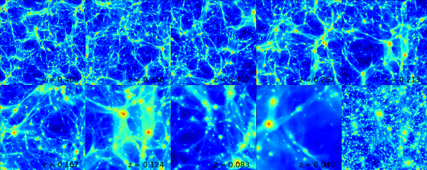

.. _light-cone-generator:

Light Cone Generator
====================

Light cones are created by stacking multiple datasets together to 
continuously span a given redshift interval.  To make a projection of a 
field through a light cone, the width of individual slices is adjusted 
such that each slice has the same angular size.  
Each slice is randomly shifted and projected along a random axis to 
ensure that the same structures are not sampled multiple times.  A 
recipe for creating a simple light cone projection can be found in 
the cookbook under :ref:`cookbook-light_cone`.

A light cone projection of the thermal Sunyaev-Zeldovich Y parameter from 
z = 0 to 0.4 with a 450x450 arcminute field of view using 9 individual 
slices.  The panels shows the contributions from the 9 individual slices with 
the final light cone image shown in the bottom, right.

Configuring the Light Cone Generator
------------------------------------

The required arguments to instantiate a 
:class:`~yt.analysis_modules.cosmological_observation.light_cone.light_cone.LightCone`
object are the path to the simulation parameter file, the simulation type, the 
nearest redshift, and the furthest redshift of the light cone.

.. code-block:: python

  from yt.analysis_modules.cosmological_observation.api import \
       LightCone

  lc = LightCone('enzo_tiny_cosmology/32Mpc_32.enzo',
                 'Enzo', 0., 0.1)

The additional keyword arguments are:

* ``use_minimum_datasets`` (*bool*):  If True, the minimum number of 
  datasets is used to connect the initial and final redshift.  If False, 
  the light cone solution will contain as many entries as possible within 
  the redshift interval.  Default: True.

* ``deltaz_min`` (*float*): Specifies the minimum Delta-z between 
  consecutive datasets in the returned list.  Default: 0.0.

* ``minimum_coherent_box_fraction`` (*float*): Used with 
  ``use_minimum_datasets`` set to False, this parameter specifies the 
  fraction of the total box size to be traversed before rerandomizing the 
  projection axis and center.  This was invented to allow light cones with 
  thin slices to sample coherent large cale structure, but in practice does 
  not work so well.  Try setting this parameter to 1 and see what happens.  
  Default: 0.0.

* ``time_data`` (*bool*): Whether or not to include time outputs when 
  gathering datasets for time series.  Default: True.

* ``redshift_data`` (*bool*): Whether or not to include redshift outputs 
  when gathering datasets for time series.  Default: True.

* ``set_parameters`` (*dict*): Dictionary of parameters to attach to 
  ds.parameters.  Default: None.

* ``output_dir`` (*string*): The directory in which images and data files
   will be written.  Default: 'LC'.

* ``output_prefix`` (*string*): The prefix of all images and data files.
  Default: 'LightCone'.

Creating Light Cone Solutions
-----------------------------

A light cone solution consists of a list of datasets spanning a redshift 
interval with a random orientation for each dataset.  A new solution 
is calcuated with the 
:func:`~yt.analysis_modules.cosmological_observation.light_cone.light_cone.LightCone.calculate_light_cone_solution`
function:

.. code-block:: python

  lc.calculate_light_cone_solution(seed=123456789, filename='lightcone.dat')

The keyword argument are:

* ``seed`` (*int*): the seed for the random number generator.  Any light 
  cone solution can be reproduced by giving the same random seed.  
  Default: None.

* ``filename`` (*str*): if given, a text file detailing the solution will be 
  written out.  Default: None.

Making a Light Cone Projection
------------------------------

With the light cone solution in place, projections with a given field of 
view and resolution can be made of any available field:

.. code-block:: python

  field = 'density'
  field_of_view = (600.0, "arcmin")
  resolution = (60.0, "arcsec")
  lc.project_light_cone(field_of_vew, resolution,
                        field , weight_field=None, 
                        save_stack=True, 
                        save_slice_images=True)

The field of view and resolution can be specified either as a tuple of 
value and unit string or as a unitful ``YTQuantity``.  
Additional keyword arguments:

* ``weight_field`` (*str*): the weight field of the projection.  This has 
  the same meaning as in standard projections.  Default: None.

* ``photon_field`` (*bool*): if True, the projection data for each slice is 
  decremented by 4 pi R :superscript:`2` , where R is the luminosity 
  distance between the observer and the slice redshift.  Default: False.

* ``save_stack`` (*bool*): if True, the unflatted light cone data including 
  each individual slice is written to an hdf5 file.  Default: True.

* ``save_final_image`` (*bool*): if True, save an image of the final light 
  cone projection.  Default: True.

* ``save_slice_images`` (*bool*): save images for each individual projection 
  slice.  Default: False.

* ``cmap_name`` (*string*): color map for images.  Default: "algae".

* ``njobs`` (*int*): The number of parallel jobs over which the light cone 
  projection will be split.  Choose -1 for one processor per individual
  projection and 1 to have all processors work together on each projection.
  Default: 1.

* ``dynamic`` (*bool*): If True, use dynamic load balancing to create the 
  projections.  Default: False.

.. note:: As of :code:`yt-3.0`, the halo mask and unique light cone functionality no longer exist.  These are still available in :code:`yt-2.x`.  If you would like to use these features in :code:`yt-3.x`, help is needed to port them over.  Contact the yt-users mailing list if you are interested in doing this.
