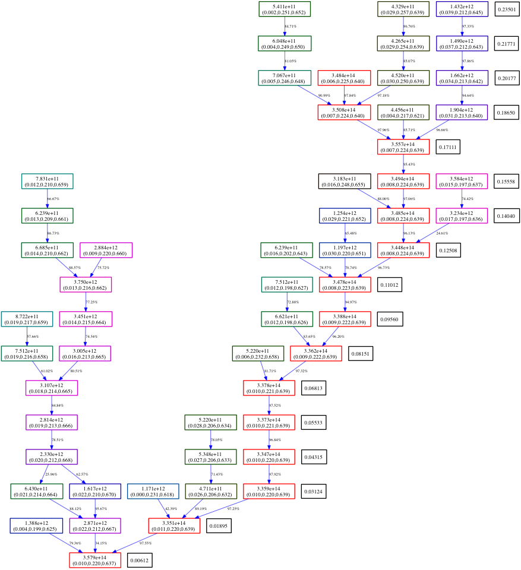

.. _merger_tree:

Halo Merger Tree
================
.. sectionauthor:: Stephen Skory <sskory@physics.ucsd.edu>
.. versionadded:: 1.7

The Halo Merger Tree extension is capable of building a database of halo mergers
over a set of time-ordered Enzo datasets. The fractional contribution of older
'parent' halos to younger 'child' halos is calculated by comparing the unique
index labels of their constituent particles. The data is stored in a
`SQLite <http://sqlite.org/>`_ database which enables the use of powerful
and fast SQL queries over all the halos.

General Overview
----------------

The first requirement is a set of sequential datasets.
The detail of the merger tree is increased as the difference in
time between snapshots is reduced, at the cost of higher computational effort
for the tree itself and and disk usage for the snapshots.
The merger tree relies on the output of one of the Halo Finders in yt, and the
user can choose which one to use.
The merger tree is capable of running the halo finder if it hasn't already
been done.
Once halo finding is accomplished for all the data snapshots, the halo
lineage is calculated by comparing the particle membership of halos between
pairs of time steps.
The halo data and tree data is stored in the SQLite database.

Clearly, another requirement is that Python has the
`sqlite3 library <http://docs.python.org/library/sqlite3.html>`_
installed.
This should be built along with everything else yt needs
if the ``install_script.sh`` was used.

The merger tree can be calculated in parallel, and if necessary, it will run
the halo finding in parallel as well. Please see the note below about the
special considerations needed for Network File Systems.

There is a convenience-wrapper for querying the database, called
``MergerTreeConnect``.
It simplifies accessing data in the database.

There are two output classes for the merger tree. The ``MergerTreeDotOutput`` class
outputs the tree for a user-specified subset of halos to a
`Graphviz format <http://graphviz.org/>`_ file.
Graphviz is an open-source package for visualizing connected objects in a
graphical way.
There are binary distributions for all major operating systems.
It is also possible to dump the contents of the SQLite database to a simple text file
with the ``MergerTreeTextOutput`` class.
The data is saved in columnar format.

Conceptual Primer
~~~~~~~~~~~~~~~~~

The best way to view the merger tree extension is as a two-part process.
First, the merger tree is built and stored in the database.
This process can be quite time consuming, depending on the size of the simulation,
and the number and size of halos found in the snapshots.
This is not a process one wants to do very often, and why it is separate
from the analysis parts.

The second part is actually a many-part process, which is the analysis of the
merger tree itself.
The first step is computationally intensive, but the analysis step
is user-intensive.
The user needs to decide what to pull out of the merger tree
and figure out how to extract the needed data with SQL statements.
Once an analysis pipeline is written, it should run very fast for even
very large databases.

A Note About Network File Systems
~~~~~~~~~~~~~~~~~~~~~~~~~~~~~~~~~

Accessing a SQLite database stored on a Network (or Distributed) File System (NFS)
is a risky thing to do, particularly if more than one task wants to write
at the same time (`see more here <http://www.sqlite.org/lockingv3.html#how_to_corrupt>`_).
NFS disks can store files on multiple physical hard drives, and it can take time
for changes made by one task to appear to all the parallel tasks.
Only one task of the merger tree ever interacts with the database,
so these dangers are minimal,
but in general it's a good idea to know something about the disk used to
store the database.

In general, it is recommended to keep the database on a 'real disk' 
(/tmp for example, if all the tasks are on the same SMP node,
or RAM disk for extra speed) if possible,
but it should work on a NFS disk as well.
If a temporary disk is used to store the database while it's being built,
remember to copy the file to a permanent disk after the merger tree script
is finished.

Running and Using the Halo Merger Tree
--------------------------------------

It is very simple to create a merger tree database for a series of snapshots.
The most difficult part is creating an ordered list of Enzo restart files.
There are two ways to do it, by hand or with the EnzoSimulation extension.

By Hand
~~~~~~~

Here is an example of how to build the list and build the database by hand.
Here, the snapshots are stored in directories named DD????, and the enzo
restart file named data????, where ???? is a four digit zero-padded integer.
The final snapshot considered (most progressed in time) is DD0116,
and the earliest that will be examined is DD0100.
The database will be saved to ``/path/to/database/halos.db``.
This example below works identically in serial or in parallel.

.. code-block:: python

  from yt.mods import *
  from yt.analysis_modules.halo_merger_tree.api import *
  from yt.analysis_modules.halo_finding.api import *

  files = []
  start = 100
  finish = 116
  for i in range(start, finish + 1):
      files.append('/path/to/snapshots/DD%04d/data%04d' % (i, i))

  MergerTree(restart_files=files, database='/path/to/database/halos.db')

If the halos have not been found previously for the snapshots, the halo finder
will be run automatically. See the note about this below.

Using EnzoSimulation
~~~~~~~~~~~~~~~~~~~~

Here is how to build the input list of restart files using the EnzoSimulation
extension.
It is possible to set range and interval between snapshots.
Please see the EnzoSimulation
documentation (:ref:`analyzing-an-entire-simulation`) for details.

.. code-block:: python

  from yt.mods import *
  from yt.analysis_modules.halo_merger_tree.api import *
  from yt.analysis_modules.halo_finding.api import *
  import yt.analysis_modules.simulation_handler.api as ES
  
  es = ES.EnzoSimulation('/path/to/snapshots/simulation.par')
  
  files = []
  for output in es.allOutputs:
      files.append(output['filename'])

  MergerTree(restart_files=files, database='/path/to/database/halos.db')

Merger Tree Parallelism
-----------------------

If the halos are to be found during the course of building the merger tree,
run with an appropriate number of tasks to the size of the dataset and the
halo finder used.
The speed of the merger tree itself,
which compares halo membership in parallel very effectively,
is almost completely constrained by the read/write times of the SQLite file.
In tests with the halos pre-located, there is not much speedup beyond two MPI tasks.
There is no negative effect with running the merger tree with more tasks (which is
why if halos are to be found by the merger tree, the merger tree should be
run with as many tasks as that step requires), and indeed if the simulation
is a large one, running in parallel does provide memory parallelism,
which is important.

How The Database Is Handled In Analysis Restarts
------------------------------------------------

The Merger Tree is designed to allow the merger tree database to be built
incrementally.
For example, if a simulation is currently being run, the merger
tree database can be built for the available datasets, and when new ones are
created, the database extended to include them.
So if there are going to be
60 data snapshots total (indexed (0, 1, 2, ..., 59)), and only 50 are saved when the
tree is first built, the analysis should be done on datasets [0, 49].
If the last ten become available, re-run the merger tree on datasets [49, 59]
referencing the same database as before.
By referencing the same database as before, work does not need to be repeated.

If the merger tree process is interrupted before completion (say, if the 
jobs walltime is exceeded and the scheduler kills it), just run the exact
same job again.
The merger tree will check to see what work has already been completed, and
resume where it left off.

Additional Parameters
~~~~~~~~~~~~~~~~~~~~~

When calling ``MergerTree``, there are three parameters that control how the
halo finder is run, if it needs to be run.

  * ``halo_finder_function`` (name) - Which of the halo finders (:ref:`halo_finding`)
    to use. Default: ``HaloFinder`` (HOP).
  * ``halo_finder_threshold`` (float) - When using HOP or Parallel HOP, this sets the
    threshold used. Default: 80.0.
  * ``FOF_link_length`` (float) - When using Friends of Friends (FOFHaloFinder), this sets
    the inter-particle link length used. Default: 0.2.
  * ``dm_only`` (bool) - Whether to include stars (False), or only the dark
    matter particles when building halos (True).
    Default: False.
  * ``refresh`` (bool) - If set to True, this will run the halo finder and
    rebuild the database regardless of whether or not the halo files or
    database exist on disk already.
    Default: False.
  * ``index`` (bool) - Whether to add an index to the SQLite file. True makes
    SQL searches faster at the cost of additional disk space. Default=True.

Example using Parallel HOP:

.. code-block:: python

  MergerTree(restart_files=files, database='/path/to/database/halos.db',
      halo_finder_function=parallelHF, halo_finder_threshold=100.)

Pre-Computing Halos
~~~~~~~~~~~~~~~~~~~

If halo finding is to happen before the merger tree is calculated, and the
work is not to be wasted, special care
should be taken to ensure that all the data required for the merger tree is
saved.
By default, the merger tree looks for files that begin with the name ``MergerHalos``
in the same directory as each Enzo restart file,
and if those files are missing or renamed, halo finding will be performed again.
If ``halos`` is the list of halos returned by the halo finder, these three
commands should be called to save the needed data:

.. code-block:: python

  halos.write_out('MergerHalos.out')
  halos.write_particle_lists('MergerHalos')
  halos.write_particle_lists_txt('MergerHalos')

There is a convenience function that will call the three functions above
at one time:

.. code-block:: python

  halos.dump('MergerHalos')

Please see the documents on halo finding for more information on what these
commands do (:ref:`halo_finding`).

Accessing Data in the Database
------------------------------

SQLite databases support nearly all of the standard SQL queries.
It is possible to write very complicated and powerful SQL queries, but below
only simple examples will are shown. Please see other resources (WWW, books) for
more on how to write SQL queries.

It is possible to read and modify a SQLite database from the command line using
the ``sqlite3`` command (e.g. ``sqlite3 database.db``). It can be very convenient
to use this to quickly inspect a database, but is not suitable for extracting or inserting
large amounts of data. There are many examples (again, see the WWW or books)
available on how to use the command line ``sqlite3`` command.

The table containing halo data in the database is named 'Halos'.
All queries for halo data will come from this table.
The table has these columns:

  #. ``GlobalHaloID`` (int) - A fully-unique identifier for the halo.
  #. ``SnapCurrentTimeIdentifier`` (int) - An unique time identifier for the snapshot
     the halo comes from. Equivalent to 'CurrentTimeIdentifier' from the Enzo
     restart file.
  #. ``SnapZ`` (float) - The redshift for the halo.
  #. ``SnapHaloID`` (int) - The halo ID for the halo taken from the output of the
     halo finder (i.e. 'halos.write_out("HopAnalysis.out")'). It is unique for halos
     in the same snapshot, but not unique across the full database.
  #. ``HaloMass`` (float) - The total mass of dark matter in the halo as
     identified by the halo finder.
  #. ``NumPart`` (int) - Number of dark matter particles in the halo as identified
     by the halo finder.
  #. ``CenMassX``, 
  #. ``CenMassY``,
  #. ``CenMassZ`` (float) - The location of the center of mass of the halo in code units.
  #. ``BulkVelX``,
  #. ``BulkVelY``,
  #. ``BulkVelZ`` (float) - The velocity of the center of mass of the halo in
     cgs units.
  #. ``MaxRad`` (float) - The distance from the center of mass to the most
     remote particle in the halo in code units.
  #. ``ChildHaloID0`` (int) - The GlobalHaloID of the child halo which receives
     the greatest proportion of particles from this halo.
  #. ``ChildHaloFrac0`` (float) - The fraction by mass of particles from this
     (parent) halo that goes to the child halo recorded in ChildHaloID0.  If
     all the particles from this parent halo goes to ChildHaloID0, this number will
     be 1.0, regardless of the mass of the child halo.
  #. ``ChildHaloID[1-4]``, ``ChildHaloFrac[1-4]`` (int, float) - Similar to the
     columns above, these store the second through fifth greatest recipients of
     particle mass from this parent halo.

.. warning::

   A value of -1 in any of the ``ChildHaloID`` columns corresponds to
   a fake (placeholder) child halo entry. There is no halo with an ID equal to -1.
   This is used during the merger tree construction,
   and must be accounted for when constructing SQL queries of the database.

To get the data for the most massive halo at the end of the simulation,
there is a convenience class that simplifies database access. Using it, a query
might look like this:

.. code-block:: python

  from yt.mods import *
  from yt.analysis_modules.halo_merger_tree.api import *

  mtc = MergerTreeConnect(database='halos.db')
  line = "SELECT * FROM Halos WHERE SnapZ=0.0 AND SnapHaloID=0;"
  results = mtc.query(line)

``results`` is a list containing a singular tuple containing the values for that halo in
the same order as
given above for the columns.

Another way to get the same information is to use one of the convenience functions.
The following example shows how to do this:

.. code-block:: python

  from yt.mods import *
  from yt.analysis_modules.halo_merger_tree.api import *

  mtc = MergerTreeConnect(database='halos.db')
  this_halo = mtc.get_GlobalHaloID(0, 0.0)

The first term of ``get_GlobalHaloID`` is the ``SnapHaloID`` for the halo of
interest, and the second is the redshift of interest.
The results are stored in ``this_halo`` as an integer.

If all that is wanted is a few of the columns, this slight modification below
will retrieve only the desired data. In general, it is a good idea to retrieve
only the columns that will actually be used. Requesting all the columns (with
``*``) requires more reads from disk and slows down the query.

.. code-block:: python

  line = "SELECT NumPart, GlobalHaloID FROM Halos WHERE SnapZ=0.0 AND SnapHaloID=0;"
  results = mtc.query(line)

``results`` is a list containing a single tuple containing two items, the values for 
``NumPart`` first and ``GlobalHaloID`` second.

There is also a convenience function that will retrieve all the data columns
for a given halo.
The input of the function is the ``GlobalHaloID`` for the
halo of interest, and it returns a dictionary where the keys are the names
of the data columns, and the values are the entries in the database.

.. code-block:: python

  from yt.mods import *
  from yt.analysis_modules.halo_merger_tree.api import *

  mtc = MergerTreeConnect(database='halos.db')
  info = mtc.get_halo_info(1544)
  print info
  {'BulkVelX': -32759799.359999999,
   'BulkVelY': -28740239.109999999,
   'BulkVelZ': -20066000.690000001,
   'CenMassX': 0.23059111360000001,
   'CenMassY': 0.4061139809,
   'CenMassZ': 0.80882763749999997,
   'ChildHaloFrac0': 0.9642857141249418,
   'ChildHaloFrac1': 0.0,
   'ChildHaloFrac2': 0.0,
   'ChildHaloFrac3': 0.0,
   'ChildHaloFrac4': 0.0,
   'ChildHaloID0': 1688,
   'ChildHaloID1': 1712,
   'ChildHaloID2': 1664,
   'ChildHaloID3': 1657,
   'ChildHaloID4': 1634,
   'GlobalHaloID': 1544,
   'HaloMass': 20934692770000.0,
   'MaxRad': 0.01531299899,
   'NumPart': 196,
   'SnapCurrentTimeIdentifier': 1275946788,
   'SnapHaloID': 56,
   'SnapZ': 0.024169713061444002}

If data from more than one halo is desired, more than one item will be returned.
This query will find the largest halo from each of the snapshots.

.. code-block:: python

  from yt.mods import *
  from yt.analysis_modules.halo_merger_tree.api import *
  
  mtc = MergerTreeConnect(database='halos.db')
  line = "SELECT HaloMass,SnapZ FROM Halos WHERE SnapHaloID=0;"
  results = mtc.query(line)

``results`` is a list of multiple two-tuples.
Note that SQLite doesn't return the values in any
particular order. If order is unimportant, it saves time. But if order is
important, you can modify the query to sort the results by redshift.

.. code-block:: python

  line = "SELECT HaloMass,SnapZ FROM Halos WHERE SnapHaloID=0 ORDER BY SnapZ DESC;"

Now ``results`` will be ordered by time, first to last, for each two-tuple
in the list.

The function ``get_halo_parents()`` will return all the halos that are
identified as parents of the specified halo.
Due to the way that the halo tree is constructed, it will also return parent
halos that have zero mass contribution to the specified halo.

.. code-block:: python

  from yt.mods import *
  from yt.analysis_modules.halo_merger_tree.api import *
  
  mtc = MergerTreeConnect(database='halos.db')
  parents = mtc.get_halo_parents(1688)
  print parents
  [[1544, 0.9642857141249418],
   [1613, 0.0],
   [1614, 0.0],
   [1489, 0.0],
   [1512, 0.0],
   [1519, 0.0],
   [1609, 0.0]]

The last example shows the kernel of the most important operation for a
merger tree: recursion back in time to find progenitors for a halo. Using a 
query similar to ones above, the ``GlobalHaloID`` is found for the halo of
interest at some late point in time (z=0, typically). Using that value (given
the random-ish value of 1234567),
the halos that came before can be identified very easily:

.. code-block:: python

  from yt.mods import *
  from yt.analysis_modules.halo_merger_tree.api import *
  
  mtc = MergerTreeConnect(database='halos.db')

  lineage = {}
  # Recursive function on parent halos.
  def findParent(haloID, lineage):
      line = "SELECT GlobalHaloID from Halos where ChildHaloID0=%d;" % haloID
      results = mtc.query(line)
      if results == []:
          return lineage
      # A one-tuple inside a list.
      parentID = results[0][0]
      lineage[parentID] = haloID
      # Now we recurse back in time.
      lineage = findParent(parentID, lineage)

  # Stores the parent->child relationships.
  lineage = {}
  # Call the function once with the late halo.
  lineage = findParent(1234567, lineage)

Contained within the dict ``lineage`` is the primary lineage for the final
chosen halo. Storing the family tree in this way may not be the best choice,
but this makes it clear how easy it is to build up the history of a halo
over time.

Merger Tree Convenience Functions
~~~~~~~~~~~~~~~~~~~~~~~~~~~~~~~~~

Below are some examples of the convenience functions available.

**get_GlobalHaloID(SnapHaloID, z)**. Returns the GlobalHaloID for the
given halo.::

        
    Parameters
    ---------
    SnapHaloID : Integer
        The index label for the halo of interest, equivalent to
        the first column of the halo finder text output file.
    z : Float
        The redshift for the halo of interest. The value returned will be
        for the halo with SnapHaloID equal to ID (above) with redshift
        closest to this value.
    
    Examples
    --------
    >>> this_halo = mtc.get_GlobalHaloID(0, 0.)

**get_halo_parents(GlobalHaloID)**. Returns a list of the parent halos to the
given halo, along with the contribution fractions from parent to child.
This function returns a list of lists, where each entry in the top list
is [GlobalHaloID, ChildHaloFrac] of the parent halo in relationship
to the given child halo.::
        
    Parameters
    ----------
    GlobalHaloID : Integer
        The GlobalHaloID of the halo of interest.
    
    Examples
    --------
    >>> parents = mtc.get_halo_parents(1688)
    >>> print parents
    [[1544, 0.9642857141249418],
     [1613, 0.0],
     [1614, 0.0],
     [1489, 0.0],
     [1512, 0.0],
     [1519, 0.0],
     [1609, 0.0]]

**get_direct_parent(GlobalHaloID)**. Returns the GlobalHaloID of the direct
parent of the given halo.
This is accomplished by identifying the most massive parent halo
that contributes at least 50% of its mass to the given halo.::
        
    Parameters
    ----------
    GlobalHaloID : Integer
        The GlobalHaloID of the halo of interest.
    
    Examples
    --------
    >>> parent = mtc.get_direct_parent(1688)
    >>> print parent
    1544

**get_halo_info(GlobalHaloID)**. Returns all available information for
the given GlobalHaloID in the form of a dict.::
        
    Parameters
    ----------
    GlobalHaloID : Integer
        The unique index for the halo of interest.
    
    Examples
    --------
    >>> info = mtc.get_halo_info(1544)
    >>> print info
    {'BulkVelX': -32759799.359999999,
     'BulkVelY': -28740239.109999999,
     'BulkVelZ': -20066000.690000001,
     'CenMassX': 0.23059111360000001,
     'CenMassY': 0.4061139809,
     'CenMassZ': 0.80882763749999997,
     'ChildHaloFrac0': 0.9642857141249418,
     'ChildHaloFrac1': 0.0,
     'ChildHaloFrac2': 0.0,
     'ChildHaloFrac3': 0.0,
     'ChildHaloFrac4': 0.0,
     'ChildHaloID0': 1688,
     'ChildHaloID1': 1712,
     'ChildHaloID2': 1664,
     'ChildHaloID3': 1657,
     'ChildHaloID4': 1634,
     'GlobalHaloID': 1544,
     'HaloMass': 20934692770000.0,
     'MaxRad': 0.01531299899,
     'NumPart': 196,
     'SnapCurrentTimeIdentifier': 1275946788,
     'SnapHaloID': 56,
     'SnapZ': 0.024169713061444002}

Merger Tree Output
------------------

There are two included methods for outputting the contents of a Merger Tree
database: Graphviz and plain-text columnar format.

Graphviz Output
~~~~~~~~~~~~~~~

The `Graphviz <http://graphviz.org/>`_ output function can write the merger
tree to a text file, which can then be parsed by the GraphViz executable
``dot`` into an image, or an image can be created directly.
The GraphViz engine used to parse the
output is the ``dot`` engine, which produces hierarchical diagrams where
directionality (such as left to right or top to bottom)
indicates some meaningful property.
In the case of the merger tree, top to bottom indicates the progress of
time.
Graphviz can output the visualization into a wide range of image and vector
formats suitable for any application.

Below is a simple example of the Graphviz/dot visualization.
Each box contains the mass of the halo (in Msun), and the center of mass
for the halo in simulation units.
For each snapshot, the box for the largest halo is colored red.
The numbers next to the link arrows gives the percentage of the parent
halo's mass that goes to the child.
On each row, the un-linked black boxes
contain the redshift for that snapshot.

To output the merger tree for a set of halos, the chosen halos need to be
identified. There are two choices, either the ``GlobalHaloID`` or
the ``SnapHaloID`` along with the ``SnapCurrentTimeIdentifier`` value
for the chosen halo(s) may be used.
Two bits of information need to be used if ``GlobalHaloID`` is not specified
because ``SnapHaloID`` is not an unique identifier in the database.
The reason why ``SnapCurrentTimeIdentifier`` is used rather than ``SnapZ`` has
to do with the float valuation of the redshift column and the way SQL queries
work.
If ``SnapZ`` were used, the precise float value of the desired redshift would
have to be used, rather than the simpler-to-get-correct integer value of
``SnapCurrentTimeIdentifier``.

Luckily it isn't as hard as it sounds to get the ``GlobalHaloID`` for the
desired halo(s).
By using the ``MergerTreeConnect`` class, it is simple to pick out halos
before creating the Graphviz output.
Below, the ``GlobalHaloID`` for the most massive halo in the last (z~0, typically)
snapshot is found:

.. code-block:: python

  from yt.mods import *
  from yt.analysis_modules.halo_merger_tree.api import *
  
  mtc = MergerTreeConnect(database='halos.db')
  
  line = "SELECT max(GlobalHaloID) FROM Halos WHERE SnapHaloID=0;"
  results = mtc.query(line)
  print results

Because of the way the database is created, from early times to late, the most
massive halo at z~0 will have the largest ``GlobalHaloID`` for all halos with
``SnapHaloID``=0. ``results`` will contain a one-tuple in a list of the
desired ``GlobalHaloID``.

Alternatively, one of the convenience functions can be used which may be easier:

.. code-block:: python

  from yt.mods import *
  
  mtc = MergerTreeConnect(database='halos.db')
  
  thisHalo = mtc.get_GlobalHaloID(0, 0.0)

``thisHalo`` will be an integer giving the GlobalHaloID for the most massive
halo (ID=0) at z=0.0.

To output the merger tree for the five largest halos in the last snapshot,
it may be simplest to find the ``SnapCurrentTimeIdentifier`` for that
snapshot.
This can either be done by referencing the dataset itself by hand
(look for ``CurrentTimeIdentifier`` in the Enzo restart file), or by querying
the database.
Here is how to query the database for the right information:

.. code-block:: python

  from yt.mods import *
  from yt.analysis_modules.halo_merger_tree.api import *
  
  mtc = MergerTreeConnect(database='halos.db')
  
  line = "SELECT max(GlobalHaloID) FROM Halos WHERE SnapHaloID=0;"
  results = mtc.query(line)
  
  line = "SELECT SnapCurrentTimeIdentifier FROM Halos WHERE GlobalHaloID=%d;" % results[0][0]
  results = mtc.query(line)
  print results

``results`` contains a one-tuple in a list of the desired
``SnapCurrentTimeIdentifier``.
Supposing that the desired ``SnapCurrentTimeIdentifier`` is 72084721, outputting
merger trees is now simple:

.. code-block:: python

  from yt.mods import *
  from yt.analysis_modules.halo_merger_tree.api import *
  
  MergerTreeDotOutput(halos=[0,1,2,3,4], database='halos.db',
      dotfile='MergerTree.gv', current_time=72084721)

This will output the file ``MergerTree.gv`` which can be parsed by Graphviz.
To output to an image format, name the file appropriately (``MergerTree.png``).
A list of available GraphViz image formats can be found by invoking
(from the command line) ``dot -v``.

If the ``GlobalHaloID`` values are known for all of the desired halos,
``current_time`` should not be specified, as below:

.. code-block:: python

  from yt.mods import *
  from yt.analysis_modules.halo_merger_tree.api import *
  
  MergerTreeDotOutput(halos=[24212,5822,19822,10423,51324], database='halos.db',
      dotfile='MergerTree.gv', link_min=0.7)

The ``link_min`` parameter above limits the tree to following links between
parent and child halos for which at least 70% of the parent halo's mass goes
to the child. The default is 0.2.

In this slightly modified example below, if ``dot`` is installed in the
``PATH``, an image file will be created without an intermediate text file:

.. code-block:: python

  from yt.mods import *
  from yt.analysis_modules.halo_merger_tree.api import *
  
  MergerTreeDotOutput(halos=[24212,5822,19822,10423,51324], database='halos.db',
      dotfile='MergerTree.png', link_min=0.7)

Plain-Text Output
~~~~~~~~~~~~~~~~~

This is how to output the entire contents of the database to a text file:

.. code-block:: python

  from yt.analysis_modules.halo_merger_tree.api import *
  
  MergerTreeTextOutput(database='halos.db', outfile='MergerTreeDB.txt')

Putting it All Together
-----------------------

Here is an example of how to create a merger tree for the most massive halo
in the final snapshot from start to finish, and output the Graphviz
visualization as a PDF file.
This will work in serial and in parallel.

.. code-block:: python

  from yt.mods import *
  from yt.analysis_modules.halo_merger_tree.api import *
  from yt.analysis_modules.halo_finding.api import *

  # Pick our snapshots to use.
  files = []
  start = 100
  finish = 116
  for i in range(start, finish + 1):
      files.append('/path/to/snapshots/DD%04d/data%04d' % (i, i))

  my_database = '/path/to/database/halos.db'

  # Build the tree.
  MergerTree(restart_files=files, database=my_database)
  
  # Get the GlobalHaloID for the halo.
  mtc = MergerTreeConnect(database=my_database)
  my_halo = mtc.get_GlobalHaloID(0, 0.0)
  
  # Output the tree as a PDF file.
  MergerTreeDotOutput(halos=my_halo, database=my_database, link_min=0.5,
      dotfile='MergerTree.pdf')

  
