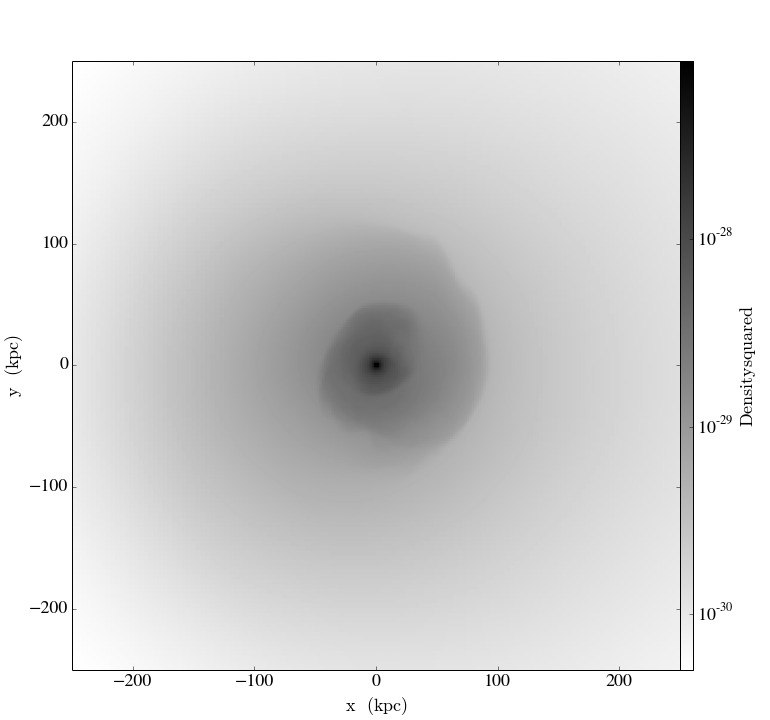
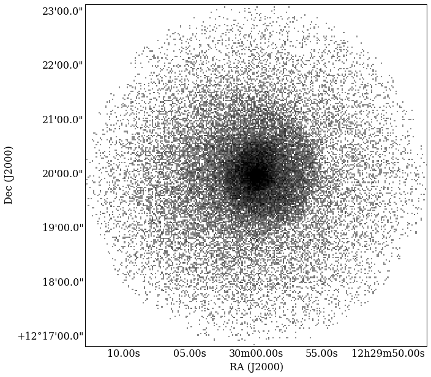
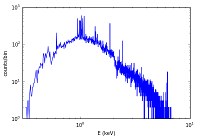
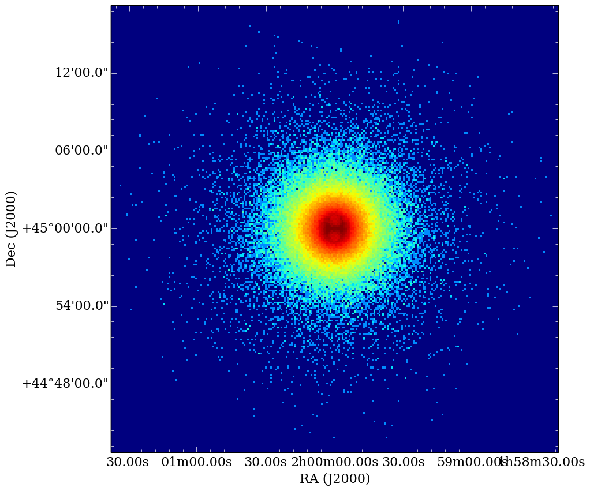
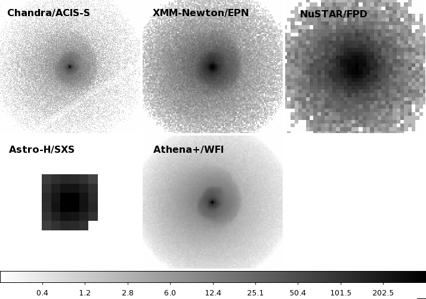
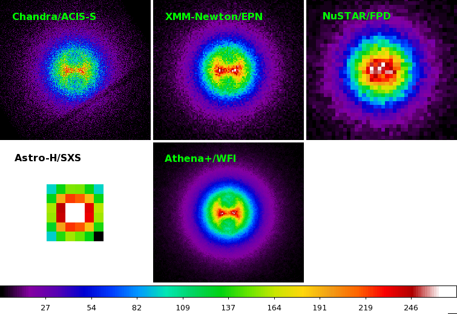

Constructing Mock X-ray Observations
------------------------------------

.. note::

  If you just want to create derived fields for X-ray emission,
  you should go `here <xray_emission_fields.html>`_ instead.

The ``photon_simulator`` analysis module enables the creation of
simulated X-ray photon lists of events from datasets that yt is able
to read. The simulated events then can be exported to X-ray telescope
simulators to produce realistic observations or can be analyzed in-line.
The algorithm is based off of that implemented in
`PHOX <http://www.mpa-garching.mpg.de/~kdolag/Phox/>`_ for SPH datasets
by Veronica Biffi and Klaus Dolag. There are two relevant papers:

`Biffi, V., Dolag, K., Bohringer, H., & Lemson, G. 2012, MNRAS, 420,
3545 <http://adsabs.harvard.edu/abs/2012MNRAS.420.3545B>`_

`Biffi, V., Dolag, K., Bohringer, H. 2013, MNRAS, 428,
1395 <http://adsabs.harvard.edu/abs/2013MNRAS.428.1395B>`_

The basic procedure is as follows:

1. Using a spectral model for the photon flux given the gas properties,
   and an algorithm for generating photons from the dataset loaded in
   yt, produce a large number of photons in three-dimensional space
   associated with the cells of the dataset.
2. Use this three-dimensional dataset as a sample from which to generate
   photon events that are projected along a line of sight, Doppler and
   cosmologically shifted, and absorbed by the Galactic foreground.
3. Optionally convolve these photons with instrument responses and
   produce images and spectra.

We'll demonstrate the functionality on a realistic dataset of a galaxy
cluster to get you started.

.. note::

  Currently, the ``photon_simulator`` analysis module only works with grid-based
  data.
  
Creating an X-ray observation of a dataset on disk
++++++++++++++++++++++++++++++++++++++++++++++++++

.. code:: python

    import yt
    #yt.enable_parallelism() # If you want to run in parallel this should go here!
    from yt.analysis_modules.photon_simulator.api import *
    from yt.utilities.cosmology import Cosmology

.. note::

    For parallel runs using ``mpi4py``, the call to ``yt.enable_parallelism`` should go *before*
    the import of the ``photon_simulator`` module, as shown above.

We're going to load up an Athena dataset of a galaxy cluster core:

.. code:: python

    ds = yt.load("MHDSloshing/virgo_low_res.0054.vtk",
                 units_override={"time_unit":(1.0,"Myr"),
                                 "length_unit":(1.0,"Mpc"),
                                 "mass_unit":(1.0e14,"Msun")})

First, to get a sense of what the resulting image will look like, let's
make a new yt field called ``"density_squared"``, since the X-ray
emission is proportional to :math:`\rho^2`, and a weak function of
temperature and metallicity.

.. code:: python

    def _density_squared(field, data):
        return data["density"]**2
    ds.add_field("density_squared", function=_density_squared, units="g**2/cm**6")

Then we'll project this field along the z-axis.

.. code:: python

    prj = yt.ProjectionPlot(ds, "z", ["density_squared"], width=(500., "kpc"))
    prj.set_cmap("density_squared", "gray_r")
    prj.show()

In this simulation the core gas is sloshing, producing spiral-shaped
cold fronts.

.. note::

   To work out the following examples, you should install
   `AtomDB <http://www.atomdb.org>`_ and get the files from the
   `xray_data <http://yt-project.org/data/xray_data.tar.gz>`_ auxiliary
   data package (see the ``xray_data`` `README <xray_data_README.html>`_ 
   for details on the latter). Make sure that
   in what follows you specify the full path to the locations of these
   files.

To generate photons from this dataset, we have several different things
we need to set up. The first is a standard yt data object. It could
be all of the cells in the domain, a rectangular solid region, a
cylindrical region, etc. Let's keep it simple and make a sphere at the
center of the domain, with a radius of 250 kpc:

.. code:: python

    sp = ds.sphere("c", (250., "kpc"))

This will serve as our ``data_source`` that we will use later. Next, we
need to create the ``SpectralModel`` instance that will determine how
the data in the grid cells will generate photons. By default, two
options are available. The first, ``XSpecThermalModel``, allows one to
use any thermal model that is known to
`XSPEC <https://heasarc.gsfc.nasa.gov/xanadu/xspec/>`_, such as
``"mekal"`` or ``"apec"``:

.. code:: python

    mekal_model = XSpecThermalModel("mekal", 0.01, 10.0, 2000)

This requires XSPEC and
`PyXspec <http://heasarc.gsfc.nasa.gov/xanadu/xspec/python/html/>`_ to
be installed. The second option, ``TableApecModel``, utilizes the data
from the `AtomDB <http://www.atomdb.org>`_ tables. We'll use this one
here:

.. code:: python

    apec_model = TableApecModel("atomdb_v2.0.2",
                                0.01, 20.0, 20000,
                                thermal_broad=False,
                                apec_vers="2.0.2")

The first argument sets the location of the AtomDB files, and the next
three arguments determine the minimum energy in keV, maximum energy in
keV, and the number of linearly-spaced bins to bin the spectrum in. If
the optional keyword ``thermal_broad`` is set to ``True``, the spectral
lines will be thermally broadened.

Now that we have our ``SpectralModel`` that gives us a spectrum, we need
to connect this model to a ``PhotonModel`` that will connect the field
data in the ``data_source`` to the spectral model to actually generate
photons. For thermal spectra, we have a special ``PhotonModel`` called
``ThermalPhotonModel``:

.. code:: python

    thermal_model = ThermalPhotonModel(apec_model, X_H=0.75, Zmet=0.3,
                                       photons_per_chunk=100000000)

Where we pass in the ``SpectralModel``, and can optionally set values for
the hydrogen mass fraction ``X_H`` and metallicity ``Z_met``. If
``Z_met`` is a float, it will assume that value for the metallicity
everywhere in terms of the solar metallicity. If it is a string, it will
assume that is the name of the metallicity field (which may be spatially
varying).

The ``ThermalPhotonModel`` iterates over "chunks" of the supplied data source
to generate the photons, to reduce memory usage and make parallelization more
efficient. For each chunk, memory is set aside for the photon energies that will
be generated. ``photons_per_chunk`` is an optional keyword argument which controls
the size of this array. For large numbers of photons, you may find that
this parameter needs to be set higher, or if you are looking to decrease memory
usage, you might set this parameter lower.

Next, we need to specify "fiducial" values for the telescope collecting
area, exposure time, and cosmological redshift. Remember, the initial
photon generation will act as a source for Monte-Carlo sampling for more
realistic values of these parameters later, so choose generous values so
that you have a large number of photons to sample from. We will also
construct a ``Cosmology`` object:

.. code:: python

    A = 6000.
    exp_time = 4.0e5
    redshift = 0.05
    cosmo = Cosmology()

Now, we finally combine everything together and create a ``PhotonList``
instance:

.. code:: python

    photons = PhotonList.from_scratch(sp, redshift, A, exp_time,
                                      thermal_model, center="c",
                                      cosmology=cosmo)

By default, the angular diameter distance to the object is determined
from the ``cosmology`` and the cosmological ``redshift``. If a
``Cosmology`` instance is not provided, one will be made from the
default cosmological parameters. If your source is local to the galaxy,
you can set its distance directly, using a tuple, e.g.
``dist=(30, "kpc")``. In this case, the ``redshift`` and ``cosmology``
will be ignored. Finally, if the photon generating function accepts any
parameters, they can be passed to ``from_scratch`` via a ``parameters``
dictionary.

At this point, the ``photons`` are distributed in the three-dimensional
space of the ``data_source``, with energies in the rest frame of the
plasma. Doppler and/or cosmological shifting of the photons will be
applied in the next step.

The ``photons`` can be saved to disk in an HDF5 file:

.. code:: python

    photons.write_h5_file("my_photons.h5")

Which is most useful if it takes a long time to generate the photons,
because a ``PhotonList`` can be created in-memory from the dataset
stored on disk:

.. code:: python

    photons = PhotonList.from_file("my_photons.h5")

This enables one to make many simulated event sets, along different
projections, at different redshifts, with different exposure times, and
different instruments, with the same ``data_source``, without having to
do the expensive step of generating the photons all over again!

To get a set of photon events such as that observed by X-ray telescopes,
we need to take the three-dimensional photon distribution and project it
along a line of sight. Also, this is the step at which we put in the
realistic values for the telescope collecting area, cosmological
redshift and/or source distance, and exposure time. The order of
operations goes like this:

1. From the adjusted exposure time, redshift and/or source distance, and
   telescope collecting area, determine the number of photons we will
   *actually* observe.
2. Determine the plane of projection from the supplied normal vector,
   and reproject the photon positions onto this plane.
3. Doppler-shift the photon energies according to the velocity along the
   line of sight, and apply cosmological redshift if the source is not
   local.
4. Optionally, alter the received distribution of photons via an
   energy-dependent galactic absorption model.
5. Optionally, alter the received distribution of photons using an
   effective area curve provided from an ancillary response file (ARF).
6. Optionally, scatter the photon energies into channels according to
   the information from a redistribution matrix file (RMF).

First, if we want to apply galactic absorption, we need to set up a
spectral model for the absorption coefficient, similar to the spectral
model for the emitted photons we set up before. Here again, we have two
options. The first, ``XSpecAbsorbModel``, allows one to use any
absorption model that XSpec is aware of that takes only the Galactic
column density :math:`N_H` as input:

.. code:: python

    N_H = 0.1 
    abs_model = XSpecAbsorbModel("wabs", N_H)  

The second option, ``TableAbsorbModel``, takes as input an HDF5 file
containing two datasets, ``"energy"`` (in keV), and ``"cross_section"``
(in cm2), and the Galactic column density :math:`N_H`:

.. code:: python

    abs_model = TableAbsorbModel("tbabs_table.h5", 0.1)

Now we're ready to project the photons. First, we choose a line-of-sight
vector ``L``. Second, we'll adjust the exposure time and the redshift.
Third, we'll pass in the absorption ``SpectrumModel``. Fourth, we'll
specify a ``sky_center`` in RA,DEC on the sky in degrees.

Also, we're going to convolve the photons with instrument ``responses``.
For this, you need a ARF/RMF pair with matching energy bins. This is of
course far short of a full simulation of a telescope ray-trace, but it's
a quick-and-dirty way to get something close to the real thing. We'll
discuss how to get your simulated events into a format suitable for
reading by telescope simulation codes later.

.. code:: python

    ARF = "chandra_ACIS-S3_onaxis_arf.fits"
    RMF = "chandra_ACIS-S3_onaxis_rmf.fits"
    L = [0.0,0.0,1.0]
    events = photons.project_photons(L, exp_time_new=2.0e5, redshift_new=0.07, absorb_model=abs_model,
                                     sky_center=(187.5,12.333), responses=[ARF,RMF])

Also, the optional keyword ``psf_sigma`` specifies a Gaussian standard
deviation to scatter the photon sky positions around with, providing a
crude representation of a PSF.

.. warning::

   The binned images that result, even if you convolve with responses,
   are still of the same resolution as the finest cell size of the
   simulation dataset. If you want a more accurate simulation of a
   particular X-ray telescope, you should check out `Storing events for future use and for reading-in by telescope simulators`_.

Let's just take a quick look at the raw events object:

.. code:: python

    print events

.. code:: python

    {'eobs': YTArray([  0.32086522,   0.32271389,   0.32562708, ...,   8.90600621,
             9.73534237,  10.21614256]) keV, 
     'xsky': YTArray([ 187.5177707 ,  187.4887825 ,  187.50733609, ...,  187.5059345 ,
            187.49897546,  187.47307048]) degree, 
     'ysky': YTArray([ 12.33519996,  12.3544496 ,  12.32750903, ...,  12.34907707,
            12.33327653,  12.32955225]) degree, 
     'ypix': array([ 133.85374195,  180.68583074,  115.14110561, ...,  167.61447493,
            129.17278711,  120.11508562]), 
     'PI': array([ 27,  15,  25, ..., 609, 611, 672]), 
     'xpix': array([  86.26331108,  155.15934197,  111.06337043, ...,  114.39586907,
            130.93509652,  192.50639633])}

We can bin up the events into an image and save it to a FITS file. The
pixel size of the image is equivalent to the smallest cell size from the
original dataset. We can specify limits for the photon energies to be
placed in the image:

.. code:: python

    events.write_fits_image("sloshing_image.fits", clobber=True, emin=0.5, emax=7.0)

The resulting FITS image will have WCS coordinates in RA and Dec. It
should be suitable for plotting in
`ds9 <http://hea-www.harvard.edu/RD/ds9/site/Home.html>`_, for example.
There is also a great project for opening astronomical images in Python,
called `APLpy <http://aplpy.github.io>`_:

.. code:: python

    import aplpy
    fig = aplpy.FITSFigure("sloshing_image.fits", figsize=(10,10))
    fig.show_colorscale(stretch="log", vmin=0.1, cmap="gray_r")
    fig.set_axis_labels_font(family="serif", size=16)
    fig.set_tick_labels_font(family="serif", size=16)

Which is starting to look like a real observation!

We can also bin up the spectrum into energy bins, and write it to a FITS
table file. This is an example where we've binned up the spectrum
according to the unconvolved photon energy:

.. code:: python

    events.write_spectrum("virgo_spec.fits", energy_bins=True, emin=0.1, emax=10.0, nchan=2000, clobber=True)

If we don't set ``energy_bins=True``, and we have convolved our events
with response files, then any other keywords will be ignored and it will
try to make a spectrum from the channel information that is contained
within the RMF, suitable for analyzing in XSPEC. For now, we'll stick
with the energy spectrum, and plot it up:

.. code:: python

    import astropy.io.fits as pyfits
    f = pyfits.open("virgo_spec.fits")
    pylab.loglog(f["SPECTRUM"].data.field("ENERGY"), f["SPECTRUM"].data.field("COUNTS"))
    pylab.xlim(0.3, 10)
    pylab.xlabel("E (keV)")
    pylab.ylabel("counts/bin")

We can also write the events to a FITS file that is of a format that can
be manipulated by software packages like
`CIAO <http://cxc.harvard.edu/ciao/>`_ and read in by ds9 to do more
standard X-ray analysis:

.. code:: python

    events.write_fits_file("my_events.fits", clobber=True)

.. warning:: We've done some very low-level testing of this feature, and
   it seems to work, but it may not be consistent with standard FITS events
   files in subtle ways that we haven't been able to identify. Please email
   jzuhone@gmail.com if you find any bugs!

Two ``EventList`` instances can be added together, which is useful if they were
created using different data sources:

.. code:: python

    events3 = events1+events2

.. warning:: This only works if the two event lists were generated using
    the same parameters!

Finally, a new ``EventList`` can be created from a subset of an existing ``EventList``,
defined by a ds9 region (this functionality requires the
`pyregion <http://pyregion.readthedocs.org>`_ package to be installed):

.. code:: python

    circle_events = events.filter_events("circle.reg")

Creating a X-ray observation from an in-memory dataset
++++++++++++++++++++++++++++++++++++++++++++++++++++++

It may be useful, especially for observational applications, to create
datasets in-memory and then create simulated observations from
them. Here is a relevant example of creating a toy cluster and evacuating two AGN-blown bubbles in it. 

First, we create the in-memory dataset (see :ref:`loading-numpy-array`
for details on how to do this):

.. code:: python

   import yt
   from yt.utilities.physical_constants import cm_per_kpc, K_per_keV, mp
   from yt.utilities.cosmology import Cosmology
   from yt.analysis_modules.photon_simulator.api import *
   import aplpy

   R = 1000. # in kpc
   r_c = 100. # in kpc
   rho_c = 1.673e-26 # in g/cm^3
   beta = 1. 
   T = 4. # in keV
   nx = 256 

   bub_rad = 30.0
   bub_dist = 50.0

   ddims = (nx,nx,nx)

   x, y, z = np.mgrid[-R:R:nx*1j,
                      -R:R:nx*1j,
                      -R:R:nx*1j]
 
   r = np.sqrt(x**2+y**2+z**2)

   dens = np.zeros(ddims)
   dens[r <= R] = rho_c*(1.+(r[r <= R]/r_c)**2)**(-1.5*beta)
   dens[r > R] = 0.0
   temp = T*K_per_keV*np.ones(ddims)
   rbub1 = np.sqrt(x**2+(y-bub_rad)**2+z**2)
   rbub2 = np.sqrt(x**2+(y+bub_rad)**2+z**2)
   dens[rbub1 <= bub_rad] /= 100.
   dens[rbub2 <= bub_rad] /= 100.
   temp[rbub1 <= bub_rad] *= 100.
   temp[rbub2 <= bub_rad] *= 100.

This created a cluster with a radius of 1 Mpc, a uniform temperature
of 4 keV, and a density distribution from a :math:`\beta`-model. We then
evacuated two "bubbles" of radius 30 kpc at a distance of 50 kpc from
the center. 

Now, we create a yt Dataset object out of this dataset:

.. code:: python

   data = {}
   data["density"] = (dens, "g/cm**3")
   data["temperature"] = (temp, "K")
   data["velocity_x"] = (np.zeros(ddims), "cm/s")
   data["velocity_y"] = (np.zeros(ddims), "cm/s")
   data["velocity_z"] = (np.zeros(ddims), "cm/s")

   bbox = np.array([[-0.5,0.5],[-0.5,0.5],[-0.5,0.5]])

   ds = yt.load_uniform_grid(data, ddims, 2*R*cm_per_kpc, bbox=bbox)

where for simplicity we have set the velocities to zero, though we
could have created a realistic velocity field as well. Now, we
generate the photon and event lists in the same way as the previous
example:

.. code:: python

   sphere = ds.sphere("c", (1.0,"Mpc"))
       
   A = 6000.
   exp_time = 2.0e5
   redshift = 0.05
   cosmo = Cosmology()

   apec_model = TableApecModel("/Users/jzuhone/Data/atomdb_v2.0.2",
                               0.01, 20.0, 20000)
   abs_model = TableAbsorbModel("tbabs_table.h5", 0.1)

   thermal_model = ThermalPhotonModel(apec_model)
   photons = PhotonList.from_scratch(sphere, redshift, A,
                                     exp_time, thermal_model, center="c")

   events = photons.project_photons([0.0,0.0,1.0], 
                                    responses=["sim_arf.fits","sim_rmf.fits"], 
                                    absorb_model=abs_model)

   events.write_fits_image("img.fits", clobber=True)

which yields the following image:

.. code:: python

   fig = aplpy.FITSFigure("img.fits", figsize=(10,10))
   fig.show_colorscale(stretch="log", vmin=0.1, vmax=600., cmap="jet")
   fig.set_axis_labels_font(family="serif", size=16)
   fig.set_tick_labels_font(family="serif", size=16)

Storing events for future use and for reading-in by telescope simulators
++++++++++++++++++++++++++++++++++++++++++++++++++++++++++++++++++++++++

If you want a more accurate representation of an observation taken by a
particular instrument, there are tools available for such purposes. For
the *Chandra* telescope, there is the venerable
`MARX <http://space.mit.edu/ASC/MARX/>`_. For a wide range of
instruments, both existing and future, there is
`SIMX <http://hea-www.harvard.edu/simx/>`_. We'll discuss two ways
to store your event files so that they can be input by these and other
codes.

The first option is the most general, and the simplest: simply dump the
event data to an HDF5 file:

.. code:: python

   events.write_h5_file("my_events.h5")

This will dump the raw event data, as well as the associated parameters,
into the file. If you want to read these events back in, it's just as
simple:

.. code:: python

   events = EventList.from_h5_file("my_events.h5")

You can use event data written to HDF5 files to input events into MARX
using `this code <http://bitbucket.org/jzuhone/yt_marx_source>`_.

The second option, for use with SIMX, is to dump the events into a
SIMPUT file:

.. code:: python

   events.write_simput_file("my_events", clobber=True, emin=0.1, emax=10.0)

which will write two files, ``"my_events_phlist.fits"`` and
``"my_events_simput.fits"``, the former being a auxiliary file for the
latter. 

.. note:: You can only write SIMPUT files if you didn't convolve
   the photons with responses, since the idea is to pass unconvolved
   photons to the telescope simulator.

The following images were made from the same yt-generated events in both MARX and
SIMX. They are 200 ks observations of the two example clusters from above
(the Chandra images have been reblocked by a factor of 4):

