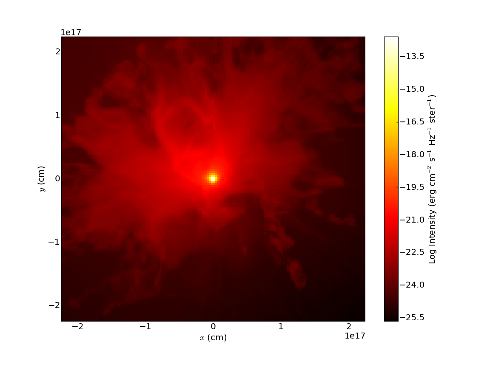

.. _radmc3d_export:

Exporting to RADMC-3D
=====================

.. sectionauthor:: Andrew Myers <atmyers2@gmail.com>
.. versionadded:: 2.6

.. figure:: _images/31micron.png

    Above: a sample image showing the continuum dust emission image around a massive protostar
    made using RADMC-3D and plotted with pyplot.

`RADMC-3D
<http://www.ita.uni-heidelberg.de/~dullemond/software/radmc-3d/>`_ is a 
three-dimensional Monte-Carlo radiative transfer code that is capable of 
handling both line and continuum emission. yt comes equipped with a  
:class:`~yt.analysis_modules.radmc3d_export.RadMC3DInterface.RadMC3DWriter`
class that exports AMR data to a format that RADMC-3D can read. Currently, only
the ASCII-style data format is supported.  
In principle, this allows one to use RADMC-3D to make synthetic observations 
from any simulation data format that yt recognizes.

Continuum Emission
------------------

To compute thermal emission intensities, RADMC-3D needs several inputs files that
describe the spatial distribution of the dust and photon sources. To create these
files, first import the RADMC-3D exporter, which is not loaded into your environment 
by default:

.. code-block:: python

    import yt
    import numpy as np
    from yt.analysis_modules.radmc3d_export.api import RadMC3DWriter, RadMC3DSource

Next, load up a dataset and instantiate the :class:`~yt.analysis_modules.radmc3d_export.RadMC3DInterface.RadMC3DWriter`.
For this example, we'll use the "StarParticle" dataset,
available `here
<http://yt-project.org/data/>`_. 

.. code-block:: python

    ds = yt.load("StarParticles/plrd01000/")
    writer = RadMC3DWriter(ds)

The first data file to create is the "amr_grid.inp" file, which describes the structure 
of the AMR index. To create this file, simply call:

.. code-block:: python

    writer.write_amr_grid()

Next, we must give RADMC-3D information about the dust density. To do this, we
define a field that calculates the dust density in each cell. We 
assume a constant dust-to-gas mass ratio of 0.01:

.. code-block:: python

    dust_to_gas = 0.01
    def _DustDensity(field, data):
        return dust_to_gas * data["density"]
    ds.add_field(("gas", "dust_density"), function=_DustDensity, units="g/cm**3")

We save this information into a file called "dust_density.inp".

.. code-block:: python

    writer.write_dust_file(("gas", "dust_density"), "dust_density.inp")

Finally, we must give RADMC-3D information about any stellar sources that are
present. To do this, we have provided the 
:class:`~yt.analysis_modules.radmc3d_export.RadMC3DInterface.RadMC3DSource`
class. For this example, we place a single source with temperature 5780 K
at the center of the domain:

.. code-block:: python

    radius_cm = 6.96e10
    mass_g = 1.989e33
    position_cm = [0.0, 0.0, 0.0]
    temperature_K = 5780.0
    star = RadMC3DSource(radius_cm, mass_g, position_cm, temperature_K)

    sources_list = [star]
    wavelengths_micron = np.logspace(-1.0, 4.0, 1000)

    writer.write_source_files(sources_list, wavelengths_micron)

The last line creates the files "stars.inp" and "wavelength_micron.inp",
which describe the locations and spectra of the stellar sources as well
as the wavelengths RADMC-3D will use in it's calculations.  

If everything goes correctly, after executing the above code, you should have
the files "amr_grid.inp", "dust_density.inp", "stars.inp", and "wavelength_micron.inp"
sitting in your working directory. RADMC-3D needs a few more configuration files to 
compute the thermal dust emission. In particular, you need an opacity file, like the 
"dustkappa_silicate.inp" file included in RADMC-3D, a main "radmc3d.inp" file that sets
some runtime parameters, and a "dustopac.inp" that describes the assumed composition of the dust.
yt cannot make these files for you; in the example that follows, we used a 
"radmc3d.inp" file that looked like:

::

    nphot = 1000000
    nphot_scat = 1000000

which basically tells RADMC-3D to use 1,000,000 photon packets instead of the default 100,000. The 
"dustopac.inp" file looked like:

::

    2
    1
    -----------------------------
    1
    0
    silicate
    -----------------------------   

To get RADMC-3D to compute the dust temperature, run the command:

::

   ./radmc3D mctherm 

in the directory that contains your "amr_grid.inp", "dust_density.inp", "stars.inp", "wavelength_micron.inp",
"radmc3d.inp", "dustkappa_silicate.inp", and "dustopac.inp" files. If everything goes correctly, you should
get a "dust_temperature.dat" file in your working directory. Once that file is generated, you can use
RADMC-3D to generate SEDs, images, and so forth. For example, to create an image at 31 microns, do the command:

::

   ./radmc3d image lambda 31 sizeau 30000 npix 800

which should create a file called "image.out". You can view this image using pyplot or whatever other
plotting package you want. To facilitate this, we provide helper functions
that parse the image.out file, returning a header dictionary with some useful metadata
and an np.array containing the image values. To plot this image in pyplot, you could do something like:

.. code-block:: python

   import matplotlib.pyplot as plt
   import numpy as np
   from yt.analysis_modules.radmc3d_export.api import read_radmc3d_image
   header, image = read_radmc3d_image("image.out")

   Nx = header['Nx']
   Ny = header['Ny']

   x_hi = 0.5*header["pixel_size_cm_x"]*Nx
   x_lo = -x_hi
   y_hi = 0.5*header["pixel_size_cm_y"]*Ny
   y_lo = -y_hi
   
   X = np.linspace(x_lo, x_hi, Nx) 
   Y = np.linspace(y_lo, y_hi, Ny) 

   plt.pcolormesh(X, Y, np.log10(image), cmap='hot')
   cbar = plt.colorbar()
   plt.axis((x_lo, x_hi, y_lo, y_hi))
   ax = plt.gca()
   ax.set_xlabel(r"$x$ (cm)")
   ax.set_ylabel(r"$y$ (cm)")
   cbar.set_label(r"Log Intensity (erg cm$^{-2}$ s$^{-1}$ Hz$^{-1}$ ster$^{-1}$)")
   plt.savefig('dust_continuum.png')

The resulting image should look like:

This barely scratches the surface of what you can do with RADMC-3D. Our goal here is
just to describe how to use yt to export the data it knows about (densities, stellar
sources, etc.) into a format that RADMC-3D can recognize.

Line Emission
-------------

The file format required for line emission is slightly different. The 
following script will generate two files, one called "numderdens_co.inp", 
which contains the number density of CO molecules for every cell in the index, 
and another called "gas-velocity.inp", which is useful if you want to include 
doppler broadening.

.. code-block:: python

    import yt
    from yt.analysis_modules.radmc3d_export.api import RadMC3DWriter

    x_co = 1.0e-4
    mu_h = yt.YTQuantity(2.34e-24, 'g')
    def _NumberDensityCO(field, data):
        return (x_co/mu_h)*data["density"]
    yt.add_field(("gas", "number_density_CO"), function=_NumberDensityCO, units="cm**-3")
    
    ds = yt.load("IsolatedGalaxy/galaxy0030/galaxy0030")
    writer = RadMC3DWriter(ds)
    
    writer.write_amr_grid()
    writer.write_line_file(("gas", "number_density_CO"), "numberdens_co.inp")
    velocity_fields = ["velocity_x", "velocity_y", "velocity_z"]
    writer.write_line_file(velocity_fields, "gas_velocity.inp") 
