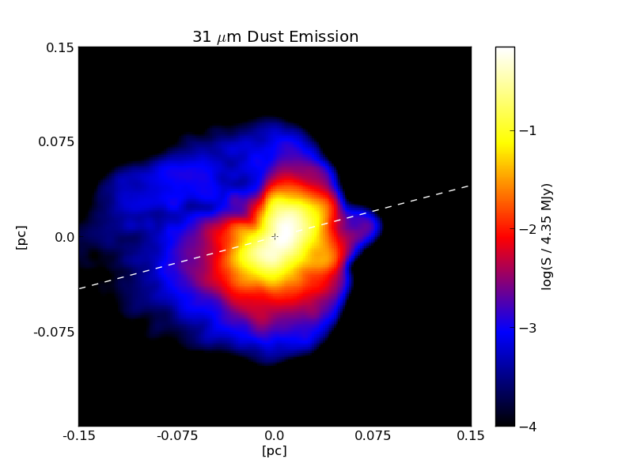

.. _radmc3d_export:

Exporting to RADMC-3D
=====================

.. sectionauthor:: Andrew Myers <atmyers2@gmail.com>
.. versionadded:: 2.6

.. note:: 

    As of :code:`yt-3.0`, the radial column density analysis module is not
    currently functional.  This functionality is still available in
    :code:`yt-2.x`.  If you would like to use these features in :code:`yt-3.x`,
    help is needed to port them over.  Contact the yt-users mailing list if you
    are interested in doing this.

`RADMC-3D
<http://www.ita.uni-heidelberg.de/~dullemond/software/radmc-3d/>`_ is a three-dimensional Monte-Carlo radiative transfer code
that is capable of handling both line and continuum emission. The :class:`~yt.analysis_modules.radmc3d_export.RadMC3DInterface.RadMC3DWriter`
class saves AMR data to disk in an ACSII format that RADMC-3D can read. 
In principle, this allows one to use RADMC-3D to make synthetic observations 
from any simulation data format that yt recognizes.

Continuum Emission
------------------

To compute thermal emission intensities, RADMC-3D needs a file called
"dust_density.inp" that specifies the density of dust for every cell in the AMR
index. To generate this file, first import the RADMC-3D exporter, which 
is not loaded into your environment by default:

.. code-block:: python

    from yt.mods import *
    from yt.analysis_modules.radmc3d_export.api import *

Then, define a field that calculates the dust density in each cell. Here, we assume
a constant dust-to-gas mass ratio of 0.01:

.. code-block:: python

    dust_to_gas = 0.01
    def _DustDensity(field, data):
        return dust_to_gas*data["density"]
    add_field("DustDensity", function=_DustDensity)

Now load up a dataset and call the
:class:`~yt.analysis_modules.radmc3d_export.RadMC3DInterface.RadMC3DWriter`:

.. code-block:: python

    ds = load("galaxy0030/galaxy0030")
    writer = RadMC3DWriter(ds)
    
    writer.write_amr_grid()
    writer.write_dust_file("DustDensity", "dust_density.inp")

The method write_amr_grid() creates an "amr_grid.inp" file that tells RADMC-3D how
to interpret the rest of the data, while "dust_density.inp" contains the actual data field. 

We can also supply temperature information. The following code creates a "DustTemperature"
field that is constant at 10 K, and saves it into a file called "dust_temperature.inp"

.. code-block:: python

    def _DustTemperature(field, data):
        return 10.0*data["Ones"]
    add_field("DustTemperature", function=_DustTemperature)
    
    writer.write_dust_file("DustTemperature", "dust_temperature.inp")

With the "amr_grid.inp", "dust_density.inp", and "dust_temperature.inp" files, RADMC-3D
has everything it needs to compute the thermal dust emission (you may also have to include
the location and spectra of any sources, which currently must be done manually). 
The result is something that looks like this:

Line Emission
-------------

The file format required for line emission is slightly different. The following script will generate 
two files, one called "numderdens_co.inp", which contains the number density of CO molecules
for every cell in the index, and another called "gas-velocity.inp", which is useful if you want 
to include doppler broadening.

.. code-block:: python

    from yt.mods import *
    from yt.analysis_modules.radmc3d_export.api import *

    x_co = 1.0e-4
    mu_h = 2.34e-24
    def _NumberDensityCO(field, data):
        return (x_co/mu_h)*data["density"]
    add_field("NumberDensityCO", function=_NumberDensityCO)
    
    ds = load("galaxy0030/galaxy0030")
    writer = RadMC3DWriter(ds)
    
    writer.write_amr_grid()
    writer.write_line_file("NumberDensityCO", "numberdens_co.inp")
    velocity_fields = ["velocity_x", "velocity_y", "velocity_z"]
    writer.write_line_file(velocity_fields, "gas_velocity.inp") 
