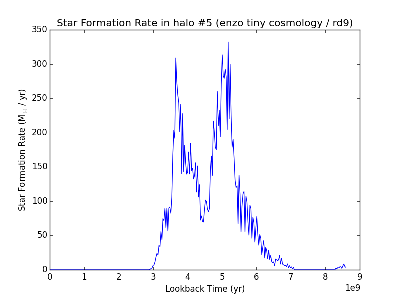
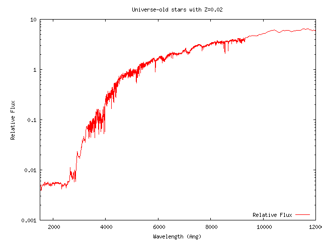

.. _star_analysis:

Star Particle Analysis
======================
.. sectionauthor:: Stephen Skory <sskory@physics.ucsd.edu>
.. versionadded:: 1.6

This document describes tools in yt for analyzing star particles.
The Star Formation Rate tool bins stars by time to produce star formation
statistics over several metrics.
A synthetic flux spectrum and a spectral energy density plot can be calculated
with the Spectrum tool.

.. _star_formation_rate:

Star Formation Rate
-------------------

This tool can calculate various star formation statistics binned over time.
As input it can accept either a yt ``data_source``, such as a region or 
sphere (see :ref:`available-objects`), or arrays containing the data for
the stars you wish to analyze.

This example will analyze all the stars in the volume:

.. code-block:: python

  import yt
  from yt.analysis_modules.star_analysis.api import StarFormationRate
  ds = yt.load("Enzo_64/DD0030/data0030")
  ad = ds.all_data()
  sfr = StarFormationRate(ds, data_source=ad)

or just a small part of the volume i.e. a small sphere at the center of the
simulation volume with radius 10% the box size:

.. code-block:: python

  import yt
  from yt.analysis_modules.star_analysis.api import StarFormationRate
  ds = yt.load("Enzo_64/DD0030/data0030")
  sp = ds.sphere([0.5, 0.5, 0.5], 0.1)
  sfr = StarFormationRate(ds, data_source=sp)

If the stars to be analyzed cannot be defined by a ``data_source``, YTArrays can
be passed. For backward compatibility it is also possible to pass generic numpy
arrays. In this case, the units for the ``star_mass`` must be in
:math:`(\mathrm{\rm{M}_\odot})`, the ``star_creation_time`` in code units, and
the volume must be specified in :math:`(\mathrm{\rm{Mpc}})` as a float (but it
doesn't have to be correct depending on which statistic is important).

.. code-block:: python

  import yt
  from yt.analysis_modules.star_analysis.api import StarFormationRate
  from yt.data_objects.particle_filters import add_particle_filter

  def Stars(pfilter, data):
        return data[("all", "particle_type")] == 2
  add_particle_filter("stars", function=Stars, filtered_type='all',
                      requires=["particle_type"])

  ds = yt.load("enzo_tiny_cosmology/RD0009/RD0009")
  ds.add_particle_filter('stars')
  v, center = ds.find_max("density")
  sp = ds.sphere(center, (50, "kpc"))

  # This puts the particle data for *all* the particles in the sphere sp
  # into the arrays sm and ct.
  mass = sp[("stars", "particle_mass")].in_units('Msun')
  age = sp[("stars", "age")].in_units('Myr')
  ct = sp[("stars", "creation_time")].in_units('Myr')

  # Pick out only old stars using Numpy array fancy indexing.
  threshold = ds.quan(100.0, "Myr")
  mass_old = mass[age > threshold]
  ct_old = ct[age > threshold]

  sfr = StarFormationRate(ds, star_mass=mass_old, star_creation_time=ct_old,
                          volume=sp.volume())

To output the data to a text file, use the command ``.write_out``:

.. code-block:: python

  sfr.write_out(name="StarFormationRate.out")

In the file ``StarFormationRate.out``, there are seven columns of data:

  1. Time (yr)
  2. Look-back time (yr)
  3. Redshift
  4. Star formation rate in this bin per year :math:`(\mathrm{\rm{M}_\odot / \rm{yr}})`
  5. Star formation rate in this bin per year per Mpc**3 :math:`(\mathrm{\rm{M}_\odot / \rm{h} / \rm{Mpc}^3})`
  6. Stars formed in this time bin :math:`(\mathrm{\rm{M}_\odot})`
  7. Cumulative stars formed up to this time bin :math:`(\mathrm{\rm{M}_\odot})`

The output is easily plotted. This is a plot for some test data (that may or may not 
correspond to anything physical) using columns #2 and #4 for the x and y
axes, respectively:

It is possible to access the output of the analysis without writing to disk.
Attached to the ``sfr`` object are the following arrays which are identical
to the ones that are saved to the text file as above:

  1. ``sfr.time``
  2. ``sfr.lookback_time``
  3. ``sfr.redshift``
  4. ``sfr.Msol_yr``
  5. ``sfr.Msol_yr_vol``
  6. ``sfr.Msol``
  7. ``sfr.Msol_cumulative``

.. _synthetic_spectrum:

Synthetic Spectrum Generator
----------------------------

Based on code generously provided by Kentaro Nagamine <kn@physics.unlv.edu>,
this will generate a synthetic spectrum for the stars using the publicly-available
tables of Bruzual & Charlot (hereafter B&C). Please see their `2003 paper
<http://adsabs.harvard.edu/abs/2003MNRAS.344.1000B>`_ for more information
and the `main data
distribution page <http://www.cida.ve/~bruzual/bc2003>`_ for the original data.
Based on the mass, age and metallicity of each star, a cumulative spectrum is
generated and can be output in two ways, either raw, or as a spectral
energy distribution.

This analysis toolkit reads in the B&C data from HDF5 files that have been
converted from the original ASCII files (available at the link above). The
HDF5 files are one-quarter the size of the ASCII files, and greatly reduce
the time required to read the data off disk. The HDF5 files are available from
the main yt website `here <http://yt-project.org/data/bc03.tar.gz>`_.
Both the Salpeter and Chabrier models have been converted,
and it is simplest to download all the files to the same location.
Please read the original B&C sources for information on the differences between
the models.

In order to analyze stars, first the Bruzual & Charlot data tables need to be
read in from disk. This is accomplished by initializing ``SpectrumBuilder`` and
specifying the location of the HDF5 files with the ``bcdir`` parameter.
The models are chosen with the ``model`` parameter, which is either
*"chabrier"* or *"salpeter"*.

.. code-block:: python

  import yt
  from yt.analysis_modules.star_analysis.api import SpectrumBuilder
  ds = yt.load("enzo_tiny_cosmology/RD0009/RD0009")
  spec = SpectrumBuilder(ds, bcdir="bc", model="chabrier")

In order to analyze a set of stars, use the ``calculate_spectrum`` command.
It accepts either a ``data_source``, or a set of YTarrays with the star 
information. Continuing from the above example:

.. code-block:: python

  v, center = ds.find_max("density")
  sp = ds.sphere(center, (50, "kpc"))
  spec.calculate_spectrum(data_source=sp)

If a subset of stars are desired, call it like this:

.. code-block:: python

  from yt.data_objects.particle_filters import add_particle_filter

  def Stars(pfilter, data):
      return data[("all", "particle_type")] == 2
  add_particle_filter("stars", function=Stars, filtered_type='all',
                      requires=["particle_type"])

  # Pick out only old stars using Numpy array fancy indexing.
  threshold = ds.quan(100.0, "Myr")
  mass_old = sp[("stars", "age")][age > threshold]
  metal_old = sp[("stars", "metallicity_fraction")][age > threshold]
  ct_old = sp[("stars", "creation_time")][age > threshold]

  spec.calculate_spectrum(star_mass=mass_old, star_creation_time=ct_old,
                          star_metallicity_fraction=metal_old)

For backward compatibility numpy arrays can be used instead for ``star_mass``
(in units :math:`\mathrm{\rm{M}_\odot}`), ``star_creation_time`` and
``star_metallicity_fraction`` (in code units).
Alternatively, when using either a ``data_source`` or individual arrays,
the option ``star_metallicity_constant`` can be specified to force all the
stars to have the same metallicity. If arrays are being used, the
``star_metallicity_fraction`` array need not be specified.

.. code-block:: python

  # Make all the stars have solar metallicity.
  spec.calculate_spectrum(data_source=sp, star_metallicity_constant=0.02)

Newly formed stars are often shrouded by thick gas. With the ``min_age`` option
of ``calculate_spectrum``, young stars can be excluded from the spectrum.
The units are in years.
The default is zero, which is equivalent to including all stars.

.. code-block:: python

  spec.calculate_spectrum(data_source=sp, star_metallicity_constant=0.02,
                          min_age=ds.quan(1.0, "Myr"))

There are two ways to write out the data once the spectrum has been calculated.
The command ``write_out`` outputs two columns of data:

  1. Wavelength :math:`(\text{\AA})`
  2. Flux (Luminosity per unit wavelength :math:`(\mathrm{\rm{L}_\odot} / \text{\AA})` , where 
       :math:`\mathrm{\rm{L}_\odot} = 3.826 \cdot 10^{33}\, \mathrm{ergs / s}` ).

and can be called simply, specifying the output file:

.. code-block:: python

  spec.write_out(name="spec.out")

The other way is to output a spectral energy density plot. Along with the
``name`` parameter, this command can also take the ``flux_norm`` option,
which is the wavelength in Angstroms of the flux to normalize the 
distribution to. The default is 5200 Angstroms. This command outputs the data
in two columns:

  1. Wavelength :math:`(\text{\AA})`
  2. Relative flux normalized to the flux at *flux_norm*.

.. code-block:: python

  spec.write_out_SED(name="SED.out", flux_norm=5200)

Below is an example of an absurd SED for universe-old stars all with 
solar metallicity at a redshift of zero. Note that even in this example,
a ``ds`` is required.

.. code-block:: python

  import yt
  import numpy as np
  from yt.analysis_modules.star_analysis.api import SpectrumBuilder

  ds = yt.load("Enzo_64/DD0030/data0030")
  spec = SpectrumBuilder(ds, bcdir="bc", model="chabrier")
  sm = np.ones(100)
  ct = np.zeros(100)
  spec.calculate_spectrum(star_mass=sm, star_creation_time=ct,
                          star_metallicity_constant=0.02)
  spec.write_out_SED('SED.out')

And the plot:

Iterate Over a Number of Halos
^^^^^^^^^^^^^^^^^^^^^^^^^^^^^^

In this example below, the halos for a dataset are found, and the SED is calculated
and written out for each.

.. code-block:: python

  import yt
  from yt.analysis_modules.star_analysis.api import SpectrumBuilder
  from yt.data_objects.particle_filters import add_particle_filter
  from yt.analysis_modules.halo_finding.api import HaloFinder

  def Stars(pfilter, data):
      return data[("all", "particle_type")] == 2
  add_particle_filter("stars", function=Stars, filtered_type='all',
                      requires=["particle_type"])

  ds = yt.load("enzo_tiny_cosmology/RD0009/RD0009")
  ds.add_particle_filter('stars')
  halos = HaloFinder(ds, dm_only=False)
  # Set up the spectrum builder.
  spec = SpectrumBuilder(ds, bcdir="bc", model="salpeter")

  # Iterate over the halos.
  for halo in halos:
      sp = halo.get_sphere()
      spec.calculate_spectrum(
          star_mass=sp[("stars", "particle_mass")],
          star_creation_time=sp[("stars", "creation_time")],
          star_metallicity_fraction=sp[("stars", "metallicity_fraction")])
      # Write out the SED using the default flux normalization.
      spec.write_out_SED(name="halo%05d.out" % halo.id)
