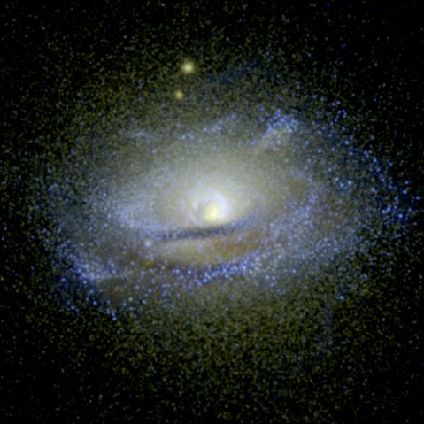

.. _sunrise_export:

Exporting to Sunrise
====================

.. sectionauthor:: Christopher Moody <cemoody@ucsc.edu>
.. versionadded:: 1.8

.. note:: 

    As of :code:`yt-3.0`, the sunrise exporter is not currently functional.
    This functionality is still available in :code:`yt-2.x`.  If you would like
    to use these features in :code:`yt-3.x`, help is needed to port them over.
    Contact the yt-users mailing list if you are interested in doing this.

The yt-Sunrise exporter essentially takes grid cell data and translates it into a binary octree format, attaches star particles, and saves the output to a FITS file Sunrise can read. For every cell, the gas mass, metals mass (a fraction of which is later assumed to be in the form of dust), and the temperature are saved. Star particles are defined entirely by their mass, position, metallicity, and a 'radius.' This guide outlines the steps to exporting the data, troubleshoots common problems, and reviews recommended sanity checks. 

Simple Export
-------------

The code outlined here is a barebones Sunrise export:

.. code-block:: python

	from yt.mods import *
	import numpy as na

	ds = ARTDataset(file_amr)
	potential_value,center=ds.find_min('Potential_New')
	root_cells = ds.domain_dimensions[0]
	le = np.floor(root_cells*center) #left edge
	re = np.ceil(root_cells*center) #right edge
	bounds = [(le[0], re[0]-le[0]), (le[1], re[1]-le[1]), (le[2], re[2]-le[2])] 
	#bounds are left edge plus a span
	bounds = numpy.array(bounds,dtype='int')
	amods.sunrise_export.export_to_sunrise(ds, out_fits_file,subregion_bounds = bounds)

To ensure that the camera is centered on the galaxy, we find the center by finding the minimum of the gravitational potential. The above code takes that center, and casts it in terms of which root cells should be extracted. At the moment, Sunrise accepts a strict octree, and you can only extract a 2x2x2 domain on the root grid, and not an arbitrary volume. See the optimization section later for workarounds. On my reasonably recent machine, the export process takes about 30 minutes.

Some codes do not yet enjoy full yt support. As a result, export_to_sunrise() can manually include particles in the yt output fits file:

.. code-block:: python

	import pyfits

	col_list = []
	col_list.append(pyfits.Column("ID", format="I", array=np.arange(mass_current.size)))
	col_list.append(pyfits.Column("parent_ID", format="I", array=np.arange(mass_current.size)))
	col_list.append(pyfits.Column("position", format="3D", array=pos, unit="kpc"))
	col_list.append(pyfits.Column("velocity", format="3D", array=vel, unit="kpc/yr"))
	col_list.append(pyfits.Column("creation_mass", format="D", array=mass_initial, unit="Msun"))
	col_list.append(pyfits.Column("formation_time", format="D", array=formation_time, unit="yr"))
	col_list.append(pyfits.Column("radius", format="D", array=star_radius, unit="kpc"))
	col_list.append(pyfits.Column("mass", format="D", array=mass_current, unit="Msun"))
	col_list.append(pyfits.Column("age_m", format="D", array=age, unit="yr"))
	col_list.append(pyfits.Column("age_l", format="D", array=age, unit="yr"))
	col_list.append(pyfits.Column("metallicity", format="D",array=z))
	col_list.append(pyfits.Column("L_bol", format="D",array=np.zeros(mass_current.size)))
	cols = pyfits.ColDefs(col_list)

	amods.sunrise_export.export_to_sunrise(ds, out_fits_file,write_particles=cols,
	    subregion_bounds = bounds)

This code snippet takes the stars in a region outlined by the ``bounds`` variable, organizes them into pyfits columns which are then passed to export_to_sunrise. Note that yt units are in CGS, and Sunrise accepts units in (physical) kpc, kelvin, solar masses, and years.  

Remember that in Sunrise, photons are not spawned at the exact point of the star particle, but stochastically in a radius around it. Default to setting this radius to the resolution (or smoothing kernel) of your simulation - and then test that Sunrise is not sensitive to a doubling or halving of this number. 

Sanity Check: Young Stars
-------------------------

Young stars are treated in a special way in Sunrise. Stars under 10 Myr do not emit in the normal fashion; instead they are replaced with MAPPINGS III particles that emulate the emission characteristics of star forming clusters. Among other things this involves a calculation of the local pressure, P/k, which Sunrise reports for debugging purposes and is something you should also check. 

The code snippet below finds the location of every star under 10 Myr and looks up the cell containing it:

.. code-block:: python

	for x,a in enumerate(zip(pos,age)): #loop over stars
	    center = x*ds['kpc']
	    grid,idx = find_cell(ds.index.grids[0],center)
	    pk[i] = grid['Pk'][idx]

This code is how Sunrise calculates the pressure, so we can add our own derived field:

.. code-block:: python

	def _Pk(field,data):
	    #calculate pressure over Boltzmann's constant: P/k=(n/V)T
	    #Local stellar ISM values are ~16500 Kcm^-3
	    vol = data['cell_volume'].astype('float64')*data.ds['cm']**3.0 #volume in cm
	    m_g = data["cell_mass"]*1.988435e33 #mass of H in g
	    n_g = m_g*5.97e23 #number of H atoms
	    teff = data["temperature"]
	    val = (n_g/vol)*teff #should be of order 1e2-1e5
	    return  val
	add_field("Pk", function=_Pk,units=r"Kcm^{-3}")

This snippet locates the cell containing a star and returns the grid and grid id.

.. code-block:: python

	def find_cell(grid,position):
	    x=grid
	    #print grid.LeftEdge
	    for child in grid.Children:
	        if numpy.all(child.LeftEdge  < position) and\
	           numpy.all(child.RightEdge > position):
	            return find_cell(child,position)

	    #if the point is not contained within any of the child grids
	    #find it within the extent of the current grid
	    le,re = x.LeftEdge,x.RightEdge
	    ad = x.ActiveDimensions
	    span = (re-le)/ad
	    idx = (position-le)/span
	    idx = numpy.floor(idx)
	    idx = numpy.int64(idx)
	    assert numpy.all(idx < ad)
	    return grid,idx

Sanity Check: Gas & Stars Line Up
---------------------------------

If you add your star particles separately from the gas cell index, then it is worth checking that they still lined up once they've been loaded into Sunrise. This is fairly easy to do with a useful 'auxiliary' run. In Sunrise, set all of your rays to zero, (nrays_nonscatter, nrays_scatter,nrays_intensity,nrays_ir ) except for nrays_aux, and this will produce an mcrx FITS file with a gas map, a metals map, a temperature*gass_mass map and a stellar map for each camera. As long as you keep some cameras at theta,phi = 0,0 or 90,0, etc., then a standard yt projection down the code's xyz axes should look identical:

.. code-block:: python

	pc.add_projection("density", 0, "density")  

Convergence: High Resolution
----------------------------

At the moment, yt exports are the only grid data format Sunrise accepts. Otherwise, Sunrise typically inputs SPH particles or AREPO Voronoi grids.  Among the many convergence checks you should perform is a high resolution check, which subdivides all leaves in the octree and copies the parent data into them, effectively increasing the resolution but otherwise not adding more information. Sunrise should yield similar results, and it is worth checking that indeed it does. Do so by just passing export_to_sunrise(...,dummy_subdivide=True). The resulting file should be slightly less than 8 times larger because of newly added cells.

Other checks:
-------------

Check that the width of your extracted region is at least the size of your camera's field of view. It should probably be significantly larger than your FOV, and cutting that short could throw out otherwise interesting objects. 

A good idea is to leverage yt to find the inertia tensor of the stars, find the rotation matrix that diagonalizes it, and use that to define cameras for Sunrise. Unless your code grid is aligned with your galaxy, this is required for getting edge-on or face-on shots.

The final product:
------------------

Above is a false color image where RGB are assigned to IR, optical and UV broadband filters, respectively. 

