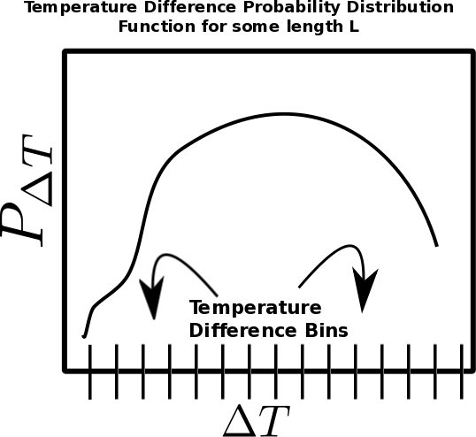
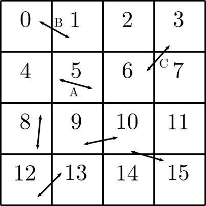
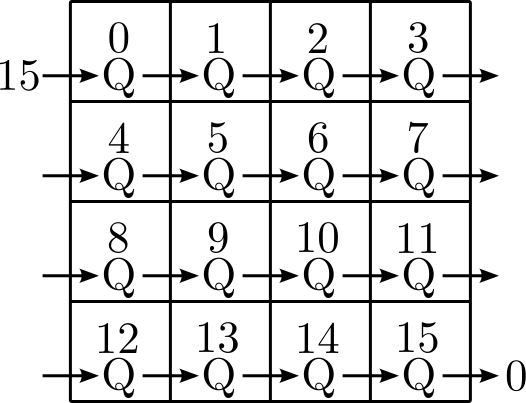
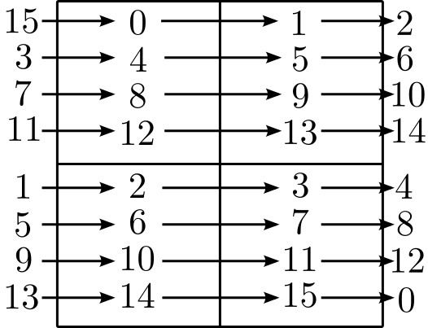
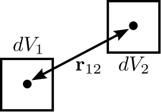

.. _two_point_functions:

Two Point Functions
===================
.. sectionauthor:: Stephen Skory <sskory@physics.ucsd.edu>
.. versionadded:: 1.7

.. note:: 

    As of :code:`yt-3.0`, the two point function analysis module is not
    currently functional.  This functionality is still available in
    :code:`yt-2.x`.  If you would like to use these features in :code:`yt-3.x`,
    help is needed to port them over.  Contact the yt-users mailing list if you
    are interested in doing this.

The Two Point Functions framework (TPF) is capable of running several
multi-dimensional two point functions simultaneously on a dataset using
memory and workload parallelism.
Examples of two point functions are structure functions and two-point
correlation functions.
It can analyze the entire simulation, or a small rectangular subvolume.
The results can be output in convenient text format and in efficient
HDF5 files.

Requirements
------------

The TPF relies on the Fortran kD-tree that is used
by the parallel HOP halo finder. The kD-tree is not built by default with yt
so it must be built by hand.

Quick Example
-------------

It is very simple to setup and run a structure point function on a dataset.
The script below will output the RMS velocity difference over the entire volume
for a range of distances. There are some brief comments given below for each
step.

.. code-block:: python

    from yt.mods import *
    from yt.analysis_modules.two_point_functions.api import *
    
    ds = load("data0005")
    
    # Calculate the S in RMS velocity difference between the two points.
    # All functions have five inputs. The first two are containers
    # for field values, and the second two are the raw point coordinates
    # for the point pair. The fifth is the normal vector between the two points
    # in r1 and r2. Not all the inputs must be used.
    # The name of the function is used to name output files.
    def rms_vel(a, b, r1, r2, vec):
        vdiff = a - b
        np.power(vdiff, 2.0, vdiff)
        vdiff = np.sum(vdiff, axis=1)
        return vdiff

    
    # Initialize a function generator object.
    # Set the input fields for the function(s),
    # the number of pairs of points to calculate, how big a data queue to
    # use, the range of pair separations and how many lengths to use, 
    # and how to divide that range (linear or log).
    tpf = TwoPointFunctions(ds, ["velocity_x", "velocity_y", "velocity_z"],
        total_values=1e5, comm_size=10000, 
        length_number=10, length_range=[1./128, .5],
        length_type="log")
    
    # Adds the function to the generator. An output label is given,
    # and whether or not to square-root the results in the text output is given.
    # Note that the items below are being added as lists.
    f1 = tpf.add_function(function=rms_vel, out_labels=['RMSvdiff'], sqrt=[True])
    
    # Define the bins used to store the results of the function.
    f1.set_pdf_params(bin_type='log', bin_range=[5e4, 5.5e13], bin_number=1000)
    
    # Runs the functions.
    tpf.run_generator()
    
    # This calculates the M in RMS and writes out a text file with
    # the RMS values and the lengths. The R happens because sqrt=True in
    # add_function, above.
    # If one is doing turbulence, the contents of this text file are what
    # is wanted for plotting.
    # The file is named 'rms_vel.txt'.
    tpf.write_out_means()
    # Writes out the raw PDF bins and bin edges to a HDF5 file.
    # The file is named 'rms_vel.h5'.
    tpf.write_out_arrays()

As an aside, note that any analysis function in yt can be accessed directly
and imported automatically using the ``amods`` construct.
Here is an abbreviated example:

.. code-block:: python

    from yt.mods import *
    ...
    tpf = amods.two_point_functions.TwoPointFunctions(ds, ...)

Probability Distribution Function
---------------------------------

For a given length of separation between points, the TPF stores the
Probability Distribution Function (PDF) of the output values.
The PDF allows more varied analysis of the TPF output than storing
the function itself.
The image below assists in how to think about this.
If the function is measuring the absolute difference in temperature
between two points, for each point separation length L, the measured
differences are binned by temperature difference (delta T).
Therefore in the figure below, for a length L, the x-axis is temperature difference
(delta T), and the y-axis is the probability of finding that temperature
difference.
To find the mean temperature difference for the length L, one just needs
to multiply the value of the temperature difference bin by its probability,
and add up over all the bins.

How It Works
------------

In order to use the TPF, one must understand how it works.
When run in parallel the defined analysis volume, whether it is the full
volume or a small region, is subdivided evenly and each task is assigned
a different subvolume.
The total number of point pairs to be created per pair separation length
is ``total_values``, and each
task is given an equal share of that total.
Each task will create its share of ``total_values`` by first making
a randomly placed point in its local volume.
The second point will be placed a distance away with location set by random
values of (phi, theta) in spherical coordinates and length by the length ranges.
If that second point is inside the tasks subvolume, the functions
are evaluated and their results binned.
However, if the second point lies outside the subvolume (as in a different
tasks subvolume), the point pair is stored in a point data queue, as well as the 
field values for the first point in a companion data queue.
When a task makes its share of ``total_values``, or it fills up its data
queue with points it can't fully process, it passes its queues to its neighbor on
the right.
It then receives the data queues from its neighbor on the left, and processes
the queues.
If it can evaluate a point in the received data queues, meaning it can find the
field values for the second point, it computes the functions for
that point pair, and removes that entry from the queue.
If it still needs to fulfill ``total_values``, it can put its own point pair
into that entry in the queues.
Once the queues are full of points that a task cannot process, it passes them
on.
The data communication cycle ends when all tasks have made their share of
``total_values``, and all the data queues are cleared.
When all the cycles have run, the bins are added up globally to find the 
global PDF.

Below is a two-dimensional representation of how the full simulation is
subdivided into 16 smaller subvolumes.
Each subvolume is assigned to one of 16 tasks
labelled with an integer [0-15].
Each task is responsible for only the field
values inside its subvolume - it is completely ignorant about all the other
subvolumes.
When point separation rulers are laid down, some like the ruler
labelled A, have both points completely inside a single subvolume.
In this case,
task 5 can evaluate the function(s) on its own.
In situations like
B or C, the points lie in different subvolumes, and no one task can evaluate
the functions independently.

This next figure shows how the data queues are passed from task to task.
Once task 0 is done with its points, or its queue is full, it passes the queue
to task 1.
Likewise, 1 passes to 2, and 15 passes back around to 0, completing the circle.
If a point pair lies in the subvolumes of 0 and 15, it can take up to 15
communication cycles for that pair to be evaluated.

Sometimes the sizes of the data fields being computed on are not very large,
and the memory-parallelism of the TPF isn't crucial.
However, if one still wants to run with lots of processors to make large amounts of
random pairs, subdividing the volumes as above is not as efficient as it could
be due to communication overhead.
By using the ``vol_ratio`` setting of TPF (see :ref:`Create the
Function Generator Object <tpf_tpf>`), the full
volume can be subdivided into larger subvolumes than above,
and tasks will own non-unique copies of the fields data.
In the figure below, the two-dimensional volume has been subdivided into
four subvolumes, and four tasks each own a copy of the data in each subvolume.
As shown, the queues are handed off in the same order as before.
But in this simple example, the maximum number of communication cycles for any
point to be evaluated is three.
This means that the communication overhead will be lower and runtimes
somewhat faster.

A Step By Step Overview
-----------------------

In order to run the TPF, these steps must be taken:

  #. Load yt (of course), and any other Python modules that are needed.
  #. Define any non-default fields in the standard yt manner.
  #. :ref:`tpf_fcns`.
  #. :ref:`tpf_tpf`.
  #. :ref:`tpf_add_fcns`.
  #. :ref:`tpf_pdf`.
  #. :ref:`tpf_run`.
  #. :ref:`tpf_output`.

.. _tpf_fcns:

Define Functions
^^^^^^^^^^^^^^^^

All functions must adhere to these specifications:

  * There must be five input variables. The first two are arrays for the 
    fields needed by the function, and the next two are the raw coordinate
    values for the points. The fifth input is an array with the normal
    vector between each of the points in r1 and r2.
  * The output must be in array format.
  * The names of the functions need to be unique.

The first two variables of a function are arrays that contain the field values.
The order of the field values in the lists is set by the call to ``TwoPointFunctions``
(that comes later).
In the example above, ``a`` and ``b``
contain the field velocities for the two points, respectively, in an N by M
array, where N is equal to ``comm_size`` (set in ``TwoPointFunctions``), and M
is the total number of input fields used by functions.
``a[:,0]`` and ``b[:,0]`` are the ``x-velocity`` field values because that field
is the first field given in the ``TwoPointFunctions``.

The second two variables ``r1`` and ``r2`` are the raw point coordinates for the two points.
The fifth input is an array containing the normal vector between each pair of points.
These arrays are all N by 3 arrays.
Note that they are not used in the example above because they are not needed.

Functions need to output in array format, with dimensionality
N by R, where R is the dimensionality of the function.
Multi-dimensional functions can be written that output
several values simultaneously.

The names of the functions must be unique because they are used to name
output files, and name collisions will result in over-written output.

.. _tpf_tpf:

Create the Two Point Function Generator Object
^^^^^^^^^^^^^^^^^^^^^^^^^^^^^^^^^^^^^^^^^^^^^^

Before any functions can be added, the ``TwoPointFunctions`` object needs
to be created. It has these inputs:

  * ``ds`` (the only required input and is always the first term).
  * Field list, required, an ordered list of field names used by the
    functions. The order in this list will need to be referenced when writing
    functions. Derived fields may be used here if they are defined first.
  * ``left_edge``, ``right_edge``, three-element lists of floats:
    Used to define a sub-region of the full volume in which to run the TDS.
    Default=None, which is equivalent to running on the full volume. Both must
    be set to have any effect.
  * ``total_values``, integer: The number of random points to generate globally
    per point separation length. If run in parallel, each task generates its
    fair share of this number.
    Default=1000000.
  * ``comm_size``, integer: How many pairs of points that are stored in the
    data queue objects on each task. Too large wastes memory, and too small will
    result in longer run times due to extra communication cycles. Each unit of
    ``comm_size`` costs (6 + number_of_fields)*8 bytes, where number_of_fields
    is the size of the set of unique data fields used by all the functions added to the
    TPF. In the RMS velocity example above, number_of_fields=3, and a 
    ``comm_size`` of 10,000 means each queue costs 10,000*8*(6+3) =
    720 KB per task.
    Default=10000.
  * ``length_type``, string ("lin" or "log"): Sets how to evenly space the point
    separation lengths, either linearly or logarithmic (log10).
    Default="lin".
  * ``length_number``, integer: How many point separations to run.
    Default=10.
  * ``length_range``, two-element list of floats: Two values that define
    the minimum and maximum point separations to run over. The lengths that will
    be used are divided into ``length_number`` pieces evenly separated according
    to ``length_type``.
    Default=None, which is equivalent to [sqrt(3)*dx, min_simulation_edge/2.], where
    min_simulation_edge is the length of the smallest edge (1D) of the simulation,
    and dx is the smallest cell size in the dataset. The sqrt(3) is there because
    that is the distance between opposite corners of a unit cube, and that
    guarantees that the point pairs will be in different cells for the most 
    refined regions.
    If the first term of the list is -1, the minimum length will be automatically
    set to sqrt(3)*dx, ex: ``length_range = [-1, 10/ds['kpc']]``.
  * ``vol_ratio``, integer: How to multiply-assign subvolumes to the parallel
    tasks. This number must be an integer factor of the total number of tasks or
    very bad things will happen. The default value of 1 will assign one task
    to each subvolume, and there will be an equal number of subvolumes as tasks.
    A value of 2 will assign two tasks to each subvolume and there will be
    one-half as many subvolumes as tasks.
    A value equal to the number of parallel tasks will result in each task
    owning a complete copy of all the fields data, meaning each task will be
    operating on the identical full volume.
    Setting this to -1 automatically adjusts ``vol_ratio`` such that all tasks
    are given the full volume.
  * ``salt``, integer: A number that will be added to the random number generator
    seed. Use this if a different random series of numbers is desired when
    keeping everything else constant from this set: (MPI task count, 
    number of ruler lengths, ruler min/max, number of functions,
    number of point pairs per ruler length). Default: 0.
  * ``theta``, float: For random pairs of points, the second point is found by
    traversing a distance along a ray set by the angle (phi, theta) from the
    first point. To keep this angle constant, set ``theta`` to a value in the
    range [0, pi]. Default = None, which will randomize theta for every pair of
    points.
  * ``phi``, float: Similar to theta above, but the range of values is
    [0, 2*pi). Default = None, which will randomize phi for every pair of
    points.

.. _tpf_add_fcns:

Add Functions
^^^^^^^^^^^^^

Each function is added to the TPF using the ``add_function`` command.
Each call must have the following inputs:

  #. The function name as previously defined.
  #. A list with label(s) for the output(s) of the function.
     Even if the function outputs only one value, this must be a list.
     These labels are used for output.
  #. A list with bools of whether or not to sqrt the output, in the same order
     as the output label list. E.g. ``[True, False]``.

The call to ``add_function`` returns a ``FcnSet`` object. For convenience,
it is best to store the output in a variable (as in the example above) so
it can be referenced later.
The functions can also be referenced through the ``TwoPointFunctions`` object
in the order in which they were added.
So would ``tpf[0]`` refer to the same thing as ``f1`` in the quick example,
above.

.. _tpf_pdf:

Set PDF Parameters
^^^^^^^^^^^^^^^^^^

Once the function is added to the TPF, the probability distribution
bins need to be defined for each using the command ``set_pdf_params``.
It has these inputs:

  * ``bin_type``, string or list of strings ("lin" or "log"):
    How to evenly subdivide the bins over the given range. If the
    function has multiple outputs, the input needs to be a list with equal
    elements.
  * ``bin_range``, list or list of lists:
    Define the min/max values for the bins for the output(s) of the
    function.
    If there are multiple outputs, there must be an equal number of lists.
  * ``bin_number``, integer or list of integers: How many bins to create over
    the min/max range defined by ``bin_range`` evenly spaced by the ``bin_type``
    parameter.
    If there are multiple outputs, there must be an equal number of integers.

The memory costs associated with the PDF bins must be considered when writing
an analysis script.
There is one set of PDF bins created per function, per point separation length.
Each PDF bin costs product(bin_number)*8 bytes, where product(bin_number) is
the product of the entries in the bin_number list, and this is duplicated
on every task.
For multidimensional PDFs, the memory costs can grow very quickly.
For example, for 3 functions, each with two outputs, with 1000 point
separation lengths set for the TPF, and with 5000 PDF bins per output dimension,
the PDF bins will cost: 3*1000*(5000)^2*8=600 GB of memory *per task*!

Note: ``bin_number`` actually specifies the number of *bin edges* to make, 
rather than the number of bins to make. The number of bins will actually be
``bin_number``-1 because values are dropped into bins between the two closest
bin edge values,
and values outside the min/max bin edges are thrown away.
If precisely ``bin_number`` bins are wanted, add 1 when setting the PDF
parameters.

.. _tpf_run:

Run the TPF
^^^^^^^^^^^

The command ``run_generator()`` pulls the trigger and runs the TPF.
There are no inputs.

After the generator runs, it will print messages like this, one per
function::

  yt         INFO       2010-03-13 12:46:54,541 Function rms_vel had 1 values too high and 4960 too low that were not binned.

Consider changing the range of the PDF bins to reduce or eliminate un-binned
values.

.. _tpf_output:

Output the Results
^^^^^^^^^^^^^^^^^^

There are two ways to output data from the TPF for structure functions.

  #. The command ``write_out_means`` writes out a text file per function
     that contains the means for each dimension of the function output
     for each point separation length.
     The file is named "function_name.txt", so in the example the file is named
     "rms_vel.txt".
     In the example above, the ``sqrt=True`` option is turned on, which square-roots
     the mean values. Here is some example output for the RMS velocity example::
     
       # length    count       RMSvdiff    
       7.81250e-03 95040       8.00152e+04 
       1.24016e-02 100000      1.07115e+05 
       1.96863e-02 100000      1.53741e+05 
       3.12500e-02 100000      2.15070e+05 
       4.96063e-02 100000      2.97069e+05 
       7.87451e-02 99999       4.02917e+05 
       1.25000e-01 100000      5.54454e+05 
       1.98425e-01 100000      7.53650e+05 
       3.14980e-01 100000      9.57470e+05 
       5.00000e-01 100000      1.12415e+06 

     The ``count`` column lists the number of pair points successfully binned
     at that point separation length.
     
     If the output is multidimensional, pass a list of bools to control the
     sqrt column by column (``sqrt=[False, True]``) to ``add_function``.
     For multidimensional functions, the means are calculated by first
     collapsing the values in the PDF matrix in the other
     dimensions, before multiplying the result by the bin edges for that output
     dimension. So in the extremely simple fabricated case of:
     
     .. code-block:: python

       # Temperature difference bin edges
       # dimension 0
       Tdiff_bins = [10, 100, 1000]
       # Density difference bin edges
       # dimension 1
       Ddiff_bins = [50,500,5000]
       
       # 2-D PDF for a point pair length of 0.05
       PDF = [ [ 0.3, 0.1],
               [ 0.4, 0.2] ]
    
     What the PDF is recording is that there is a 30% probability of getting a
     temperature difference between [10, 100), at the same time of getting a
     density difference between [50, 500). There is a 40% probability for Tdiff
     in [10, 100) and Ddiff in [500, 5000). The text output of this PDF is
     calculated like this:
    
     .. code-block:: python
    
        # Temperature
        T_PDF = PDF.sum(axis=0)
        # ... which gets ...
        T_PDF = [0.7, 0.3]
        # Then to get the mean, multiply by the centers of the temperature bins.
        means = [0.7, 0.3] * [55, 550]
        # ... which gets ...
        means = [38.5, 165]
        mean = sum(means)
        # ... which gets ...
        mean = 203.5
        
        # Density
        D_PDF = PDF.sum(axis=1)
        # ... which gets ...
        D_PDF = [0.4, 0.6]
        # As above...
        means = [0.4, 0.6] * [275, 2750]
        mean = sum(means)
        # ... which gets ...
        mean = 1760
    
     The text file would look something like this::
    
      # length    count       Tdiff    Ddiff
      0.05        980242      2.03500e+02 1.76000e+3
    
  #. The command ``write_out_arrays()`` writes the raw PDF bins, as well as the
     bin edges for each output dimension to a HDF5 file named
     ``function_name.h5``.
     Here is example content for the RMS velocity script above::
     
       $ h5ls rms_vel.h5
       bin_edges_00_RMSvdiff    Dataset {1000}
       bin_edges_names          Dataset {1}
       counts                   Dataset {10}
       lengths                  Dataset {10}
       prob_bins_00000          Dataset {999}
       prob_bins_00001          Dataset {999}
       prob_bins_00002          Dataset {999}
       prob_bins_00003          Dataset {999}
       prob_bins_00004          Dataset {999}
       prob_bins_00005          Dataset {999}
       prob_bins_00006          Dataset {999}
       prob_bins_00007          Dataset {999}
       prob_bins_00008          Dataset {999}
       prob_bins_00009          Dataset {999}
     
     Every HDF5 file produced will have the datasets ``lengths``,
     ``bin_edges_names``, and ``counts``.
     ``lengths`` contains the list of the pair separation
     lengths used for the TPF, and is identical to the first column in the
     text output file.
     ``bin_edges_names`` lists the name(s) of the dataset(s) that contain the bin
     edge values.
     ``counts`` contains the number of successfully binned point pairs for each
     point separation length, and is equivalent to the second column in the
     text output file.
     In the HDF5 file above, the ``lengths`` dataset looks like this::
     
       $ h5dump -d lengths rms_vel.h5
       HDF5 "rms_vel.h5" {
       DATASET "lengths" {
         DATATYPE  H5T_IEEE_F64LE
         DATASPACE  SIMPLE { ( 10 ) / ( 10 ) }
         DATA {
         (0): 0.0078125, 0.0124016, 0.0196863, 0.03125, 0.0496063, 0.0787451,
         (6): 0.125, 0.198425, 0.31498, 0.5
         }
       }
       }

     There are ten length values. ``prob_bins_00000`` is the PDF for pairs of
     points separated by the first length value given, which is 0.0078125.
     Points separated by 0.0124016 are recorded in ``prob_bins_00001``, and so
     on.
     The entries in the ``prob_bins`` datasets are the raw PDF for that function
     for that point separation length.
     If the function has multiple outputs, the arrays stored in the datasets
     are multidimensional.
     
     ``bin_edges_names`` looks like this::
     
       $ h5dump -d bin_edges_names rms_vel.h5
       HDF5 "rms_vel.h5" {
       DATASET "bin_edges_names" {
         DATATYPE  H5T_STRING {
           STRSIZE 22;
           STRPAD H5T_STR_NULLPAD;
           CSET H5T_CSET_ASCII;
           CTYPE H5T_C_S1;
         }
         DATASPACE  SIMPLE { ( 1 ) / ( 1 ) }
         DATA {
         (0): "/bin_edges_00_RMSvdiff"
         }
       }
       }

     This gives the names of the datasets that contain the bin edges, in the
     same order as the function output the data.
     If the function outputs several items, there will be more than one
     dataset listed in ``bin_edges-names``.
     ``bin_edges_00_RMSvdiff`` therefore contains the (dimension 0) bin edges
     as specified when the PDF parameters were set.
     If there were other output fields, they would be named
     ``bin_edges_01_outfield1``, ``bin_edges_02_outfield2`` respectively.

.. _tpf_strategies:

Strategies for Computational Efficiency
---------------------------------------

Here are a few recommendations that will make the function generator
run as quickly as possible, in particular when running in parallel.

  * Calculate how much memory the data fields and PDFs will require, and
    figure out what fraction can fit on a single compute node. For example
    (ignoring the PDF memory costs), if four data fields are required, and each
    takes up 8GB of memory (as in each field has 1e9 doubles), 32GB total is
    needed. If the analysis is being run on a machine with 4GB per node,
    at least eight nodes must be used (but in practice it is often just under
    4GB available to applications, so more than eight nodes are needed).
    The number of nodes gives the minimal number of MPI tasks to use, which
    corresponds to the minimal volume decomposition required.
    Benchmark tests show that the function generator runs the quickest
    when each MPI task owns as much of the full volume as possible.
    If this number of MPI tasks calculated above is fewer than desired due to
    the number of pairs to be generated, instead of further subdividing the volume,
    use the ``vol_ratio`` parameter to multiply-assign tasks to the same subvolume.
    The total number of compute nodes will have to be increased because field
    data is being duplicated in memory, but tests have shown that things run
    faster in this mode. The bottom line: pick a vol_ratio that is as large
    as possible.

  * The ideal ``comm_size`` appears to be around 1e5 or 1e6 in size.
  
  * If possible, write the functions using only Numpy functions and methods.
    The input and output must be in array format, but the logic inside the function
    need not be. However, it will run much slower if optimized methods are not used.
  
  * Run a few test runs before doing a large run so that the PDF parameters can
    be correctly set.
  

Advanced Two Point Function Techniques
--------------------------------------

Density Threshold
^^^^^^^^^^^^^^^^^

If points are to only be compared if they both are above some density threshold,
simply pass the density field to the function, and return a value
that lies outside the PDF min/max if the density is too low.
Here are the modifications to the RMS velocity example to do this that
requires a gas density of at least 1e-26 g cm^-3 at each point:

.. code-block:: python

    def rms_vel(a, b, r1, r2, vec):
      # Pick out points with only good densities
      a_good = a[:,3] >= 1.e-26
      b_good = b[:,3] >= 1.e-26
      # Pick out the pairs with both good densities
      both_good = np.bitwise_and(a_good, b_good)
      # Operate only on the velocity columns
      vdiff = a[:,0:3] - b[:,0:3]
      np.power(vdiff, 2.0, vdiff)
      vdiff = np.sum(vdiff, axis=1)
      # Multiplying by a boolean array has the effect of multiplying by 1 for
      # True, and 0 for False. This operation below will force pairs of not
      # good points to zero, outside the PDF (see below), and leave good
      # pairs unchanged.
      vdiff *= both_good
      return vdiff
    
    ...
    tpf = TwoPointFunctions(ds, ["velocity_x", "velocity_y", "velocity_z", "density"],
        total_values=1e5, comm_size=10000, 
        length_number=10, length_range=[1./128, .5],
        length_type="log")
    
    tpf.add_function(rms_vel, ['RMSvdiff'], [False])
    tpf[0].set_pdf_params(bin_type='log', bin_range=[5e4, 5.5e13], bin_number=1000)

Because 0 is outside of the ``bin_range``, a pair of points that don't satisfy
the density requirements do not contribute to the PDF.
If density cutoffs are to be done in this fashion, the fractional volume that is
above the density threshold should be calculated first, and ``total_values``
multiplied by the square of the inverse of this (which should be a multiplicative factor
greater than one, meaning more point pairs will be generated to compensate
for trashed points).

Multidimensional PDFs
^^^^^^^^^^^^^^^^^^^^^

It is easy to modify the example above to output in multiple dimensions. In
this example, the ratio of the densities of the two points is recorded at
the same time as the velocity differences.

.. code-block:: python

    from yt.mods import *
    from yt.analysis_modules.two_point_functions.api import *
    
    ds = load("data0005")
    
    # Calculate the S in RMS velocity difference between the two points.
    # Also store the ratio of densities (keeping them >= 1).
    # All functions have four inputs. The first two are containers
    # for field values, and the second two are the raw point coordinates
    # for the point pair. The name of the function is used to name
    # output files.
    def rms_vel_D(a, b, r1, r2, vec):
      # Operate only on the velocity columns
      vdiff = a[:,0:3] - b[:,0:3]
      np.power(vdiff, 2.0, vdiff)
      vdiff = np.sum(vdiff, axis=1)
      # Density ratio
      Dratio = np.max(a[:,3]/b[:,3], b[:,3]/a[:,3])
      return [vdiff, Dratio]
    
    # Initialize a function generator object.
    # Set the number of pairs of points to calculate, how big a data queue to
    # use, the range of pair separations and how many lengths to use, 
    # and how to divide that range (linear or log).
    tpf = TwoPointFunctions(ds, ["velocity_x", "velocity_y", "velocity_z", "density"],
        total_values=1e5, comm_size=10000, 
        length_number=10, length_range=[1./128, .5],
        length_type="log")
    
    # Adds the function to the generator.
    f1 = tpf.add_function(rms_vel, ['RMSvdiff', 'Dratio'], [True, False])
    
    # Define the bins used to store the results of the function.
    # Note that the bin edges can have different division, "lin" and "log".
    # In particular, a bin edge of 0 doesn't play well with "log".
    f1.set_pdf_params(bin_type=['log', 'lin'], 
        bin_range=[[5e4, 5.5e13], [1., 10000.]],
        bin_number=[1000, 1000])
    
    # Runs the functions.
    tpf.run_generator()
    
    # This calculates the M in RMS and writes out a text file with
    # the RMS values and the lengths. The R happens because sqrt=[True, False]
    # in add_function.
    # The file is named 'rms_vel_D.txt'. It will sqrt only the MS velocity column.
    tpf.write_out_means()
    # Writes out the raw PDF bins and bin edges to a HDF5 file.
    # The file is named 'rms_vel_D.h5'.
    tpf.write_out_arrays()

Two-Point Correlation Functions
-------------------------------

In a Gaussian random field of galaxies, the probability of finding a pair of
galaxies within the volumes :math:`dV_1` and :math:`dV_2` is

.. math::

  dP = n^2 dV_1 dV_2

where n is the average number density of galaxies. Real galaxies are not
distributed randomly, rather they tend to be clustered on a characteristic
length scale.
Therefore, the probability of two galaxies being paired is a function of
radius

.. math::

  dP = n^2 (1 + \xi(\mathbf{r}_{12})) dV_1 dV_2

where :math:`\xi(\mathbf{r}_{12})` gives the excess probability as a function of
:math:`\mathbf{r}_{12}`,
and is the two-point correlation function.
Values of :math:`\xi` greater than one mean galaxies are super-gaussian,
and visa-versa.
In order to use the TPF to calculate two point correlation functions,
the number of pairs of galaxies between the two dV volumes is measured.
A PDF is built that gives the probabilities of finding the number of pairs.
To find the excess probability, a function `write_out_correlation` does
something similar to `write_out_means` (above), but also normalizes by the
number density of galaxies and the dV volumes.
As an aside, a good rule of thumb is that
for galaxies, :math:`\xi(r) = (r_0/r)^{1.8}` where :math:`r_0=5` Mpc/h.

It is possible to calculate the correlation function for galaxies using
the TPF using a script based on the example below.
Unlike the figure above, the volumes are spherical.
This script can be run in parallel.

.. code-block:: python
    
    from yt.mods import *
    from yt.utilities.kdtree import *
    from yt.analysis_modules.two_point_functions.api import *
    
    # Specify the dataset on which we want to base our work.
    ds = load('data0005')
    
    # Read in the halo centers of masses.
    CoM = []
    data = file('HopAnalysis.out', 'r')
    for line in data:
        if '#' in line: continue
        line = line.split()
        xp = float(line[7])
        yp = float(line[8])
        zp = float(line[9])
        CoM.append(np.array([xp, yp, zp]))
    data.close()
    
    # This is the same dV as in the formulation of the two-point correlation.
    dV = 0.05
    radius = (3./4. * dV / np.pi)**(2./3.)
    
    # Instantiate our TPF object.
    # For technical reasons (hopefully to be fixed someday) `vol_ratio`
    # needs to be equal to the number of tasks used if this is run
    # in parallel. A value of -1 automatically does this.
    tpf = TwoPointFunctions(ds, ['x'],
        total_values=1e7, comm_size=10000, 
        length_number=11, length_range=[2*radius, .5],
        length_type="lin", vol_ratio=-1)
    
    # Build the kD tree of halos. This will be built on all
    # tasks so it shouldn't be too large.
    # All of these need to be set even if they're not used.
    # Convert the data to fortran major/minor ordering
    add_tree(1)
    fKD.t1.pos = np.array(CoM).T
    fKD.t1.nfound_many = np.empty(tpf.comm_size, dtype='int64')
    fKD.t1.radius = radius
    # These must be set because the function find_many_r_nearest
    # does more than how we are using it, and it needs these.
    fKD.t1.radius_n = 1
    fKD.t1.nn_dist = np.empty((fKD.t1.radius_n, tpf.comm_size), dtype='float64')
    fKD.t1.nn_tags = np.empty((fKD.t1.radius_n, tpf.comm_size), dtype='int64')
    # Makes the kD tree.
    create_tree(1)
    
    # Remembering that two of the arguments for a function are the raw
    # coordinates, we define a two-point correlation function as follows.
    def tpcorr(a, b, r1, r2, vec):
        # First, we will find out how many halos are within fKD.t1.radius of our
        # first set of points, r1, which will be stored in fKD.t1.nfound_many.
        fKD.t1.qv_many = r1.T
        find_many_r_nearest(1)
        nfirst = fKD.t1.nfound_many.copy()
        # Second.
        fKD.t1.qv_many = r2.T
        find_many_r_nearest(1)
        nsecond = fKD.t1.nfound_many.copy()
        # Now we simply multiply these two arrays together. The rest comes later.
        nn = nfirst * nsecond
        return nn
    
    # Now we add the function to the TPF.
    # ``corr_norm`` is used to normalize the correlation function.
    tpf.add_function(function=tpcorr, out_labels=['tpcorr'], sqrt=[False], 
        corr_norm=dV**2 * len(CoM)**2)
    
    # And define how we want to bin things.
    # It has to be linear bin_type because we want 0 to be in the range.
    # The big end of bin_range should correspond to the square of the maximum
    # number of halos expected inside dV in the volume.
    tpf[0].set_pdf_params(bin_type='lin', bin_range=[0, 2500000], bin_number=1000)
    
    # Runs the functions.
    tpf.run_generator()
    
    # Write out the data to "tpcorr_correlation.txt"
    # The file has two columns, the first is radius, and the second is
    # the value of \xi.
    tpf.write_out_correlation()
    
    # Empty the kdtree
    del fKD.t1.pos, fKD.t1.nfound_many, fKD.t1.nn_dist, fKD.t1.nn_tags
    free_tree(1)

If one wishes to operate on field values, rather than discrete objects like
halos, the situation is a bit simpler, but still a bit confusing.
In the example below, we find the two-point correlation of cells above
a particular density threshold.
Instead of constant-size spherical dVs, the dVs here are the sizes of the grid
cells at each end of the rulers.
Because there can be cells of different volumes when using AMR,
the number of pairs counted is actually the number of most-refined-cells
contained within the volume of the cell.
For one level of refinement, this means that a root-grid cell has the equivalent
of 8 refined grid cells in it.
Therefore, when the number of pairs are counted, it has to be normalized by
the volume of the cells.

.. code-block:: python

    from yt.mods import *
    from yt.utilities.kdtree import *
    from yt.analysis_modules.two_point_functions.api import *
    
    # Specify the dataset on which we want to base our work.
    ds = load('data0005')
    
    # We work in simulation's units, these are for conversion.
    vol_conv = ds['cm'] ** 3
    sm = ds.index.get_smallest_dx()**3
    
    # Our density limit, in gm/cm**3
    dens = 2e-31
    
    # We need to find out how many cells (equivalent to the most refined level)
    # are denser than our limit overall.
    def _NumDens(data):
        select = data["density"] >= dens
        cv = data["cell_volume"][select] / vol_conv / sm
        return (cv.sum(),)
    def _combNumDens(data, d):
        return d.sum()
    add_quantity("TotalNumDens", function=_NumDens,
        combine_function=_combNumDens, n_ret=1)
    all = ds.all_data()
    n = all.quantities["TotalNumDens"]()
    
    print n,'n'
    
    # Instantiate our TPF object.
    tpf = TwoPointFunctions(ds, ['density', 'cell_volume'],
        total_values=1e5, comm_size=10000, 
        length_number=11, length_range=[-1, .5],
        length_type="lin", vol_ratio=1)
    
    # Define the density threshold two point correlation function.
    def dens_tpcorr(a, b, r1, r2, vec):
        # We want to find out which pairs of Densities from a and b are both
        # dense enough. The first column is density.
        abig = (a[:,0] >= dens)
        bbig = (b[:,0] >= dens)
        both = np.bitwise_and(abig, bbig)
        # We normalize by the volume of the most refined cells.
        both = both.astype('float')
        both *= a[:,1] * b[:,1] / vol_conv**2 / sm**2
        return both
    
    # Now we add the function to the TPF.
    # ``corr_norm`` is used to normalize the correlation function.
    tpf.add_function(function=dens_tpcorr, out_labels=['tpcorr'], sqrt=[False], 
        corr_norm=n**2 * sm**2)
    
    # And define how we want to bin things.
    # It has to be linear bin_type because we want 0 to be in the range.
    # The top end of bin_range should be 2^(2l)+1, where l is the number of
    # levels, and bin_number=2^(2l)+2
    tpf[0].set_pdf_params(bin_type='lin', bin_range=[0, 2], bin_number=3)
    
    # Runs the functions.
    tpf.run_generator()
    
    # Write out the data to "dens_tpcorr_correlation.txt"
    # The file has two columns, the first is radius, and the second is
    # the value of \xi.
    tpf.write_out_correlation()
