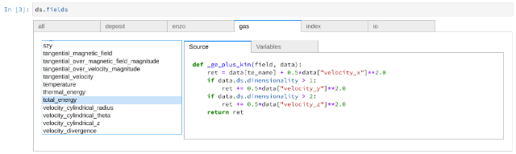

.. _fields:

Fields in yt
============

Fields are spatially-dependent quantities associated with a parent dataset.
Examples of fields are gas density, gas temperature, particle mass, etc.
The fundamental way to query data in yt is to access a field, either in its raw
form (by examining a data container) or a processed form (derived quantities,
projections, aggregations, and so on).  "Field" is something of a loaded word,
as it can refer to quantities that are defined everywhere, which we refer to as
"mesh" or "fluid" fields, or discrete points that populate the domain,
traditionally thought of as "particle" fields.  The word "particle" here is
gradually falling out of favor, as these discrete fields can be any type of
sparsely populated data.

.. _what-are-fields:

What are fields?
----------------

Fields in yt are denoted by a two-element tuple, of the form ``(field_type,
field_name)``. The first element, the "field type" is a category for a
field. Possible field types used in yt include ``gas`` (for fluid mesh fields
defined on a mesh) or ``io`` (for fields defined at particle locations). Field
types can also correspond to distinct particle of fluid types in a single
simulation. For example, a plasma physics simulation using the Particle in Cell
method might have particle types corresponding to ``electrons`` and ``ions``. See
:ref:`known-field-types` below for more info about field types in yt.

The second element of field tuples, the ``field_name``, denotes the specific field
to select, given the field type. Possible field names include ``density``,
``velocity_x`` or ``pressure`` --- these three fields are examples of field names
that might be used for a fluid defined on a mesh. Examples of particle fields
include ``particle_mass`` ``particle_position`` or ``particle_velocity_x`` In
general, particle field names are prefixed by ``particle_``, which makes it easy
to distinguish between a particle field or a mesh field when no field type is
provided.

What fields are available?
--------------------------

We provide a full list of fields that yt recognizes by default at
:ref:`field-list`.  If you want to create additional custom derived fields,
see :ref:`creating-derived-fields`.

Every dataset has an attribute, ``ds.fields``.  This attribute possesses
attributes itself, each of which is a "field type," and each field type has as
its attributes the fields themselves.  When one of these is printed, it returns
information about the field and things like units and so on.  You can use this
for tab-completing as well as easier access to information.

Additionally, if you have `ipywidgets
<https://ipywidgets.readthedocs.io/en/stable/>`_ installed and are in a `Jupyter
environment <https://jupyter.org/>`_, you can view the rich representation of
the fields (including source code) by either typing ``ds.fields`` as the last
item in a cell or by calling ``display(ds.fields)``.  The resulting output will
have tabs and source:

As an example, you might browse the available fields like so:

.. code-block:: python

  print(dir(ds.fields))
  print(dir(ds.fields.gas))
  print(ds.fields.gas.density)

On an Enzo dataset, the result from the final command would look something like
this:::

  Alias Field for "('enzo', 'Density')" (gas, density): (units: g/cm**3)

You can use this to easily explore available fields, particularly through
tab-completion in Jupyter/IPython.

It's also possible to iterate over the list of fields associated with each
field type. For example, to print all of the ``'gas'`` fields, one might do:

.. code-block:: python

   for field in ds.fields.gas:
       print(field)

You can also check if a given field is associated with a field type using
standard python syntax:

.. code-block:: python

   # these examples evaluate to True for a dataset that has ('gas', 'density')
   "density" in ds.fields.gas
   ("gas", "density") in ds.fields.gas
   ds.fields.gas.density in ds.fields.gas

For a more programmatic method of accessing fields, you can utilize the
``ds.field_list``, ``ds.derived_field_list`` and some accessor methods to gain
information about fields.  The full list of fields available for a dataset can
be found as the attribute ``field_list`` for native, on-disk fields and
``derived_field_list`` for derived fields (``derived_field_list`` is a superset
of ``field_list``).  You can view these lists by examining a dataset like this:

.. code-block:: python

   ds = yt.load("my_data")
   print(ds.field_list)
   print(ds.derived_field_list)

By using the ``field_info()`` class, one can access information about a given
field, like its default units or the source code for it.

.. code-block:: python

   ds = yt.load("my_data")
   ds.index
   print(ds.field_info["gas", "pressure"].get_units())
   print(ds.field_info["gas", "pressure"].get_source())

Using fields to access data
---------------------------

.. warning::

   These *specific* operations will load the entire field -- which can be
   extremely memory intensive with large datasets!  If you are looking to
   compute quantities, see :ref:`Data-objects` for methods for computing
   aggregates, averages, subsets, regriddings, etc.

The primary *use* of fields in yt is to access data from a dataset. For example,
if I want to use a data object (see :ref:`Data-objects` for more detail about
data objects) to access the ``('gas', 'density')`` field, one can do any of the
following:

.. code-block:: python

    ad = ds.all_data()

    # just a field name
    density = ad["density"]

    # field tuple with no parentheses
    density = ad["gas", "density"]

    # full field tuple
    density = ad[("gas", "density")]

    # through the ds.fields object
    density = ad[ds.fields.gas.density]

The first data access example is the simplest. In that example, the field type
is inferred from the name of the field. However, yt will complain if there are multiple
field names that could be meant by this simple string access.  The next two examples
use the field type explicitly, this might be necessary if there is more than one field
type with a "density" field defined in the same dataset. The third example is slightly
more verbose but is syntactically identical to the second example due to the way
indexing works in the Python language.

The final example uses the ``ds.fields`` object described above. This way of
accessing fields lends itself to interactive use, especially if you make heavy
use of IPython's tab completion features. Any of these ways of denoting the
``('gas', 'density')`` field can be used when supplying a field name to a yt
data object, analysis routines, or plotting and visualization function.

Accessing Fields without a Field Type
-------------------------------------

In previous versions of yt, there was a single mechanism of accessing fields on
a data container -- by their name, which was mandated to be a single string, and
which often varied between different code frontends.  yt 3.0 allows for datasets
containing multiple different types of fluid fields, mesh fields, particles
(with overlapping or disjoint lists of fields). However, to preserve backward
compatibility and make interactive use simpler, yt will still accept field names
given as a string and will try to infer the field type given a field name.

As an example, we may be in a situation where have multiple types of particles
which possess the ``particle_position`` field.  In the case where a data
container, here called ``ad`` (short for "all data") contains a field, we can
specify which particular particle type we want to query:

.. code-block:: python

   print(ad["dark_matter", "particle_position"])
   print(ad["stars", "particle_position"])
   print(ad["black_holes", "particle_position"])

Each of these three fields may have different sizes.  In order to enable
falling back on asking only for a field by the name, yt will use the most
recently requested field type for subsequent queries.  (By default, if no field
has been queried, it will look for the special field ``all``, which
concatenates all particle types.)  For example, if I were to then query for the
velocity:

.. code-block:: python

   print(ad["particle_velocity"])

it would select ``black_holes`` as the field type, since the last field accessed
used that field type.

The same operations work for fluid and mesh fields.  As an example, in some
cosmology simulations, we may want to examine the mass of particles in a region
versus the mass of gas.  We can do so by examining the special "deposit" field
types (described below) versus the gas fields:

.. code-block:: python

   print(ad["deposit", "dark_matter_density"] / ad["gas", "density"])

The ``deposit`` field type is a mesh field, so it will have the same shape as
the gas density.  If we weren't using ``deposit``, and instead directly
querying a particle field, this *wouldn't* work, as they are different shapes.
This is the primary difference, in practice, between mesh and particle fields
-- they will be different shapes and so cannot be directly compared without
translating one to the other, typically through a "deposition" or "smoothing"
step.

How are fields implemented?
---------------------------

There are two classes of fields in yt.  The first are those fields that exist
external to yt, which are immutable and can be queried -- most commonly, these
are fields that exist on disk.  These will often be returned in units that are
not in a known, external unit system (except possibly by design, on the part of
the code that wrote the data), and yt will take every effort possible to use
the names by which they are referred to by the data producer.  The default
field type for mesh fields that are "on-disk" is the name of the code frontend.
(For example, ``art``, ``enzo``, ``pyne``, and so on.) The default name for
particle fields, if they do not have a particle type affiliated with them, is
``io``.

The second class of field is the "derived field."  These are fields that are
functionally defined, either *ab initio* or as a transformation or combination
of other fields.  For example, when dealing with simulation codes, often the
fields that are evolved and output to disk are not the fields that are the most
relevant to researchers.  Rather than examining the internal gas energy, it is
more convenient to think of the temperature.  By applying one or multiple
functions to on-disk quantities, yt can construct new derived fields from them.
Derived fields do not always have to relate to the data found on disk; special
fields such as ``x``, ``y``, ``phi`` and ``dz`` all relate exclusively to the
geometry of the mesh, and provide information about the mesh that can be used
elsewhere for further transformations.

For more information, see :ref:`creating-derived-fields`.

There is a third, borderline class of field in yt, as well.  This is the
"alias" type, where a field on disk (for example, (frontend, ``Density``)) is
aliased into an internal yt-name (for example, (``gas``, ``density``)). The
aliasing process allows universally-defined derived fields to take advantage of
internal names, and it also provides an easy way to address what units something
should be returned in.  If an aliased field is requested (and aliased fields
will always be lowercase, with underscores separating words) it will be returned
in the units specified by the unit system of the database, whereas if the
frontend-specific field is requested, it will not undergo any unit conversions
from its natural units.  (This rule is occasionally violated for fields which
are mesh-dependent, specifically particle masses in some cosmology codes.)

.. _known-field-types:

Field types known to yt
-----------------------

Recall that fields are formally accessed in two parts: ('*field type*',
'*field name*').  Here we describe the different field types you will encounter:

* frontend-name -- Mesh or fluid fields that exist on-disk default to having
  the name of the frontend as their type name (e.g., ``enzo``, ``flash``,
  ``pyne`` and so on).  The units of these types are whatever units are
  designated by the source frontend when it writes the data.
* ``index`` -- This field type refers to characteristics of the mesh, whether
  that mesh is defined by the simulation or internally by an octree indexing
  of particle data.  A few handy fields are ``x``, ``y``, ``z``, ``theta``,
  ``phi``, ``radius``, ``dx``, ``dy``, ``dz`` and so on.  Default units
  are in CGS.
* ``gas`` -- This is the usual default for simulation frontends for fluid
  types.  These fields are typically aliased to the frontend-specific mesh
  fields for grid-based codes or to the deposit fields for particle-based
  codes.  Default units are in the unit system of the dataset.
* particle type -- These are particle fields that exist on-disk as written
  by individual frontends.  If the frontend designates names for these particles
  (i.e. particle type) those names are the field types.
  Additionally, any particle unions or filters will be accessible as field
  types.  Examples of particle types are ``Stars``, ``DM``, ``io``, etc.
  Like the front-end specific mesh or fluid fields, the units of these fields
  are whatever was designated by the source frontend when written to disk.
* ``io`` -- If a data frontend does not have a set of multiple particle types,
  this is the default for all particles.
* ``all`` -- This is a special particle field type that represents a
  concatenation of all particle field types using :ref:`particle-unions`.
* ``deposit`` -- This field type refers to the deposition of particles
  (discrete data) onto a mesh, typically to compute smoothing kernels, local
  density estimates, counts, and the like.  See :ref:`deposited-particle-fields`
  for more information.

While it is best to be explicit access fields by their full names
(i.e. ('*field type*', '*field name*')), yt provides an abbreviated
interface for accessing common fields (i.e. '*field name*').  In the abbreviated
case, yt will assume you want the last *field type* accessed.  If you
haven't previously accessed a *field type*, it will default to *field type* =
``'all'`` in the case of particle fields and *field type* = ``'gas'`` in the
case of mesh fields.

Field Plugins
-------------

Derived fields are organized via plugins.  Inside yt are a number of field
plugins, which take information about fields in a dataset and then construct
derived fields on top of them.  This allows them to take into account
variations in naming system, units, data representations, and most importantly,
allows only the fields that are relevant to be added.  This system will be
expanded in future versions to enable much deeper semantic awareness of the
data types being analyzed by yt.

The field plugin system works in this order:

 * Available, inherent fields are identified by yt
 * The list of enabled field plugins is iterated over.  Each is called, and new
   derived fields are added as relevant.
 * Any fields which are not available, or which throw errors, are discarded.
 * Remaining fields are added to the list of derived fields available for a
   dataset
 * Dependencies for every derived field are identified, to enable data
   preloading

Field plugins can be loaded dynamically, although at present this is not
particularly useful.  Plans for extending field plugins to dynamically load, to
enable simple definition of common types (divergence, curl, etc), and to
more verbosely describe available fields, have been put in place for future
versions.

The field plugins currently available include:

 * Angular momentum fields for particles and fluids
 * Astrophysical fields, such as those related to cosmology
 * Vector fields for fluid fields, such as gradients and divergences
 * Particle vector fields
 * Magnetic field-related fields
 * Species fields, such as for chemistry species (yt can recognize the entire
   periodic table in field names and construct ionization fields as need be)

Field Labeling
--------------

By default yt formats field labels nicely for plots. To adjust the chosen
format you can use the ``ds.set_field_label_format`` method like so:

.. code-block:: python

   ds = yt.load("my_data")
   ds.set_field_label_format("ionization_label", "plus_minus")

The first argument accepts a ``format_property``, or specific aspect of the labeling, and the
second sets the corresponding ``value``. Currently available format properties are

    * ``ionization_label``: sets how the ionization state of ions are labeled. Available
            options are ``"plus_minus"`` and ``"roman_numeral"``

.. _efields:

Energy and Momemtum Fields
--------------------------

Fields in yt representing energy and momentum quantities follow a specific
naming convention (as of yt-4.x). In hydrodynamic simulations, the relevant
quantities are often energy per unit mass or volume, momentum, or momentum
density To distinguish clearly between the different types of fields, the
following naming convention is adhered to:

* Energy per unit mass fields are named as ``specific_*_energy``
* Energy per unit volume fields are named as ``*_energy_density``
* Momentum fields should be named ``momentum_density_*`` for momentum per
  unit density, or ``momentum_*`` for momentum, where the ``*`` indicates
  one of three coordinate axes in any supported coordinate system.

For example, in the case of kinetic energy, the fields should be
``kinetic_energy_density`` and ``specific_kinetic_energy``.

In versions of yt previous to v4.0.0, these conventions were not adopted, and so
energy fields in particular could be ambiguous with respect to units. For
example, the ``kinetic_energy`` field was actually kinetic energy per unit
volume, whereas the ``thermal_energy`` field, usually defined by various
frontends, was typically thermal energy per unit mass. The above scheme
rectifies these problems, but for the time being the previous field names are
mapped to the current field naming scheme with a deprecation warning. These
aliases will be removed in yt v4.1.0. Following this, new fields will be created
which have dimensions of energy, which will simply be named ``*_energy`` as
above.

.. _bfields:

Magnetic Fields
---------------

Magnetic fields require special handling, because their dimensions are different in
different systems of units, in particular between the CGS and MKS (SI) systems of units.
Superficially, it would appear that they are in the same dimensions, since the units
of the magnetic field in the CGS and MKS system are gauss (:math:`\rm{G}`) and tesla
(:math:`\rm{T}`), respectively, and numerically :math:`1~\rm{G} = 10^{-4}~\rm{T}`. However,
if we examine the base units, we find that they do indeed have different dimensions:

.. math::

    \rm{1~G = 1~\frac{\sqrt{g}}{\sqrt{cm}\cdot{s}}} \\
    \rm{1~T = 1~\frac{kg}{A\cdot{s^2}}}

It is easier to see the difference between the dimensionality of the magnetic field in the two
systems in terms of the definition of the magnetic pressure:

.. math::

    p_B = \frac{B^2}{8\pi}~\rm{(cgs)} \\
    p_B = \frac{B^2}{2\mu_0}~\rm{(MKS)}

where :math:`\mu_0 = 4\pi \times 10^{-7}~\rm{N/A^2}` is the vacuum permeability. yt automatically
detects on a per-frontend basis what units the magnetic should be in, and allows conversion between
different magnetic field units in the different unit systems as well. To
determine how to set up special magnetic field handling when designing a new frontend, check out
:ref:`bfields-frontend`.

.. _species-fields:

Species Fields
--------------

For many types of data, yt is able to detect different chemical elements and molecules
within the dataset, as well as their abundances and ionization states. Examples include:

* CO (Carbon monoxide)
* Co (Cobalt)
* OVI (Oxygen ionized five times)
* H:math:`^{2+}` (Molecular Hydrogen ionized once)
* H:math:`^{-}` (Hydrogen atom with an additional electron)

The naming scheme for the fields starts with prefixes in the form ``MM[_[mp][NN]]``. ``MM``
is the molecule, defined as a concatenation of atomic symbols and numbers, with no spaces or
underscores. The second sequence is only required if ionization states are present in the
dataset, and is of the form ``p`` and ``m`` to indicate "plus" or "minus" respectively,
followed by the number. If a given species has no ionization states given, the prefix is
simply ``MM``.

For the examples above, the prefixes would be:

* ``CO``
* ``Co``
* ``O_p5``
* ``H2_p1``
* ``H_m1``

The name ``El`` is used for electron fields, as it is unambiguous and will not be
utilized elsewhere. Neutral ionic species (e.g. H I, O I) are represented as ``MM_p0``.
Additionally, the isotope of :math:`^2`H will be included as ``D``.

Finally, in those frontends which are single-fluid, these fields for each species are
defined:

* ``MM[_[mp][NN]]_fraction``
* ``MM[_[mp][NN]]_number_density``
* ``MM[_[mp][NN]]_density``
* ``MM[_[mp][NN]]_mass``

To refer to the number density of the entirety of a single atom or molecule (regardless
of its ionization state), please use the ``MM_nuclei_density`` fields.

Many datasets do not have species defined, but there may be an underlying assumption
of primordial abundances of H and He which are either fully ionized or fully neutral.
This will also determine the value of the mean molecular weight of the gas, which
will determine the value of the temperature if derived from another quantity like the
pressure or thermal energy. To allow for these possibilities, there is a keyword
argument ``default_species_fields`` which can be passed to :func:`~yt.loaders.load`:

.. code-block:: python

    import yt

    ds = yt.load(
        "GasSloshing/sloshing_nomag2_hdf5_plt_cnt_0150", default_species_fields="ionized"
    )

By default, the value of this optional argument is ``None``, which will not initialize
any default species fields. If the ``default_species_fields`` argument is not set to
``None``, then the following fields are defined:

* ``H_nuclei_density``
* ``He_nuclei_density``

More specifically, if ``default_species_fields="ionized"``, then these
additional fields are defined:

* ``H_p1_number_density`` (Ionized hydrogen: equal to the value of ``H_nuclei_density``)
* ``He_p2_number_density`` (Doubly ionized helium: equal to the value of ``He_nuclei_density``)
* ``El_number_density`` (Free electrons: assuming full ionization)

Whereas if ``default_species_fields="neutral"``, then these additional
fields are defined:

* ``H_p0_number_density`` (Neutral hydrogen: equal to the value of ``H_nuclei_density``)
* ``He_p0_number_density`` (Neutral helium: equal to the value of ``He_nuclei_density``)

In this latter case, because the gas is neutral, ``El_number_density`` is not defined.

The ``mean_molecular_weight`` field will be constructed from the abundances of the elements
in the dataset. If no element or molecule fields are defined, the value of this field
is determined by the value of ``default_species_fields``. If it is set to ``None`` or
``"ionized"``, the ``mean_molecular_weight`` field is set to :math:`\mu \approx 0.6`,
whereas if ``default_species_fields`` is set to ``"neutral"``, then the
``mean_molecular_weight`` field is set to :math:`\mu \approx 1.14`. Some frontends do
not directly store the gas temperature in their datasets, in which case it must be
computed from the pressure and/or thermal energy as well as the mean molecular weight,
so check this carefully!

Particle Fields
---------------

Naturally, particle fields contain properties of particles rather than
grid cells.  By examining the particle field in detail, you can see that
each element of the field array represents a single particle, whereas in mesh
fields each element represents a single mesh cell.  This means that for the
most part, operations cannot operate on both particle fields and mesh fields
simultaneously in the same way, like filters (see :ref:`filtering-data`).
However, many of the particle fields have corresponding mesh fields that
can be populated by "depositing" the particle values onto a yt grid as
described below.

.. _field_parameters:

Field Parameters
----------------

Certain fields require external information in order to be calculated.  For
example, the radius field has to be defined based on some point of reference
and the radial velocity field needs to know the bulk velocity of the data object
so that it can be subtracted.  This information is passed into a field function
by setting field parameters, which are user-specified data that can be associated
with a data object.  The
:meth:`~yt.data_objects.data_containers.YTDataContainer.set_field_parameter`
and
:meth:`~yt.data_objects.data_containers.YTDataContainer.get_field_parameter`
functions are
used to set and retrieve field parameter values for a given data object.  In the
cases above, the field parameters are ``center`` and ``bulk_velocity`` respectively --
the two most commonly used field parameters.

.. code-block:: python

   ds = yt.load("my_data")
   ad = ds.all_data()

   ad.set_field_parameter("wickets", 13)

   print(ad.get_field_parameter("wickets"))

If a field parameter is not set, ``get_field_parameter`` will return None.
Within a field function, these can then be retrieved and used in the same way.

.. code-block:: python

   def _wicket_density(field, data):
       n_wickets = data.get_field_parameter("wickets")
       if n_wickets is None:
           # use a default if unset
           n_wickets = 88
       return data["gas", "density"] * n_wickets

For a practical application of this, see :ref:`cookbook-radial-velocity`.

.. _gradient_fields:

Gradient Fields
---------------

yt provides a way to compute gradients of spatial fields using the
:meth:`~yt.data_objects.static_output.Dataset.add_gradient_fields`
method. If you have a spatially-based field such as density or temperature,
and want to calculate the gradient of that field, you can do it like so:

.. code-block:: python

    ds = yt.load("GasSloshing/sloshing_nomag2_hdf5_plt_cnt_0150")
    grad_fields = ds.add_gradient_fields(("gas", "temperature"))

where the ``grad_fields`` list will now have a list of new field names that can be used
in calculations, representing the 3 different components of the field and the magnitude
of the gradient, e.g., ``"temperature_gradient_x"``, ``"temperature_gradient_y"``,
``"temperature_gradient_z"``, and ``"temperature_gradient_magnitude"``. To see an example
of how to create and use these fields, see :ref:`cookbook-complicated-derived-fields`.

.. note::

    ``add_gradient_fields`` currently only supports Cartesian geometries!

.. _relative_fields:

Relative Vector Fields
----------------------

yt makes use of "relative" fields for certain vector fields, which are fields
which have been defined relative to a particular origin in the space of that
field. For example, relative particle positions can be specified relative to
a center coordinate, and relative velocities can be specified relative to a
bulk velocity. These origin points are specified by setting field parameters
as detailed below (see :ref:`field_parameters` for more information).

The relative fields which are currently supported for gas fields are:

* ``("gas", "relative_velocity_{xyz}")``, defined by setting the
  ``"bulk_velocity"`` field parameter
* ``("gas", "relative_magnetic_field_{xyz}")``, defined by setting the
  ``"bulk_magnetic_field"`` field parameter

For particle fields, for a given particle type ``ptype``, the relative
fields which are supported are:

* ``(ptype, "relative_particle_position")``, defined by setting the
  ``"center"`` field parameter
* ``(ptype, "relative_particle_velocity")``, defined by setting the
  ``"bulk_velocity"`` field parameter
* ``(ptype, "relative_particle_position_{xyz}")``, defined by setting the
  ``"center"`` field parameter
* ``(ptype, "relative_particle_velocity_{xyz}")``, defined by setting the
  ``"bulk_velocity"`` field parameter

These fields are in use when defining magnitude fields, line-of-sight fields,
etc.. The ``"bulk_{}"`` field parameters are ``[0.0, 0.0, 0.0]`` by default,
and the ``"center"`` field parameter depends on the data container in use.

There is currently no mechanism to create new relative fields, but one may be
added at a later time.

.. _los_fields:

Line of Sight Fields
--------------------

In astrophysics applications, one often wants to know the component of a vector
field along a given line of sight. If you are doing a projection of a vector
field along an axis, or just want to obtain the values of a vector field
component along an axis, you can use a line-of-sight field. For projections,
this will be handled automatically:

.. code-block:: python

    prj = yt.ProjectionPlot(
        ds, "z", ("gas", "velocity_los"), weight_field=("gas", "density")
    )

Which, because the axis is ``"z"``, will give you the same result if you had
projected the ``"velocity_z"`` field. This also works for off-axis projections:

.. code-block:: python

    prj = yt.OffAxisProjectionPlot(
        ds, [0.1, -0.2, 0.3], ("gas", "velocity_los"), weight_field=("gas", "density")
    )

This shows that the projection axis can be along a principle axis of the domain
or an arbitrary off-axis 3-vector (which will be automatically normalized). If
you want to examine a line-of-sight vector within a 3-D data object, set the
``"axis"`` field parameter:

.. code-block:: python

    dd = ds.all_data()
    # Set to one of [0, 1, 2] for ["x", "y", "z"] axes
    dd.set_field_parameter("axis", 1)
    print(dd["gas", "magnetic_field_los"])
    # Set to a three-vector for an off-axis component
    dd.set_field_parameter("axis", [0.3, 0.4, -0.7])
    print(dd["gas", "velocity_los"])

.. warning::

    If you need to change the axis of the line of sight on the *same* data container
    (sphere, box, cylinder, or whatever), you will need to delete the field using
    ``del dd["velocity_los"]`` and re-generate it.

At this time, this functionality is enabled for the velocity and magnetic vector
fields, ``("gas", "velocity_los")`` and ``("gas", "magnetic_field_los")``. The
following fields built into yt make use of these line-of-sight fields:

* ``("gas", "sz_kinetic")`` uses ``("gas", "velocity_los")``
* ``("gas", "rotation_measure")`` uses ``("gas", "magnetic_field_los")``

General Particle Fields
-----------------------

Every particle will contain both a ``particle_position`` and ``particle_velocity``
that tracks the position and velocity (respectively) in code units.

.. _deposited-particle-fields:

Deposited Particle Fields
-------------------------

In order to turn particle (discrete) fields into fields that are deposited in
some regular, space-filling way (even if that space is empty, it is defined
everywhere) yt provides mechanisms for depositing particles onto a mesh.  These
are in the special field-type space ``deposit``, and are typically of the form
``("deposit", "particletype_depositiontype")`` where ``depositiontype`` is the
mechanism by which the field is deposited, and ``particletype`` is the particle
type of the particles being deposited.  If you are attempting to examine the
cloud-in-cell (``cic``) deposition of the ``all`` particle type, you would
access the field ``("deposit", "all_cic")``.

yt defines a few particular types of deposition internally, and creating new
ones can be done by modifying the files ``yt/geometry/particle_deposit.pyx``
and ``yt/fields/particle_fields.py``, although that is an advanced topic
somewhat outside the scope of this section.  The default deposition types
available are:

* ``count`` - this field counts the total number of particles of a given type
  in a given mesh zone.  Note that because, in general, the mesh for particle
  datasets is defined by the number of particles in a region, this may not be
  the most useful metric.  This may be made more useful by depositing particle
  data onto an :ref:`arbitrary-grid`.
* ``density`` - this field takes the total sum of ``particle_mass`` in a given
  mesh field and divides by the volume.
* ``mass`` - this field takes the total sum of ``particle_mass`` in each mesh
  zone.
* ``cic`` - this field performs cloud-in-cell interpolation (see `Section 2.2
  <http://ta.twi.tudelft.nl/dv/users/lemmens/MThesis.TTH/chapter4.html>`_ for more
  information) of the density of particles in a given mesh zone.
* ``smoothed`` - this is a special deposition type.  See discussion below for
  more information, in :ref:`sph-fields`.

You can also directly use the
:meth:`~yt.data_objects.static_outputs.add_deposited_particle_field` function
defined on each dataset to depose any particle field onto the mesh like so:

.. code-block:: python

   import yt

   ds = yt.load("output_00080/info_00080.txt")
   fname = ds.add_deposited_particle_field(
       ("all", "particle_velocity_x"), method="nearest"
   )

   print(f"The velocity of the particles are (stored in {fname}")
   print(ds.r[fname])

.. note::

   In this example, we are using the returned field name as our input.  You
   *could* also access it directly, but it might take a slightly different form
   than you expect -- in this particular case, the field name will be
   ``("deposit", "all_nn_velocity_x")``, which has removed the prefix
   ``particle_`` from the deposited name!

Possible deposition methods are:

* ``simple_smooth`` - perform an SPH-like deposition of the field onto the mesh
  optionally accepting a ``kernel_name``.
* ``sum`` - sums the value of the particle field for all particles found in
  each cell.
* ``std`` - computes the standard deviation of the value of the particle field
  for all particles found in each cell.
* ``cic`` - performs cloud-in-cell interpolation (see `Section 2.2
  <http://ta.twi.tudelft.nl/dv/users/lemmens/MThesis.TTH/chapter4.html>`_ for more
  information) of the particle field on a given mesh zone.
* ``weighted_mean`` - computes the mean of the particle field, weighted by
  the field passed into ``weight_field`` (by default, it uses the particle
  mass).
* ``count`` - counts the number of particles in each cell.
* ``nearest`` - assign to each cell the value of the closest particle.

In addition, the :meth:`~yt.data_objects.static_outputs.add_deposited_particle_field` function
returns the name of the newly created field.

Deposited particle fields can be useful for visualizing particle data, including
particles without defined smoothing lengths. See :ref:`particle-plotting-workarounds`
for more information.

.. _mesh-sampling-particle-fields:

Mesh Sampling Particle Fields
-----------------------------

In order to turn mesh fields into discrete particle field, yt provides
a mechanism to do sample mesh fields at particle locations. This operation is
the inverse operation of :ref:`deposited-particle-fields`: for each
particle the cell containing the particle is found and the value of
the field in the cell is assigned to the particle. This is for
example useful when using tracer particles to have access to the
Eulerian information for Lagrangian particles.

The particle fields are named ``(ptype, cell_ftype_fname)`` where
``ptype`` is the particle type onto which the deposition occurs,
``ftype`` is the mesh field type (e.g. ``gas``) and ``fname`` is the
field (e.g. ``temperature``, ``density``, ...). You can directly use
the :meth:`~yt.data_objects.static_output.Dataset.add_mesh_sampling_particle_field`
function defined on each dataset to impose a field onto the particles like so:

.. code-block:: python

   import yt

   ds = yt.load("output_00080/info_00080.txt")
   ds.add_mesh_sampling_particle_field(("gas", "temperature"), ptype="all")

   print("The temperature at the location of the particles is")
   print(ds.r["all", "cell_gas_temperature"])

For octree codes (e.g. RAMSES), you can trigger the build of an index so
that the next sampling operations will be mush faster

.. code-block:: python

   import yt

   ds = yt.load("output_00080/info_00080.txt")
   ds.add_mesh_sampling_particle_field(("gas", "temperature"), ptype="all")

   ad = ds.all_data()
   ad[
       "all", "cell_index"
   ]  # Trigger the build of the index of the cell containing the particles
   ad["all", "cell_gas_temperature"]  # This is now much faster

.. _sph-fields:

SPH Fields
----------

See :ref:`yt4differences`.

In previous versions of yt, there were ways of computing the distance to the
N-th nearest neighbor of a particle, as well as computing the nearest particle
value on a mesh.  Unfortunately, because of changes to the way that particles
are regarded in yt, these are not currently available.  We hope that this will
be rectified in future versions and are tracking this in `Issue 3301
<https://github.com/yt-project/yt/issues/3301>`_.  You can read a bit more
about the way yt now handles particles in the section :ref:`demeshening`.

**But!**  It is possible to compute the smoothed values from SPH particles on
grids.  For example, one can construct a covering grid that extends over the
entire domain of a simulation, with resolution 256x256x256, and compute the gas
density with this reasonable terse command:

.. code-block:: python

   import yt

   ds = yt.load("snapshot_033/snap_033.0.hdf5")
   cg = ds.r[::256j, ::256j, ::256j]
   smoothed_values = cg["gas", "density"]

This will work for any smoothed field; any field that is under the ``"gas"``
field type will be a smoothed field in an SPH-based simulation.  Here we have
used the ``ds.r[]`` notation, as described in :ref:`quickly-selecting-data` for
creating what's called an "arbitrary grid"
(:class:`~yt.data_objects.construction_data_containers.YTArbitraryGrid`).  You
can, of course, also supply left and right edges to make the grid take up a
much smaller portion of the domain, as well, by supplying the arguments as
detailed in :ref:`arbitrary-grid-selection` and supplying the bounds as the
first and second elements in each element of the slice.
