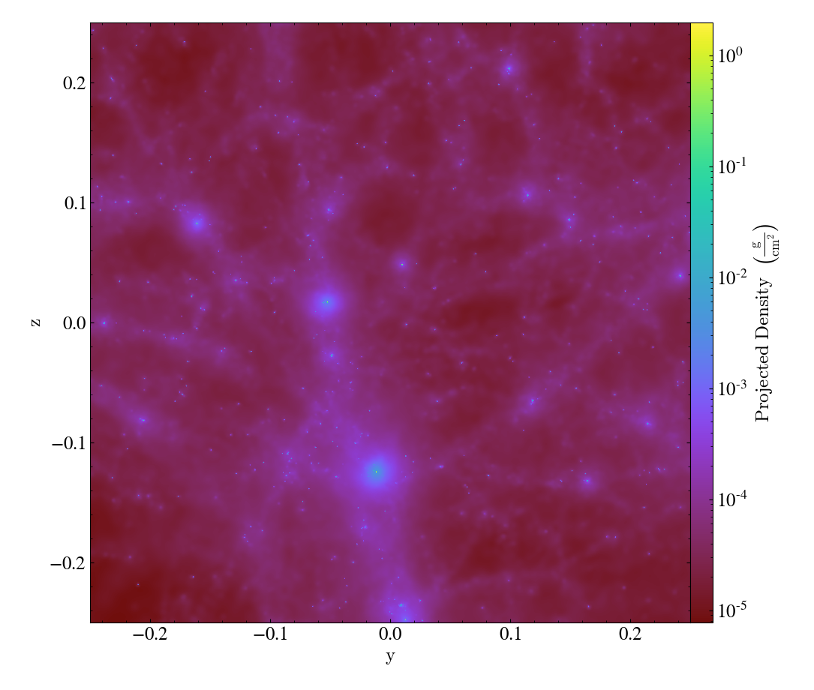

.. _demeshening:

How Particles are Indexed
=========================

With yt-4.0, the method by which particles are indexed changed considerably.
Whereas in previous versions, particles were indexed based on their position in
an octree (the structure of which was determined by particle number density),
in yt-4.0 this system was overhauled to utilize a `bitmap
index<https://en.wikipedia.org/wiki/Bitmap_index>`_ based on a space-filling
curve, using a `enhanced word-aligned
hybrid<https://github.com/lemire/ewahboolarray>` boolean array as their
backend.

.. note::

   You may see scattered references to "the demeshening" (including in the
   filename for this document!). This was a humorous name used in the yt
   development process to refer to removing a global (octree) mesh for
   particle codes.

By avoiding the use of octrees as a base mesh, yt is able to create *much* more
accurate SPH visualizations.  We have a `gallery demonstrating
this<https://matthewturk.github.io/yt4-gallery/>`_ but even in this
side-by-side comparison the differences can be seen quite easily, with the left
image being from the old, octree-based approach and the right image the new,
meshless approach.

Effectively, what "the demeshening" does is allow yt to treat the particles as
discrete objects (or with an area of influence) and use their positions in a
multi-level index to optimize and minimize the disk operations necessary to
load only those particles it needs.

.. note::

   The theory and implementation of yt's bitmap indexing system is described in
   some detail in the `yt 4.0
   paper<https://yt-project.github.io/yt-4.0-paper/>`_ in the section entitled
   `Indexing Discrete-Point
   Datasets<https://yt-project.github.io/yt-4.0-paper/#sec:point_indexing>`_.

In brief, however, what this relies on is two numbers, ``index_order1`` and
``index_order2``.  These control the "coarse" and "refined" sets of indices,
and they are supplied to any particle dataset ``load()`` in the form of a tuple
as the argument ``index_order``.  By default these are set to 5 and 7,
respectively, but it is entirely likely that a different set of values will
work better for your purposes.

For example, if you were to use the sample Gadget-3 dataset, you could override
the default values and use values of 5 and 5 by specifying this argument to the
``load_sample`` function; this works with ``load`` as well.

.. code-block:: python

   ds = yt.load_sample("Gadget3-snap-format2", index_order=(5, 5))

So this is how you *change* the index order, but it doesn't explain precisely
what this "index order" actually is.

Indexing and Why yt Does it
---------------------------

yt is based on the idea that data should be selected and read only when it is
needed.  So for instance, if you only want particles or grid cells from a small
region in the center of your dataset, yt wants to avoid any reading of the data
*outside* of that region.  Now, in practice, this isn't entirely possible --
particularly with particles, you can't actually tell when something is inside
or outside of a region *until* you read it, because the particle locations are
*stored in the dataset*.

One way to avoid this is to have an index of the data, so that yt can know that
some of the data that is located *here* in space is located *there* in the file
or files on disk.  So if you're able to say, I only care about data in "region
A", you can look for those files that contain data within "region A," read
those, and discard the parts of them that are *not* within "region A."

The finer grained the index, the longer it takes to build that index -- and the
larger than index is, and the longer it takes to query.  The cost of having too
*coarse* an index, on the other hand, is that the IO conducted to read a given
region is likely to be *too much*, and more particles will be discarded after
being read, before being "selected" by the data selector (sphere, region, etc).

An important note about all of this is that the index system is not meant to
*replace* the positions stored on disk, but instead to speed up queries of
those positions -- the index is meant to be lossy in representation, and only
provides means of generating IO information.  Additionally, the atomic unit
that yt considers when conducting IO or selection queries is called a "chunk"
internally.  For situations where the individual *files* are very, very large,
yt will "sub-chunk" these into smaller bits, which are by-default set to $64^3$
particles.  Whenever indexing is done, it is done at this granular level, with
offsets to individual particle collections stored.  For instance, if you had a
(single) file with $1024^3$ particles in it, yt would instead regard this as a
series of $64^3$ particle files, and index each one individually.

Index Order
-----------

The bitmap index system is based on a two-level scheme for assigning positions
in three-dimensional space to integer values.  What this means is that each
particle is assigned a "coarse" index, which is global to the full domain of
the collection of particles, and *if necessary* an additional "refined" index
is assigned to the particle, within that coarse index.

The index "order" values refer to the number of entries on a side that each
index system is allowed.  For instance, if we allow the particles to be
subdivided into 8 "bins" in each direction, this would correspond to an index
order of 3 (as $2^3 = 8$); correspondingly, an index order of 5 would be 32
bins in each direction, and an index order of 7 would be 128 bins in each
direction.  Each particle is then assigned a set of i, j, k values for the bin
value in each dimension, and these i, j, k values are combined into a single
(64-bit) integer according to a space-filling curve.

The process by which this is done by yt is as follows:

  1. For each "chunk" of data -- which may be a file, or a subset of a file in
     which particles are contained -- assign each particle to an integer value
     according to the space-filling curve and the coarse index order.  Set the
     "bit" in an array of boolean values that each of these integers correspond
     to.  Note that this is almost certainly *reductive* -- there will be fewer
     bits set than there are particles, which is *by design*.
  2. Once all chunks or files have been assigned an array of bits that
     correspond to the places where, according to the coarse indexing scheme,
     they have particles, identify all those "bits" that have been set by more
     than one chunk.  All of these bits correspond to locations where more than
     one file contains particles -- so if you want to select something from
     this region, you'd need to read more than one file.
  3. For each "collision" location, apply a *second-order* index, to identify
     which sub-regions are touched by more than one file.

At the end of this process, each file will be associated with a single "coarse"
index (which covers the entire domain of the data), as well as a set of
"collision" locations, and in each "collision" location a set of bitarrays that
correspond to that subregion.

When reading data, yt will identify which "coarse" index regions are necessary
to read.  If any of those coarse index regions are covered by more than one
file, it will examine the "refined" index for those regions and see if it is able
to subset more efficiently.  Because all of these operations can be done with
logical operations, this considerably reduces the amount of data that needs to
be read from disk before expensive selection operations are conducted.

For those situations that involve particles with regions of influence -- such
as smoothed particle hydrodynamics, where particles have associated smoothing
lenghts -- these are taken into account when conducting the indexing system.

Efficiency of Index Orders
--------------------------

What this can lead to, however, is situations where (particularly at the edges
of regions populated by SPH particles) the indexing system identifies
collisions, but the relatively small number of particles and correspondingly
large "smoothing lengths" result in a large number of "refined" index values that
need to be set.

Counterintuitively, this actually means that occasionally the "refined" indexing
process can take an inordinately long amount of time for *small* datasets,
rather than large datasets.

In these situations, it is typically sufficient to set the "refined" index order
to be much lower than its default value.  For instance, setting the
``index_order`` to (5, 3) means that the full domain will be subdivided into 32
bins in each dimension, and any "collision" zones will be further subdivided
into 8 bins in each dimension (corresponding to an effective 256 bins across
the full domain).

If you are experiencing very long index times, this may be a productive
parameter to modify.  For instance, if you are seeing very rapid "coarse"
indexing followed by very, very slow "refined" indexing, this likely plays a
part; often this will be most obvious in small-ish (i.e., $256^3$ or smaller)
datasets.

Index Caching
-------------

The index values are cached between instantiation, in a sidecar file named with
the name of the dataset file and the suffix ``.indexII_JJ.ewah``, where ``II``
and ``JJ`` are ``index_order1`` and ``index_order2``.  So for instance, if
``index_order`` is set to (5, 7), and you are loading a dataset file named
"snapshot_200.hdf5", after indexing, you will have an index sidecar file named
``snapshot_200.hdf5.index5_7.ewah``.  On subsequent loads, this index file will
be reused, rather than re-generated.

By *default* these sidecars are stored next to the dataset itself, in the same
directory.  However, the filename scheme (and thus location) can be changed by
supplying an alternate filename to the ``load`` command with the argument
``index_filename``.  For instance, if you are accessing data in a read-only
location, you can specify that the index will be cached in a location that is
write-accessible to you.

These files contain the *compressed* bitmap index values, along with some
metadata that describes the version of the indexing system they use and so
forth.  If the version of the index that yt uses has changed, they will be
regenerated; in general this will not vary very often (and should be much less
frequent than, for instance, yt releases) and yt will provide a message to let
you know it is doing it.

The file size of these cached index files can be difficult to estimate; because
it is based on a compressed bitmap arrays, it will depend on the spatial
organization of the particles it is indexing, and how co-located they are
according to the space filling curve.  For very small datasets it will be
small, but we do not expect these index files to grow beyond a few hundred
megabytes even in the extreme case of large datasets that have little to no
coherence in their clustering.
