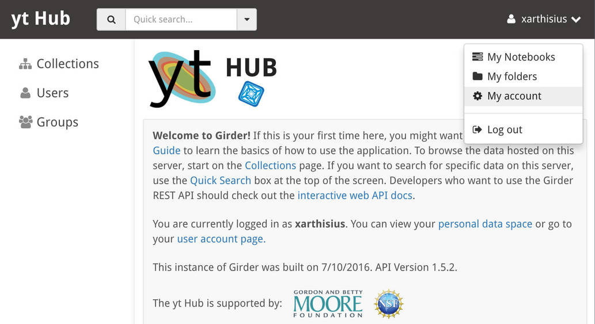
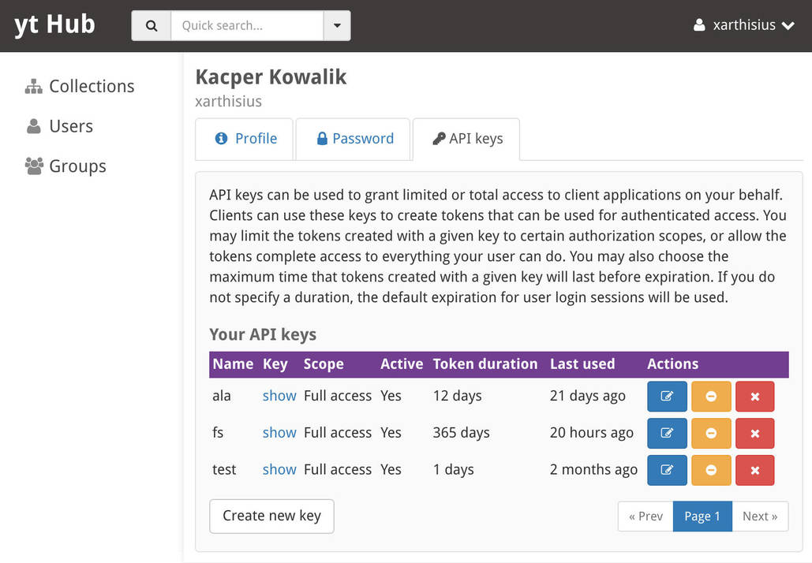
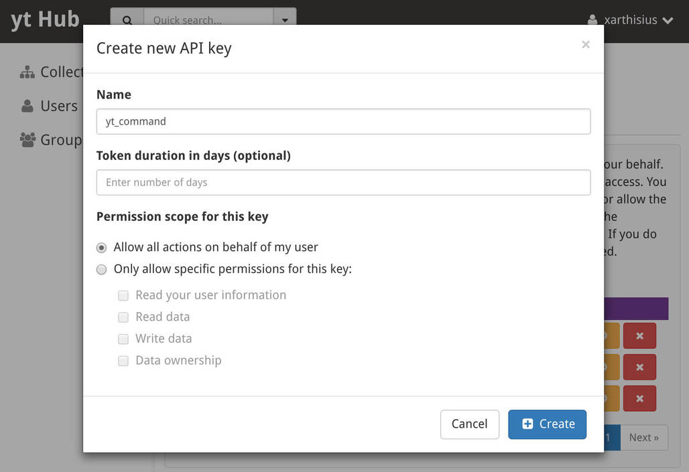
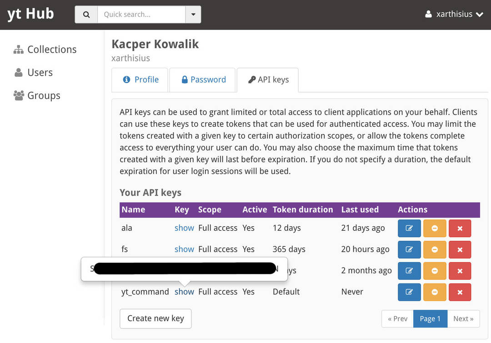

.. _sharing-data:

The yt Hub
==========

.. contents::
   :depth: 2
   :local:
   :backlinks: none

What is the yt Hub?
-------------------

The yt data Hub is a mechanism by which images, data objects and projects can be
shared with other people. For instance, one can upload a dataset and allow other
people to remotely analyze it with a jupyter notebook or upload notebooks and
view them from any web browser.

.. note:: All items posted on the hub are public!

Over time, more widgets will be added, and more datatypes will be able to be
uploaded.  If you are interested in adding more ways of sharing data, please
email the developers' list.  We would like to add support for 3D widgets such
as isocontours as well as interactive binning and rebinning of data from yt
data objects, to be displayed as phase plots and profiles.

.. note:: Working with the Hub requires additional dependencies to be installed.
          You can obtain them by running: ``pip install yt[hub]``.

.. _hub-APIkey:

Obtaining an API key
--------------------

In order to interact with the yt Hub, you need to obtain API key, which is
available only for authenticated users. You can `log into
<https://girder.hub.yt/#?dialog=login>`_ the Hub using your Google, GitHub or
Bitbucket account. After you log in, an API key can be generated under the *My
account* page, which can be accessed through the dropdown menu in the upper
right corner.

Select the *API keys* tab and press *Create new key* button:

By convention, the *Name* field of API keys can be used to specify what
application is making use of the key in a human-readable way e.g. ``yt
command``, although you may name your key however you want.

After the API Key is created you can obtain it by clicking *show* link:

For more information about API keys please see `this document
<https://girder.readthedocs.io/en/latest/user-guide.html?highlight=API%20keys#api-keys>`__.

After you have gotten your API key, update your config file:

.. code-block:: none

   $ yt config set yt hub_api_key 3fd1de56c2114c13a2de4dd51g10974b

Replace ``3fd1de56c2114c13a2de4dd51g10974b`` with your API key.

Registering a User
^^^^^^^^^^^^^^^^^^

If you do not wish to use OAuth authentication, you can create a Hub account
using ``yt`` command. To register a user:

.. code-block:: bash

   $ yt hub register

This will walk you through the process of registering. You will need to supply
a name, a username, a password and an email address. Apart from creating a new
user account, it will also generate an API key and append it to the yt's config
file.  At this point, you're ready to go!

What Can Be Uploaded
--------------------

Currently, the yt hub can accept these types of data:

 * Raw data files, scripts.
 * IPython notebooks: these are stored on the hub and are made available for
   download and via the IPython `nbviewer <https://nbviewer.jupyter.org/>`_
   service.

How to Upload Data
------------------

Uploading data can be performed using the ``girder-cli`` command tool or
directly via the web interface. Please refer to ``girder-cli`` `documentation page
<https://girder.readthedocs.io/en/latest/python-client.html>`_ for additional
information.

Uploading Notebooks
^^^^^^^^^^^^^^^^^^^

Notebooks can be uploaded from the bash command line:

.. code-block:: bash

   yt upload_notebook notebook_file.ipynb

After the notebook is finished uploading, yt will print a link to the raw
notebook as well as an nbviewer link to the same notebook.  Your notebooks will
be stored under your hub Public directory.
