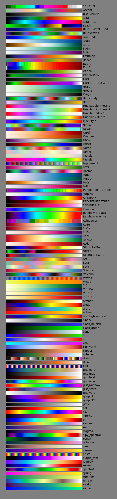
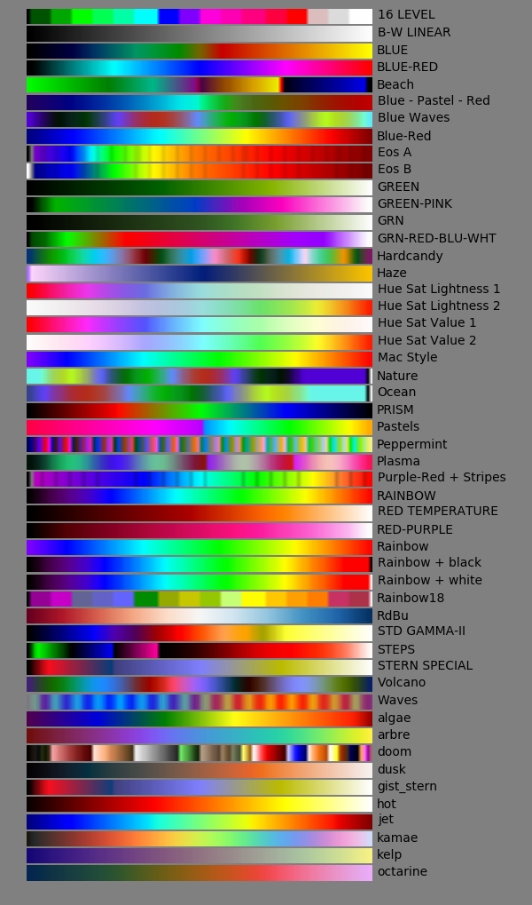

.. _colormaps:

Colormaps
=========

There are several colormaps available for yt.  yt includes all of the 
matplotlib colormaps as well for nearly all functions.  Individual 
visualization functions usually allow you to specify a colormap with the 
``cmap`` flag.

.. _palettable:

Palettable and ColorBrewer2 
~~~~~~~~~~~~~~~~~~~~~~~~~~~

While colormaps that employ a variety of colors often look attractive,
they are not always the best choice to convey information to one's audience.
There are numerous `articles <https://eagereyes.org/basics/rainbow-color-map>`_ 
and 
`presentations <http://pong.tamu.edu/~kthyng/presentations/visualization.pdf`_ 
that discuss how rainbow-based colormaps fail with regard to black-and-white 
reproductions, colorblind audience members, and confusing in color ordering.
Depending on the application, the consensus seems to be that gradients between
one or two colors are the best way for the audience to extract information
from one's figures.  Many such colormaps are found in palettable.

If you have installed `palettable <http://jiffyclub.github.io/palettable/>`_ 
(formerly brewer2mpl), you can also access the discrete colormaps available 
to that package including those from `colorbrewer <http://colorbrewer2.org>`_.
Install `palettable <http://jiffyclub.github.io/palettable/>`_ with 
``pip install palettable``.  To access these maps in yt, instead of supplying 
the colormap name, specify a tuple of the form (name, type, number), for 
example ``('RdBu', 'Diverging', 9)``.  These discrete colormaps will
not be interpolated, and can be useful for creating
colorblind/printer/grayscale-friendly plots. For more information, visit
`http://colorbrewer2.org <http://colorbrewer2.org>`_.

.. _custom-colormaps:

Making and Viewing Custom Colormaps
~~~~~~~~~~~~~~~~~~~~~~~~~~~~~~~~~~~

yt can also accommodate custom colormaps using the 
:func:`~yt.visualization.color_maps.make_colormap` function 
These custom colormaps can be made to an arbitrary level of 
complexity.  You can make these on the fly for each yt session, or you can 
store them in your :ref:`plugin-file` for access to them in every future yt 
session.  The example below creates two custom colormaps, one that has
three equally spaced bars of blue, white and red, and the other that 
interpolates in increasing lengthed intervals from black to red, to green, 
to blue.  These will be accessible for the rest of the yt session as 
'french_flag' and 'weird'.  See 
:func:`~yt.visualization.color_maps.make_colormap` and 
:func:`~yt.visualization.color_maps.show_colormaps` for more details.

.. code-block:: python

    yt.make_colormap([('blue', 20), ('white', 20), ('red', 20)], 
                     name='french_flag', interpolate=False)
    yt.make_colormap([('black', 5), ('red', 10), ('green', 20), ('blue', 0)],
                     name='weird', interpolate=True)
    yt.show_colormaps(subset=['french_flag', 'weird'], filename='cmaps.png')

All Colormaps (including matplotlib)
~~~~~~~~~~~~~~~~~~~~~~~~~~~~~~~~~~~~

This is a chart of all of the yt and matplotlib colormaps available.  In
addition to each colormap displayed here, you can access its "reverse" by simply
appending a ``"_r"`` to the end of the colormap name.  

Native yt Colormaps
~~~~~~~~~~~~~~~~~~~

Displaying Colormaps Locally
~~~~~~~~~~~~~~~~~~~~~~~~~~~~

To display the most up to date colormaps locally, you can use the 
:func:`~yt.visualization.color_maps.show_colormaps` function.  By default,
you'll see every colormap available to you, but you can specify subsets
of colormaps to display, either as just the ``yt_native`` colormaps, or
by specifying a list of colormap names.  This will display all the colormaps
available in a local window:

.. code-block:: python

    import yt
    yt.show_colormaps()

or to output just a few colormaps to an image file, try:

.. code-block:: python

    import yt
    yt.show_colormaps(subset=['algae', 'kamae', 'spectral'], 
                      filename="yt_native.png")

Applying a Colormap to your Rendering
~~~~~~~~~~~~~~~~~~~~~~~~~~~~~~~~~~~~~

All of the visualization functions in yt have a keyword allowing you to
manually specify a specific colormap.  For example:

.. code-block:: python

    yt.write_image(im, "output.png", cmap_name = 'jet')

If you're using the Plot Window interface (e.g. SlicePlot, ProjectionPlot, 
etc.), it's even easier than that.  Simply create your rendering, and you
can quickly swap the colormap on the fly after the fact with the ``set_cmap``
callback:

.. code-block:: python

    ds = yt.load("IsolatedGalaxy/galaxy0030/galaxy0030")
    p = yt.ProjectionPlot(ds, "z", "density")

    p.set_cmap(field="density", cmap='jet')
    p.save('proj_with_jet_cmap.png')

    p.set_cmap(field="density", cmap='hot')
    p.save('proj_with_hot_cmap.png')

For more information about the callbacks available to Plot Window objects, 
see :ref:`callbacks`.

Examples of Each Colormap
~~~~~~~~~~~~~~~~~~~~~~~~~

To give the reader a better feel for how a colormap appears once it is applied
to a dataset, below we provide a library of identical projections of an 
isolated galaxy where only the colormap has changed.  They use the sample 
dataset "IsolatedGalaxy" available at 
`http://yt-project.org/data <http://yt-project.org/data>`_.

.. yt_colormaps:: cmap_images.py
