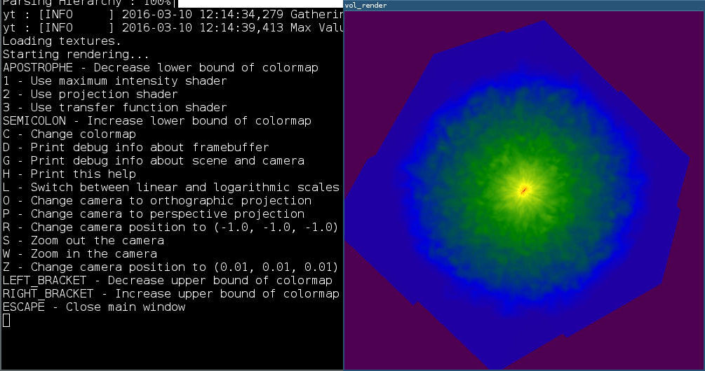

.. _interactive_data_visualization:

Interactive Data Visualization
==============================

In version 3.3 of yt, an experimental, hardware-accelerated interactive volume
renderer was introduced.  This interactive renderer is based on OpenGL and
natively understands adaptive mesh refinement data; this enables
(GPU) memory-efficient loading of data.  The data is copied from CPU memory
onto the GPU as a series of 3D textures, which are then rendered to an
interactive window.  The window itself is the view from a conceptual "camera",
which can be rotated, zoomed, and so on.  The color of each displayed pixel is
computed by a "fragment shader" which is executed on each grid that is
displayed.  The fragment shaders currently implemented in yt enable computing
(and then mapping to a colormap) the maximum value along each pixel's line of
sight and an unweighted integration of values along each pixel's line of sight
(and subsequent mapping to a colormap.)  An experimental transfer function
shader has been implemented, but is not yet functioning correctly.  For more
information, see :ref:`projection-types`.

A comprehensive description of the OpenGL volume rendering is beyond the scope
of this document. However, a more detailed explanation can be found in `this
guide <https://open.gl/>`_.

Much of the Interactive Data Visualization (IDV) interface is designed to
mimic the interface available for software volume rendering (see
:ref:`volume_rendering`) so that in future versions API compatibility may lead
to greater code reuse both for scripts that create visualizations and for
internal visualization objects.

Installation
^^^^^^^^^^^^

In order to use Interactive Data Visualization (IDV) you need to install
`PyOpenGL <https://pypi.org/project/PyOpenGL>`_ and `cyglfw3
<https://pypi.org/project/cyglfw3/>`_ along with their respective
dependencies, e.g. `glfw3 <https://www.glfw.org/>`_ is required to be installed
before you can ``pip install cyglfw3``. Please carefully read installation
instructions provided on pypi pages of both packages.

Using the interactive renderer
^^^^^^^^^^^^^^^^^^^^^^^^^^^^^^

You can simply pass dataset to :meth:`~yt.interactive_render`. By default
it will load all data and render gas density:

.. code-block:: python

    import yt

    ds = yt.load("IsolatedGalaxy/galaxy0030/galaxy0030")
    yt.interactive_render(ds)

Alternatively you can provide a data object as a first argument to
:meth:`~yt.interactive_render` if your dataset is too big to fit GPU memory:

.. code-block:: python

    import yt

    ds = yt.load("IsolatedGalaxy/galaxy0030/galaxy0030")
    sp = ds.sphere("max", (0.1, "Mpc"))

    cam_pos = ds.arr([0.1, 0.1, 0.1], "Mpc").in_units("code_length")
    yt.interactive_render(
        sp, field="pressure", cam_position=cam_pos, window_size=(512, 512)
    )

A successful call to :meth:`~yt.interactive_render` should create a new window
called *vol_render*.

By default it renders a Maximum Intensity Projection of the density field (see
:ref:`projection-types` for more information). The rendering can be
dynamically modified using the following keybindings:

1
   Switch to MIP fragment shader
2
   Switch to integration fragment shader
L
   Switch between linear and logarithmic scales
W
   Zoom in the camera
S
   Zoom out the camera
C
   Change the colormap

Pressing the *h* key will print all the available key bindings in a terminal window.
The camera can be moved around by holding a left mouse button while moving the mouse.

More advanced initialization of interactive volume renderer can be found in
:ref:`cookbook-opengl_vr`.
