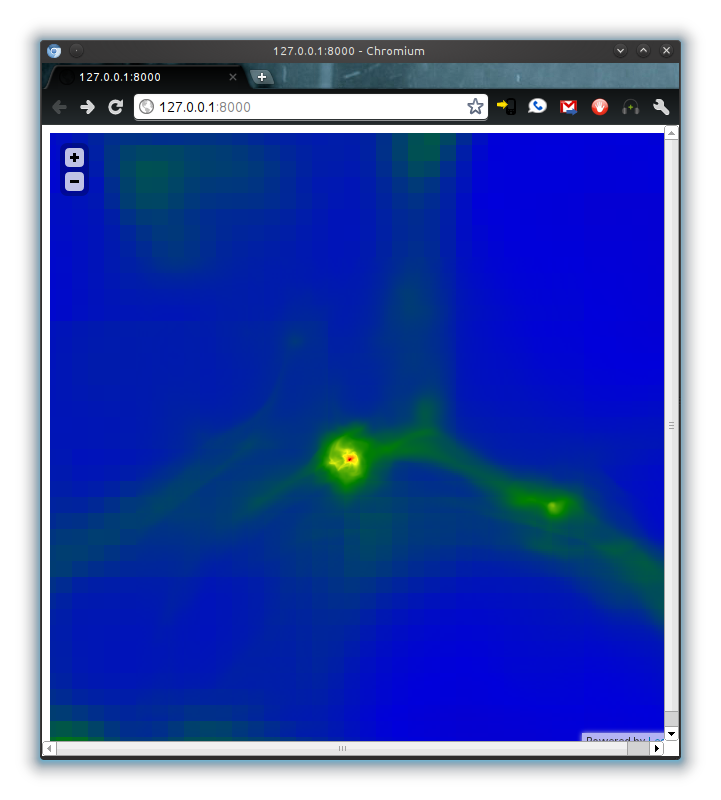

.. _mapserver:

Mapserver - A Google-Maps-like Interface to your Data
-----------------------------------------------------

The mapserver is an experimental feature.  It's based on `Leaflet
<https://leafletjs.com/>`_, a library written to create zoomable,
map-tile interfaces.  (Similar to Google Maps.)  yt provides everything you
need to start up a web server that will interactively re-pixelize an adaptive
image.  This means you can explore your datasets in a fully pan-n-zoom
interface.

.. note::

   Previous versions of yt bundled the necessary dependencies, but with more
   recent released you will need to install the package ``bottle`` via pip or
   conda.

To start up the mapserver, you can use the command yt (see
:ref:`command-line`) with the ``mapserver`` subcommand.  It takes several of
the same options and arguments as the ``plot`` subcommand.  For instance:

.. code-block:: bash

   yt mapserver DD0050/DD0050

That will take a slice along the x axis at the center of the domain.  The
field, projection, weight and axis can all be specified on the command line.

When you do this, it will spawn a micro-webserver on your localhost, and output
the URL to connect to standard output.  You can connect to it (or create an
SSH tunnel to connect to it) and explore your data.  Double-clicking zooms, and
dragging drags.

This is also functional on touch-capable devices such as Android Tablets and
iPads/iPhones.
