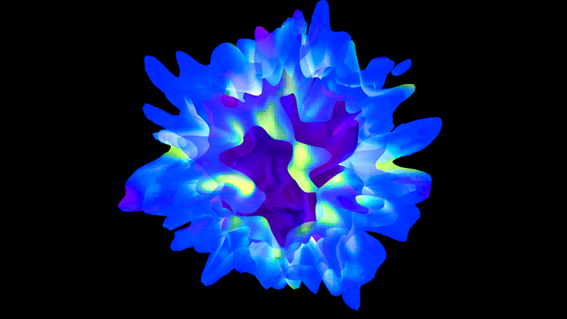

.. _extracting-isocontour-information:
.. _surfaces:

3D Surfaces and Sketchfab
=========================

.. sectionauthor:: Jill Naiman and Matthew Turk

Surface Objects and Extracting Isocontour Information
-----------------------------------------------------

yt contains an implementation of the `Marching Cubes
<https://en.wikipedia.org/wiki/Marching_cubes>`__ algorithm, which can operate on
3D data objects.  This provides two things.  The first is to identify
isocontours and return either the geometry of those isocontours or to return
another field value sampled along that isocontour.  The second piece of
functionality is to calculate the flux of a field over an isocontour.

Note that these isocontours are not guaranteed to be topologically connected.
In fact, inside a given data object, the marching cubes algorithm will return
all isocontours, not just a single connected one.  This means if you encompass
two clumps of a given density in your data object and extract an isocontour at
that density, it will include both of the clumps.

This means that with adaptive mesh refinement
data, you *will* see cracks across refinement boundaries unless a
"crack-fixing" step is applied to match up these boundaries.  yt does not
perform such an operation, and so there will be seams visible in 3D views of
your isosurfaces.

Surfaces can be exported in `OBJ format
<https://en.wikipedia.org/wiki/Wavefront_.obj_file>`_, values can be samples
at the center of each face of the surface, and flux of a given field could be
calculated over the surface.  This means you can, for instance, extract an
isocontour in density and calculate the mass flux over that isocontour.  It
also means you can export a surface from yt and view it in something like
`Blender <https://www.blender.org/>`__, `MeshLab
<http://www.meshlab.net>`__, or even on your Android or iOS device in
`MeshPad <http://www.meshpad.org/>`__.

To extract geometry or sample a field, call
:meth:`~yt.data_objects.data_containers.YTSelectionContainer3D.extract_isocontours`.  To
calculate a flux, call
:meth:`~yt.data_objects.data_containers.YTSelectionContainer3D.calculate_isocontour_flux`.
both of these operations will run in parallel.  For more information on enabling
parallelism in yt, see :ref:`parallel-computation`.

Alternatively, you can make an object called ``YTSurface`` that makes
this process much easier.  You can create one of these objects by specifying a
source data object and a field over which to identify a surface at a given
value.  For example:

.. code-block:: python

   import yt

   ds = yt.load("IsolatedGalaxy/galaxy0030/galaxy0030")
   sphere = ds.sphere("max", (1.0, "Mpc"))
   surface = ds.surface(sphere, "density", 1e-27)

This object, ``surface``, can be queried for values on the surface.  For
instance:

.. code-block:: python

   print(surface["temperature"].min(), surface["temperature"].max())

will return the values 11850.7476943 and 13641.0663899.  These values are
interpolated to the face centers of every triangle that constitutes a portion
of the surface.  Note that reading a new field requires re-calculating the
entire surface, so it's not the fastest operation.  You can get the vertices of
the triangle by looking at the property ``.vertices``.

Exporting to a File
-------------------

If you want to export this to a `PLY file
<https://en.wikipedia.org/wiki/PLY_(file_format)>`_ you can call the routine
``export_ply``, which will write to a file and optionally sample a field at
every face or vertex, outputting a color value to the file as well.  This file
can then be viewed in MeshLab, Blender or on the website `Sketchfab.com
<https://sketchfab.com>`__.  But if you want to view it on Sketchfab, there's an
even easier way!

Exporting to Sketchfab
----------------------

`Sketchfab <https://sketchfab.com>`__ is a website that uses WebGL, a relatively
new technology for displaying 3D graphics in any browser.  It's very fast and
typically requires no plugins.  Plus, it means that you can share data with
anyone and they can view it immersively without having to download the data or
any software packages!  Sketchfab provides a free tier for up to 10 models, and
these models can be embedded in websites.

There are lots of reasons to want to export to Sketchfab.  For instance, if
you're looking at a galaxy formation simulation and you publish a paper, you
can include a link to the model in that paper (or in the arXiv listing) so that
people can explore and see what the data looks like.  You can also embed a
model in a website with other supplemental data, or you can use Sketchfab to
discuss morphological properties of a dataset with collaborators.  It's also
just plain cool.

The ``YTSurface`` object includes a method to upload directly to Sketchfab,
but it requires that you get an API key first.  You can get this API key by
creating an account and then going to your "dashboard," where it will be listed
on the right hand side.  Once you've obtained it, put it into your
``~/.config/yt/yt.toml`` file under the heading ``[yt]`` as the variable
``sketchfab_api_key``.  If you don't want to do this, you can also supply it as
an argument to the function ``export_sketchfab``.

Now you can run a script like this:

.. code-block:: python

    import yt
    from yt.units import kpc

    ds = yt.load("IsolatedGalaxy/galaxy0030/galaxy0030")
    dd = ds.sphere(ds.domain_center, (500, "kpc"))
    rho = 1e-28

    bounds = [[dd.center[i] - 250 * kpc, dd.center[i] + 250 * kpc] for i in range(3)]

    surf = ds.surface(dd, "density", rho)

    upload_id = surf.export_sketchfab(
        title="galaxy0030 - 1e-28",
        description="Extraction of Density (colored by temperature) at 1e-28 g/cc",
        color_field="temperature",
        color_map="hot",
        color_log=True,
        bounds=bounds,
    )

and yt will extract a surface, convert to a format that Sketchfab.com
understands (PLY, in a zip file) and then upload it using your API key.  For
this demo, I've used data kindly provided by Ryan Joung from a simulation of
galaxy formation.  Here's what my newly-uploaded model looks like, using the
embed code from Sketchfab:

.. raw:: html

     <iframe width="640" height="480" src="https://sketchfab.com/models/ff59dacd55824110ad5bcc292371a514/embed" frameborder="0" allowfullscreen mozallowfullscreen="true" webkitallowfullscreen="true" onmousewheel=""></iframe>

As a note, Sketchfab has a maximum model size of 50MB for the free account.
50MB is pretty hefty, though, so it shouldn't be a problem for most
needs. Additionally, if you have an eligible e-mail address associated with a
school or university, you can request a free professional account, which allows
models up to 200MB. See https://sketchfab.com/education for details.

OBJ and MTL Files
-----------------

If the ability to maneuver around an isosurface of your 3D simulation in
`Sketchfab <https://sketchfab.com>`__ cost you half a day of work (let's be
honest, 2 days), prepare to be even less productive.  With a new  `OBJ file
<https://en.wikipedia.org/wiki/Wavefront_.obj_file>`__ exporter, you can now
upload multiple surfaces of different transparencies in the same file.
The following code snippet produces two files which contain the vertex info
(surfaces.obj) and color/transparency info (surfaces.mtl) for a 3D
galaxy simulation:

.. code-block:: python

   import yt

   ds = yt.load("IsolatedGalaxy/galaxy0030/galaxy0030")
   rho = [2e-27, 1e-27]
   trans = [1.0, 0.5]
   filename = "./surfaces"

   sphere = ds.sphere("max", (1.0, "Mpc"))
   for i, r in enumerate(rho):
       surf = ds.surface(sphere, "density", r)
       surf.export_obj(
           filename, transparency=trans[i], color_field="temperature", plot_index=i
       )

The calling sequence is fairly similar to the ``export_ply`` function
`previously used <https://blog.yt-project.org/post/3DSurfacesAndSketchFab/>`__
to export 3D surfaces.  However, one can now specify a transparency for each
surface of interest, and each surface is enumerated in the OBJ files with ``plot_index``.
This means one could potentially add surfaces to a previously
created file by setting ``plot_index`` to the number of previously written
surfaces.

One tricky thing: the header of the OBJ file points to the MTL file (with
the header command ``mtllib``).  This means if you move one or both of the files
you may have to change the header to reflect their new directory location.

A Few More Options
------------------

There are a few extra inputs for formatting the surface files you may want to use.

(1) Setting ``dist_fac`` will divide all the vertex coordinates by this factor.
Default will scale the vertices by the physical bounds of your sphere.

(2) Setting ``color_field_max`` and/or ``color_field_min`` will scale the colors
of all surfaces between this min and max.  Default is to scale the colors of each
surface to their own min and max values.

Uploading to SketchFab
----------------------

To upload to `Sketchfab <https://sketchfab.com>`__ one only needs to zip the
OBJ and MTL files together, and then upload via your dashboard prompts in
the usual way.  For example, the above script produces:

.. raw:: html

   <iframe frameborder="0" height="480" width="854" allowFullScreen
   webkitallowfullscreen="true" mozallowfullscreen="true"
   src="https://skfb.ly/5k4j2fdcb?autostart=0&transparent=0&autospin=0&controls=1&watermark=1">
   </iframe>

Importing to MeshLab and Blender
--------------------------------

The new OBJ formatting will produce multi-colored surfaces in both
`MeshLab <http://www.meshlab.net/>`__ and `Blender <https://www.blender.org/>`__,
a feature not possible with the
`previous PLY exporter <https://blog.yt-project.org/post/3DSurfacesAndSketchFab/>`__.
To see colors in MeshLab go to the "Render" tab and
select "Color -> Per Face".  Note in both MeshLab and Blender, unlike Sketchfab, you can't see
transparencies until you render.

...One More Option
------------------

If you've started poking around the actual code instead of skipping off to
lose a few days running around your own simulations
you may have noticed there are a few more options then those listed above,
specifically, a few related to something called "Emissivity."  This allows you
to output one more type of variable on your surfaces.  For example:

.. code-block:: python

    import yt

    ds = yt.load("IsolatedGalaxy/galaxy0030/galaxy0030")
    rho = [2e-27, 1e-27]
    trans = [1.0, 0.5]
    filename = "./surfaces"

    def emissivity(field, data):
        return data["density"] * data["density"] * np.sqrt(data["temperature"])

    add_field("emissivity", function=_Emissivity, sampling_type="cell", units=r"g*K/cm**6")

    sphere = ds.sphere("max", (1.0, "Mpc"))
    for i, r in enumerate(rho):
        surf = ds.surface(sphere, "density", r)
        surf.export_obj(
            filename,
            transparency=trans[i],
            color_field="temperature",
            emit_field="emissivity",
            plot_index=i,
        )

will output the same OBJ and MTL as in our previous example, but it will scale
an emissivity parameter by our new field.  Technically, this makes our outputs
not really OBJ files at all, but a new sort of hybrid file, however we needn't worry
too much about that for now.

This parameter is useful if you want to upload your files in Blender and have the
embedded rendering engine do some approximate ray-tracing on your transparencies
and emissivities.   This does take some slight modifications to the OBJ importer
scripts in Blender.  For example, on a Mac, you would modify the file
"/Applications/Blender/blender.app/Contents/MacOS/2.65/scripts/addons/io_scene_obj/import_obj.py",
in the function "create_materials" with:

.. code-block:: patch

   # ...

                    elif line_lower.startswith(b'tr'):  # translucency
                        context_material.translucency = float_func(line_split[1])
                    elif line_lower.startswith(b'tf'):
                        # rgb, filter color, blender has no support for this.
                        pass
                    elif line_lower.startswith(b'em'): # MODIFY: ADD THIS LINE
                        context_material.emit = float_func(line_split[1]) # MODIFY: THIS LINE TOO
                    elif line_lower.startswith(b'illum'):
                        illum = int(line_split[1])

   # ...

To use this in Blender, you might create a
`Blender script <https://docs.blender.org/manual/en/latest/advanced/scripting/introduction.html>`__
like the following:

.. code-block:: python

   from math import radians

   import bpy

   bpy.ops.import_scene.obj(filepath="./surfaces.obj")  # will use new importer

   # set up lighting = indirect
   bpy.data.worlds["World"].light_settings.use_indirect_light = True
   bpy.data.worlds["World"].horizon_color = [0.0, 0.0, 0.0]  # background = black
   # have to use approximate, not ray tracing for emitting objects ...
   #   ... for now...
   bpy.data.worlds["World"].light_settings.gather_method = "APPROXIMATE"
   bpy.data.worlds["World"].light_settings.indirect_factor = 20.0  # turn up all emiss

   # set up camera to be on -x axis, facing toward your object
   scene = bpy.data.scenes["Scene"]
   scene.camera.location = [-0.12, 0.0, 0.0]  # location
   scene.camera.rotation_euler = [
       radians(90.0),
       0.0,
       radians(-90.0),
   ]  # face to (0,0,0)

   # render
   scene.render.filepath = "/Users/jillnaiman/surfaces_blender"  # needs full path
   bpy.ops.render.render(write_still=True)

This above bit of code would produce an image like so:

Note that the hottest stuff is brightly shining, while the cool stuff is less so
(making the inner isodensity contour barely visible from the outside of the surfaces).

If the Blender image caught your fancy, you'll be happy to know there is a greater
integration of Blender and yt in the works, so stay tuned!
