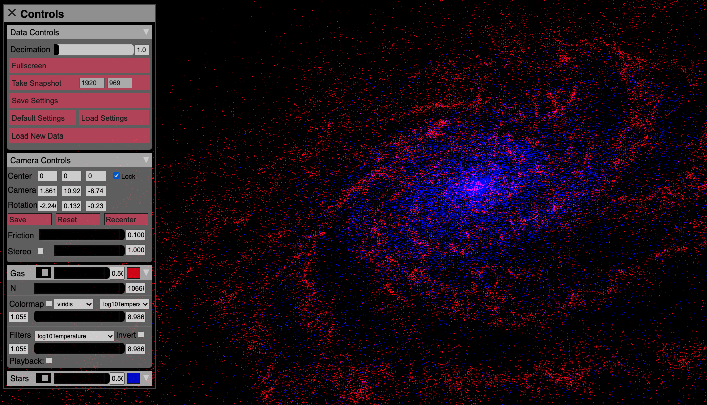

.. _visualizing_particle_datasets_with_firefly:

Visualizing Particle Datasets with Firefly
==========================================
`Firefly <https://github.com/ageller/Firefly>`_
is an interactive, browser-based,
particle visualization platform that allows you to filter, colormap, and fly
through their data. The user interface can be entirely customized through the
`python api <https://github.com/agurvich/firefly_api>`_
yt offers to ability
to export your data to Firefly's JSON format through the
:meth:`~yt.data_objects.data_containers.YTDataContainer.create_firefly_object`
method. You will still need to clone the
`repository <https://github.com/ageller/Firefly>`_
and ensure these data files are stored in the ``Firefly/data`` directory,
this is easily done using the
``path_to_firefly`` argument of
:meth:`~yt.data_objects.data_containers.YTDataContainer.create_firefly_object`
which should point at Firefly's ``index.html``.

You can adjust the interface settings, particle colors, decimation factors, and
other Firefly settings through the returned ``firefly_api.reader`` object. Once the
settings are tuned to your liking, calling the ``reader.dumpToJSON()`` method will
produce the final JSON files. Note that ``reader.clean_JSONdir`` defaults to true
when using
:meth:`~yt.data_objects.data_containers.YTDataContainer.create_firefly_object`
so if you would like to manage multiple datasets
you will need to use the ``dataset_name`` keyword argument of
:meth:`~yt.data_objects.data_containers.YTDataContainer.create_firefly_object`.

Exporting an Example Dataset to Firefly
^^^^^^^^^^^^^^^^^^^^^^^^^^^^^^^^^^^^^^^
Here is an example of how to use yt to export data to Firefly using some
`sample data <https://yt-project.org/data/>`_.

.. code-block:: python

   ramses_ds = yt.load("DICEGalaxyDisk_nonCosmological/output_00002/info_00002.txt")

   region = ramses_ds.sphere(ramses_ds.domain_center, (1000, "kpc"))

   reader = region.create_firefly_object(
       path_to_firefly="repos/Firefly",
       fields_to_include=["particle_extra_field_1", "particle_extra_field_2"],
       fields_units=["dimensionless", "dimensionless"],
       dataset_name="IsoGalaxyRamses",
   )

   reader.options["color"]["io"] = [1, 1, 0, 1]
   reader.particleGroups[0].decimation_factor = 100
   reader.dumpToJSON()
