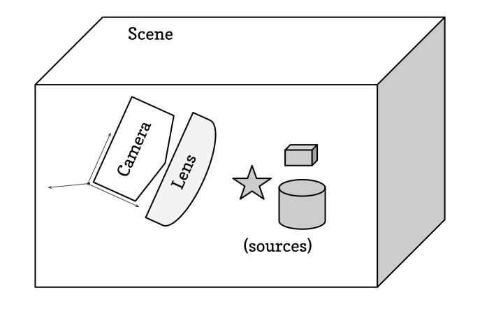
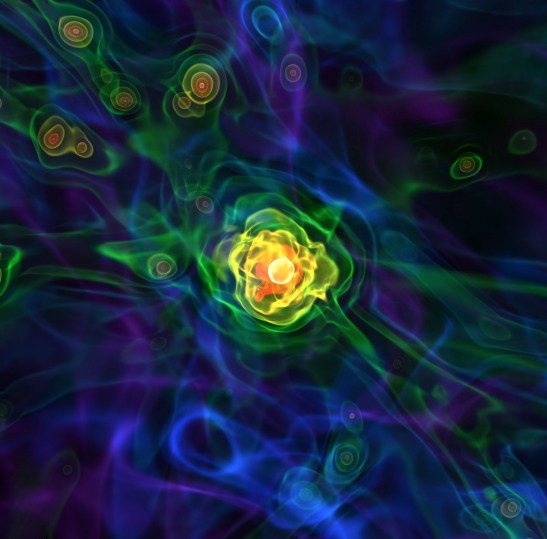

.. _volume_rendering:

3D Visualization and Volume Rendering
=====================================

yt has the ability to create 3D visualizations using a process known as *volume
rendering* (oftentimes abbreviated VR).  This volume rendering code differs
from the standard yt infrastructure for generating :ref:`simple-inspection`
in that it evaluates the radiative transfer equations through the volume with
user-defined transfer functions for each ray.  Thus it can accommodate both
opaque and transparent structures appropriately.  Currently all of the
rendering capabilities are implemented in software, requiring no specialized
hardware. Optimized versions implemented with OpenGL and utilizing graphics
processors are being actively developed.

.. note::

   There is a Jupyter notebook containing a volume rendering tutorial available
   at :ref:`volume-rendering-tutorial`.

Volume Rendering Introduction
-----------------------------

Constructing a 3D visualization is a process of describing the "scene" that
will be rendered.  This includes the location of the viewing point (i.e., where
the "camera" is placed), the method by which a system would be viewed (i.e.,
the "lens," which may be orthographic, perspective, fisheye, spherical, and so
on) and the components that will be rendered (render "sources," such as volume
elements, lines, annotations, and opaque surfaces).  The 3D plotting
infrastructure then develops a resultant image from this scene, which can be
saved to a file or viewed inline.

By constructing the scene in this programmatic way, full control can be had
over each component in the scene as well as the method by which the scene is
rendered; this can be used to prototype visualizations, inject annotation such
as grid or continent lines, and then to render a production-quality
visualization.  By changing the "lens" used, a single camera path can output
images suitable for planetarium domes, immersive and head tracking systems
(such as the Oculus Rift or recent 360-degree/virtual reality movie viewers
such as the mobile YouTube app), as well as standard screens.

.. _scene-description:

Volume Rendering Components
---------------------------

The Scene class and its subcomponents are organized as follows.  Indented
objects *hang* off of their parent object.

* :ref:`Scene <scene>` - container object describing a volume and its contents
    * :ref:`Sources <render-sources>` - objects to be rendered
        * :ref:`VolumeSource <volume-sources>` - simulation volume tied to a dataset
            * :ref:`TransferFunction <transfer_functions>` - mapping of simulation field values to color, brightness, and transparency
        * :ref:`OpaqueSource <opaque-sources>` - Opaque structures like lines, dots, etc.
        * :ref:`Annotations <volume_rendering_annotations>` - Annotated structures like grid cells, simulation boundaries, etc.
    * :ref:`Camera <camera>` - object for rendering; consists of a location, focus, orientation, and resolution
        * :ref:`Lens <lenses>` - object describing method for distributing rays through Sources

.. _scene:

Scene
^^^^^

The :class:`~yt.visualization.volume_rendering.scene.Scene`
is the container class which encompasses the whole of the volume
rendering interface.  At its base level, it describes an infinite volume,
with a series of
:class:`~yt.visualization.volume_rendering.render_source.RenderSource` objects
hanging off of it that describe the contents
of that volume.  It also contains a
:class:`~yt.visualization.volume_rendering.camera.Camera` for rendering that
volume.  All of its classes can be
accessed and modified as properties hanging off of the scene.
The scene's most important functions are
:meth:`~yt.visualization.volume_rendering.scene.Scene.render` for
casting rays through the scene and
:meth:`~yt.visualization.volume_rendering.scene.Scene.save` for saving the
resulting rendered image to disk (see note on :ref:`when_to_render`).

The easiest way to create a scene with sensible defaults is to use the
functions:
:func:`~yt.visualization.volume_rendering.volume_rendering.create_scene`
(creates the scene) or
:func:`~yt.visualization.volume_rendering.volume_rendering.volume_render`
(creates the scene and then triggers ray tracing to produce an image).
See the :ref:`annotated-vr-example` for details.

.. _render-sources:

RenderSources
^^^^^^^^^^^^^

:class:`~yt.visualization.volume_rendering.render_source.RenderSource` objects
comprise the contents of what is actually *rendered*.  One can add several
different RenderSources to a Scene and the ray-tracing step will pass rays
through all of them to produce the final rendered image.

.. _volume-sources:

VolumeSources
+++++++++++++

:class:`~yt.visualization.volume_rendering.render_source.VolumeSource` objects
are 3D :ref:`geometric-objects` of individual datasets placed into the scene
for rendering.  Each VolumeSource requires a
:ref:`TransferFunction <transfer_functions>` to describe how the fields in
the VolumeSource dataset produce different colors and brightnesses in the
resulting image.

.. _opaque-sources:

OpaqueSources
+++++++++++++

In addition to semi-transparent objects, fully opaque structures can be added
to a scene as
:class:`~yt.visualization.volume_rendering.render_source.OpaqueSource` objects
including
:class:`~yt.visualization.volume_rendering.render_source.LineSource` objects
and
:class:`~yt.visualization.volume_rendering.render_source.PointSource` objects.
These are useful if you want to annotate locations or particles in an image,
or if you want to draw lines connecting different regions or
vertices.  For instance, lines can be used to draw outlines of regions or
continents.

Worked examples of using the ``LineSource`` and ``PointSource`` are available at
:ref:`cookbook-vol-points` and :ref:`cookbook-vol-lines`.

.. _volume_rendering_annotations:

Annotations
+++++++++++

Similar to OpaqueSources, annotations enable the user to highlight
certain information with opaque structures.  Examples include
:class:`~yt.visualization.volume_rendering.api.BoxSource`,
:class:`~yt.visualization.volume_rendering.api.GridSource`, and
:class:`~yt.visualization.volume_rendering.api.CoordinateVectorSource`.  These
annotations will operate in data space and can draw boxes, grid information,
and also provide a vector orientation within the image.

For example scripts using these features,
see :ref:`cookbook-volume_rendering_annotations`.

.. _transfer_functions:

Transfer Functions
^^^^^^^^^^^^^^^^^^

A transfer function describes how rays that pass through the domain of a
:class:`~yt.visualization.volume_rendering.render_source.VolumeSource` are
mapped from simulation field values to color, brightness, and opacity in the
resulting rendered image.  A transfer function consists of an array over
the x and y dimensions.  The x dimension typically represents field values in
your underlying dataset to which you want your rendering to be sensitive (e.g.
density from 1e20 to 1e23).  The y dimension consists of 4 channels for red,
green, blue, and alpha (opacity).  A transfer function starts with all zeros
for its y dimension values, implying that rays traversing the VolumeSource
will not show up at all in the final image.  However, you can add features to
the transfer function that will highlight certain field values in your
rendering.

.. _transfer-function-helper:

TransferFunctionHelper
++++++++++++++++++++++

Because good transfer functions can be difficult to generate, the
:class:`~yt.visualization.volume_rendering.transfer_function_helper.TransferFunctionHelper`
exists in order to help create and modify transfer functions with smart
defaults for your datasets.

To ease constructing transfer functions, each ``VolumeSource`` instance has a
``TransferFunctionHelper`` instance associated with it. This is the easiest way
to construct and customize a ``ColorTransferFunction`` for a volume rendering.

In the following example, we make use of the ``TransferFunctionHelper``
associated with a scene's ``VolumeSource`` to create an appealing transfer
function between a physically motivated range of densities in a cosmological
simulation:

.. python-script::

   import yt

   ds = yt.load("Enzo_64/DD0043/data0043")

   sc = yt.create_scene(ds, lens_type="perspective")

   # Get a reference to the VolumeSource associated with this scene
   # It is the first source associated with the scene, so we can refer to it
   # using index 0.
   source = sc[0]

   # Set the bounds of the transfer function
   source.tfh.set_bounds((3e-31, 5e-27))

   # set that the transfer function should be evaluated in log space
   source.tfh.set_log(True)

   # Make underdense regions appear opaque
   source.tfh.grey_opacity = True

   # Plot the transfer function, along with the CDF of the density field to
   # see how the transfer function corresponds to structure in the CDF
   source.tfh.plot("transfer_function.png", profile_field=("gas", "density"))

   # save the image, flooring especially bright pixels for better contrast
   sc.save("rendering.png", sigma_clip=6.0)

For fun, let's make the same volume_rendering, but this time setting
``grey_opacity=False``, which will make overdense regions stand out more:

.. python-script::

   import yt

   ds = yt.load("Enzo_64/DD0043/data0043")

   sc = yt.create_scene(ds, lens_type="perspective")

   source = sc[0]

   # Set transfer function properties
   source.tfh.set_bounds((3e-31, 5e-27))
   source.tfh.set_log(True)
   source.tfh.grey_opacity = False

   source.tfh.plot("transfer_function.png", profile_field=("gas", "density"))

   sc.save("rendering.png", sigma_clip=4.0)

To see a full example on how to use the ``TransferFunctionHelper`` interface,
follow the annotated :ref:`transfer-function-helper-tutorial`.

Color Transfer Functions
++++++++++++++++++++++++

A :class:`~yt.visualization.volume_rendering.transfer_functions.ColorTransferFunction`
is the standard way to map dataset field values to colors, brightnesses,
and opacities in the rendered rays.  One can add discrete features to the
transfer function, which will render isocontours in the field data and
works well for visualizing nested structures in a simulation.  Alternatively,
one can also add continuous features to the transfer function.

See :ref:`cookbook-custom-transfer-function` for an annotated, runnable tutorial
explaining usage of the ColorTransferFunction.

There are several methods to create a
:class:`~yt.visualization.volume_rendering.transfer_functions.ColorTransferFunction`
for a volume rendering. We will describe the low-level interface for
constructing color transfer functions here, and provide examples for each
option.

add_layers
""""""""""

The easiest way to create a ColorTransferFunction is to use the
:meth:`~yt.visualization.volume_rendering.transfer_functions.ColorTransferFunction.add_layers` function,
which will add evenly spaced isocontours along the transfer function, sampling a
colormap to determine the colors of the layers.

.. python-script::

   import numpy as np

   import yt

   ds = yt.load("Enzo_64/DD0043/data0043")

   sc = yt.create_scene(ds, lens_type="perspective")

   source = sc[0]

   source.set_field(("gas", "density"))
   source.set_log(True)

   bounds = (3e-31, 5e-27)

   # Since this rendering is done in log space, the transfer function needs
   # to be specified in log space.
   tf = yt.ColorTransferFunction(np.log10(bounds))

   tf.add_layers(5, colormap="arbre")

   source.tfh.tf = tf
   source.tfh.bounds = bounds

   source.tfh.plot("transfer_function.png", profile_field=("gas", "density"))

   sc.save("rendering.png", sigma_clip=6)

sample_colormap
"""""""""""""""

To add a single gaussian layer with a color determined by a colormap value, use
:meth:`~yt.visualization.volume_rendering.transfer_functions.ColorTransferFunction.sample_colormap`.

.. python-script::

   import numpy as np

   import yt

   ds = yt.load("Enzo_64/DD0043/data0043")

   sc = yt.create_scene(ds, lens_type="perspective")

   source = sc[0]

   source.set_field(("gas", "density"))
   source.set_log(True)

   bounds = (3e-31, 5e-27)

   # Since this rendering is done in log space, the transfer function needs
   # to be specified in log space.
   tf = yt.ColorTransferFunction(np.log10(bounds))

   tf.sample_colormap(np.log10(1e-30), w=0.01, colormap="arbre")

   source.tfh.tf = tf
   source.tfh.bounds = bounds

   source.tfh.plot("transfer_function.png", profile_field=("gas", "density"))

   sc.save("rendering.png", sigma_clip=6)

add_gaussian
""""""""""""

If you would like to add a gaussian with a customized color or no color, use
:meth:`~yt.visualization.volume_rendering.transfer_functions.ColorTransferFunction.add_gaussian`.

.. python-script::

   import numpy as np

   import yt

   ds = yt.load("Enzo_64/DD0043/data0043")

   sc = yt.create_scene(ds, lens_type="perspective")

   source = sc[0]

   source.set_field(("gas", "density"))
   source.set_log(True)

   bounds = (3e-31, 5e-27)

   # Since this rendering is done in log space, the transfer function needs
   # to be specified in log space.
   tf = yt.ColorTransferFunction(np.log10(bounds))

   tf.add_gaussian(np.log10(1e-29), width=0.005, height=[0.753, 1.0, 0.933, 1.0])

   source.tfh.tf = tf
   source.tfh.bounds = bounds

   source.tfh.plot("transfer_function.png", profile_field=("gas", "density"))

   sc.save("rendering.png", sigma_clip=6)

map_to_colormap
"""""""""""""""

Finally, to map a colormap directly to a range in densities use
:meth:`~yt.visualization.volume_rendering.transfer_functions.ColorTransferFunction.map_to_colormap`. This
makes it possible to map a segment of the transfer function space to a colormap
at a single alpha value. Where the above options produced layered volume
renderings, this allows all of the density values in a dataset to contribute to
the volume rendering.

.. python-script::

   import numpy as np

   import yt

   ds = yt.load("Enzo_64/DD0043/data0043")

   sc = yt.create_scene(ds, lens_type="perspective")

   source = sc[0]

   source.set_field(("gas", "density"))
   source.set_log(True)

   bounds = (3e-31, 5e-27)

   # Since this rendering is done in log space, the transfer function needs
   # to be specified in log space.
   tf = yt.ColorTransferFunction(np.log10(bounds))

   def linramp(vals, minval, maxval):
       return (vals - vals.min()) / (vals.max() - vals.min())

   tf.map_to_colormap(
       np.log10(3e-31), np.log10(5e-27), colormap="arbre", scale_func=linramp
   )

   source.tfh.tf = tf
   source.tfh.bounds = bounds

   source.tfh.plot("transfer_function.png", profile_field=("gas", "density"))

   sc.save("rendering.png", sigma_clip=6)

Projection Transfer Function
++++++++++++++++++++++++++++

This is designed to allow you to generate projections like what you obtain
from the standard :ref:`projection-plots`, and it forms the basis of
:ref:`off-axis-projections`.  See :ref:`cookbook-offaxis_projection` for a
simple example.  Note that the integration here is scaled to a width of 1.0;
this means that if you want to apply a colorbar, you will have to multiply by
the integration width (specified when you initialize the volume renderer) in
whatever units are appropriate.

Planck Transfer Function
++++++++++++++++++++++++

This transfer function is designed to apply a semi-realistic color field based
on temperature, emission weighted by density, and approximate scattering based
on the density.  This class is currently under-documented, and it may be best
to examine the source code to use it.

More Complicated Transfer Functions
+++++++++++++++++++++++++++++++++++

For more complicated transfer functions, you can use the
:class:`~yt.visualization.volume_rendering.transfer_functions.MultiVariateTransferFunction`
object.  This allows for a set of weightings, linkages and so on.
All of the information about how all transfer functions are used and values are
extracted is contained in the sourcefile ``utilities/lib/grid_traversal.pyx``.
For more information on how the transfer function is actually applied, look
over the source code there.

.. _camera:

Camera
^^^^^^

The :class:`~yt.visualization.volume_rendering.camera.Camera` object
is what it sounds like, a camera within the Scene.  It possesses the
quantities:

* :meth:`~yt.visualization.volume_rendering.camera.Camera.position` - the position of the camera in scene-space
* :meth:`~yt.visualization.volume_rendering.camera.Camera.width` - the width of the plane the camera can see
* :meth:`~yt.visualization.volume_rendering.camera.Camera.focus` - the point in space the camera is looking at
* :meth:`~yt.visualization.volume_rendering.camera.Camera.resolution` - the image resolution
* ``north_vector`` - a vector defining the "up" direction in an image
* :ref:`lens <lenses>` - an object controlling how rays traverse the Scene

.. _camera_movement:

Moving and Orienting the Camera
+++++++++++++++++++++++++++++++

There are multiple ways to manipulate the camera viewpoint and orientation.
One can set the properties listed above explicitly, or one can use the
:class:`~yt.visualization.volume_rendering.camera.Camera` helper methods.
In either case, any change triggers an update of all of the other properties.
Note that the camera exists in a right-handed coordinate system centered on
the camera.

Rotation-related methods
 * :meth:`~yt.visualization.volume_rendering.camera.Camera.pitch` - rotate about the lateral axis
 * :meth:`~yt.visualization.volume_rendering.camera.Camera.yaw` - rotate about the vertical axis (i.e. ``north_vector``)
 * :meth:`~yt.visualization.volume_rendering.camera.Camera.roll` - rotate about the longitudinal axis (i.e. ``normal_vector``)
 * :meth:`~yt.visualization.volume_rendering.camera.Camera.rotate` - rotate about an arbitrary axis
 * :meth:`~yt.visualization.volume_rendering.camera.Camera.iter_rotate` - iteratively rotate about an arbitrary axis

For the rotation methods, the camera pivots around the ``rot_center`` rotation
center.  By default, this is the camera position, which means that the
camera doesn't change its position at all, it just changes its orientation.

Zoom-related methods
 * :meth:`~yt.visualization.volume_rendering.camera.Camera.set_width` - change the width of the FOV
 * :meth:`~yt.visualization.volume_rendering.camera.Camera.zoom` - change the width of the FOV
 * :meth:`~yt.visualization.volume_rendering.camera.Camera.iter_zoom` - iteratively change the width of the FOV

Perhaps counterintuitively, the camera does not get closer to the focus
during a zoom; it simply reduces the width of the field of view.

Translation-related methods
 * :meth:`~yt.visualization.volume_rendering.camera.Camera.set_position` - change the location of the camera keeping the focus fixed
 * :meth:`~yt.visualization.volume_rendering.camera.Camera.iter_move` - iteratively change the location of the camera keeping the focus fixed

The iterative methods provide iteration over a series of changes in the
position or orientation of the camera.  These can be used within a loop.
For an example on how to use all of these camera movement functions, see
:ref:`cookbook-camera_movement`.

.. _lenses:

Camera Lenses
^^^^^^^^^^^^^

Cameras possess :class:`~yt.visualization.volume_rendering.lens.Lens` objects,
which control the geometric path in which rays travel to the camera.  These
lenses can be swapped in and out of an existing camera to produce different
views of the same Scene.  For a full demonstration of a Scene object
rendered with different lenses, see :ref:`cookbook-various_lens`.

Plane Parallel
++++++++++++++

The :class:`~yt.visualization.volume_rendering.lens.PlaneParallelLens` is the
standard lens type used for orthographic projections.  All rays emerge
parallel to each other, arranged along a plane.

Perspective and Stereo Perspective
++++++++++++++++++++++++++++++++++

The :class:`~yt.visualization.volume_rendering.lens.PerspectiveLens`
adjusts for an opening view angle, so that the scene will have an
element of perspective to it.
:class:`~yt.visualization.volume_rendering.lens.StereoPerspectiveLens`
is identical to PerspectiveLens, but it produces two images from nearby
camera positions for use in 3D viewing. How 3D the image appears at viewing
will depend upon the value of
:attr:`~yt.visualization.volume_rendering.lens.StereoPerspectiveLens.disparity`,
which is half the maximum distance between two corresponding points in the left
and right images. By default, it is set to 3 pixels.

Fisheye or Dome
+++++++++++++++

The :class:`~yt.visualization.volume_rendering.lens.FisheyeLens`
is appropriate for viewing an arbitrary field of view.  Fisheye images
are typically used for dome-based presentations; the Hayden planetarium
for instance has a field of view of 194.6.  The images returned by this
camera will be flat pixel images that can and should be reshaped to the
resolution.

Spherical and Stereo Spherical
++++++++++++++++++++++++++++++

The :class:`~yt.visualization.volume_rendering.lens.SphericalLens` produces
a cylindrical-spherical projection.  Movies rendered in this way can be
displayed as YouTube 360-degree videos (for more information see
`the YouTube help: Upload 360-degree videos
<https://support.google.com/youtube/answer/6178631?hl=en>`_).
:class:`~yt.visualization.volume_rendering.lens.StereoSphericalLens`
is identical to :class:`~yt.visualization.volume_rendering.lens.SphericalLens`
but it produces two images from nearby camera positions for virtual reality
movies, which can be displayed in head-tracking devices (e.g. Oculus Rift)
or in mobile YouTube app with Google Cardboard (for more information
see `the YouTube help: Upload virtual reality videos
<https://support.google.com/youtube/answer/6316263?hl=en>`_).
`This virtual reality video
<https://youtu.be/ZYWY53X7UQE>`_ on YouTube is an example produced with
:class:`~yt.visualization.volume_rendering.lens.StereoSphericalLens`. As in
the case of
:class:`~yt.visualization.volume_rendering.lens.StereoPerspectiveLens`, the
difference between the two images can be controlled by changing the value of
:attr:`~yt.visualization.volume_rendering.lens.StereoSphericalLens.disparity`
(See above).

.. _annotated-vr-example:

Annotated Examples
------------------

.. warning:: 3D visualizations can be fun but frustrating!  Tuning the
             parameters to both look nice and convey useful scientific
             information can be hard.  We've provided information about best
             practices and tried to make the interface easy to develop nice
             visualizations, but getting them *just right* is often
             time-consuming.  It's usually best to start out simple and expand
             and tweak as needed.

The scene interface provides a modular interface for creating renderings
of arbitrary data sources. As such, manual composition of a scene can require
a bit more work, but we will also provide several helper functions that attempt
to create satisfactory default volume renderings.

When the
:func:`~yt.visualization.volume_rendering.volume_rendering.volume_render`
function is called, first an empty
:class:`~yt.visualization.volume_rendering.scene.Scene` object is created.
Next, a :class:`~yt.visualization.volume_rendering.api.VolumeSource`
object is created, which decomposes the volume elements
into a tree structure to provide back-to-front rendering of fixed-resolution
blocks of data.  (If the volume elements are grids, this uses a
:class:`~yt.utilities.amr_kdtree.amr_kdtree.AMRKDTree` object.) When the
:class:`~yt.visualization.volume_rendering.api.VolumeSource`
object is created, by default it will create a transfer function
based on the extrema of the field that you are rendering. The transfer function
describes how rays that pass through the domain are "transferred" and thus how
brightness and color correlates to the field values.  Modifying and adjusting
the transfer function is the primary way to modify the appearance of an image
based on volumes.

Once the basic set of objects to be rendered is constructed (e.g.
:class:`~yt.visualization.volume_rendering.scene.Scene`,
:class:`~yt.visualization.volume_rendering.render_source.RenderSource`, and
:class:`~yt.visualization.volume_rendering.api.VolumeSource` objects) , a
:class:`~yt.visualization.volume_rendering.camera.Camera` is created and
added to the scene.  By default the creation of a camera also creates a
plane-parallel :class:`~yt.visualization.volume_rendering.lens.Lens`
object. The analog to a real camera is intentional -- a camera can take a
picture of a scene from a particular point in time and space, but different
lenses can be swapped in and out.  For example, this might include a fisheye
lens, a spherical lens, or some other method of describing the direction and
origin of rays for rendering. Once the camera is added to the scene object, we
call the main methods of the
:class:`~yt.visualization.volume_rendering.scene.Scene` class,
:meth:`~yt.visualization.volume_rendering.scene.Scene.render` and
:meth:`~yt.visualization.volume_rendering.scene.Scene.save`.  When rendered,
the scene will loop through all of the
:class:`~yt.visualization.volume_rendering.render_source.RenderSource` objects
that have been added and integrate the radiative transfer equations through the
volume. Finally, the image and scene object is returned to the user. An example
script the uses the high-level :func:`~yt.visualization.volume_rendering.volume_rendering.volume_render`
function to quickly set up defaults is:

.. python-script::

  import yt

  # load the data
  ds = yt.load("IsolatedGalaxy/galaxy0030/galaxy0030")

  # volume render the ("gas", "density") field, and save the resulting image
  im, sc = yt.volume_render(ds, ("gas", "density"), fname="rendering.png")

  # im is the image array generated. it is also saved to 'rendering.png'.
  # sc is an instance of a Scene object, which allows you to further refine
  # your renderings and later save them.

  # Let's zoom in and take a closer look
  sc.camera.width = (300, "kpc")
  sc.camera.switch_orientation()

  # Save the zoomed in rendering
  sc.save("zoomed_rendering.png")

Alternatively, if you don't want to immediately generate an image of your
volume rendering, and you just want access to the default scene object,
you can skip the expensive operation of rendering by just running the
:func:`~yt.visualization.volume_rendering.volume_rendering.create_scene`
function in lieu of the
:func:`~yt.visualization.volume_rendering.volume_rendering.volume_render`
function. Example:

.. python-script::

    import numpy as np

    import yt

    ds = yt.load("IsolatedGalaxy/galaxy0030/galaxy0030")
    sc = yt.create_scene(ds, ("gas", "density"))

    source = sc[0]

    source.transfer_function = yt.ColorTransferFunction(
        np.log10((1e-30, 1e-23)), grey_opacity=True
    )

    def linramp(vals, minval, maxval):
        return (vals - vals.min()) / (vals.max() - vals.min())

    source.transfer_function.map_to_colormap(
        np.log10(1e-25), np.log10(8e-24), colormap="arbre", scale_func=linramp
    )

    # For this low resolution dataset it's very important to use interpolated
    # vertex centered data to avoid artifacts. For high resolution data this
    # setting may cause a substantial slowdown for marginal visual improvement.
    source.set_use_ghost_zones(True)

    cam = sc.camera

    cam.width = 15 * yt.units.kpc
    cam.focus = ds.domain_center
    cam.normal_vector = [-0.3, -0.3, 1]
    cam.switch_orientation()

    sc.save("rendering.png")

For an in-depth tutorial on how to create a Scene and modify its contents,
see this annotated :ref:`volume-rendering-tutorial`.

.. _volume-rendering-method:

Volume Rendering Method
-----------------------

Direct ray casting through a volume enables the generation of new types of
visualizations and images describing a simulation.  yt has the facility
to generate volume renderings by a direct ray casting method.  However, the
ability to create volume renderings informed by analysis by other mechanisms --
for instance, halo location, angular momentum, spectral energy distributions --
is useful.

The volume rendering in yt follows a relatively straightforward approach.

#. Create a set of transfer functions governing the emission and absorption as
   a function of one or more variables. (:math:`f(v) \rightarrow (r,g,b,a)`)
   These can be functions of any field variable, weighted by independent
   fields, and even weighted by other evaluated transfer functions.  (See
   ref:`_transfer_functions`.)
#. Partition all chunks into non-overlapping, fully domain-tiling "bricks."
   Each of these "bricks" contains the finest available data at any location.
#. Generate vertex-centered data for all grids in the volume rendered domain.
#. Order the bricks from front-to-back.
#. Construct plane of rays parallel to the image plane, with initial values set
   to zero and located at the back of the region to be rendered.
#. For every brick, identify which rays intersect.  These are then each 'cast'
   through the brick.

   #. Every cell a ray intersects is sampled 5 times (adjustable by parameter),
      and data values at each sampling point are trilinearly interpolated from
      the vertex-centered data.
   #. Each transfer function is evaluated at each sample point.  This gives us,
      for each channel, both emission (:math:`j`) and absorption
      (:math:`\alpha`) values.
   #. The value for the pixel corresponding to the current ray is updated with
      new values calculated by rectangular integration over the path length:

      :math:`v^{n+1}_{i} =  j_{i}\Delta s + (1 - \alpha_{i}\Delta s )v^{n}_{i}`

      where :math:`n` and :math:`n+1` represent the pixel before and after
      passing through a sample, :math:`i` is the color (red, green, blue) and
      :math:`\Delta s` is the path length between samples.
   #. Determine if any addition integrate will change the sample value; if not,
      terminate integration.  (This reduces integration time when rendering
      front-to-back.)
#. The image is returned to the user:

Parallelism
-----------

yt can utilize both MPI and OpenMP parallelism for volume rendering.  Both, and
their combination, are described below.

MPI Parallelization
^^^^^^^^^^^^^^^^^^^

Currently the volume renderer is parallelized using MPI to decompose the volume
by attempting to split up the
:class:`~yt.utilities.amr_kdtree.amr_kdtree.AMRKDTree` in a balanced way.  This
has two advantages:

#.  The :class:`~yt.utilities.amr_kdtree.amr_kdtree.AMRKDTree`
    construction is parallelized since each MPI task only needs
    to know about the part of the tree it will traverse.
#.  Each MPI task will only read data for portion of the volume that it has
    assigned.

Once the :class:`~yt.utilities.amr_kdtree.amr_kdtree.AMRKDTree` has been
constructed, each MPI task begins the rendering
phase until all of its bricks are completed.  At that point, each MPI task has
a full image plane which we then use a tree reduction to construct the final
image, using alpha blending to add the images together at each reduction phase.

Caveats:

#.  At this time, the :class:`~yt.utilities.amr_kdtree.amr_kdtree.AMRKDTree`
    can only be decomposed by a power of 2 MPI
    tasks.  If a number of tasks not equal to a power of 2 are used, the largest
    power of 2 below that number is used, and the remaining cores will be idle.
    This issue is being actively addressed by current development.
#.  Each MPI task, currently, holds the entire image plane.  Therefore when
    image plane sizes get large (>2048^2), the memory usage can also get large,
    limiting the number of MPI tasks you can use.  This is also being addressed
    in current development by using image plane decomposition.

For more information about enabling parallelism, see :ref:`parallel-computation`.

OpenMP Parallelization
^^^^^^^^^^^^^^^^^^^^^^

The volume rendering also parallelized using the OpenMP interface in Cython.
While the MPI parallelization is done using domain decomposition, the OpenMP
threading parallelizes the rays intersecting a given brick of data.  As the
average brick size relative to the image plane increases, the parallel
efficiency increases.

By default, the volume renderer will use the total number of cores available on
the symmetric multiprocessing (SMP) compute platform.  For example, if you have
a shiny new laptop with 8 cores, you'll by default launch 8 OpenMP threads.
The number of threads can be controlled with the num_threads keyword in
:meth:`~yt.visualization.volume_rendering.camera.Camera.snapshot`.  You may also restrict the number of OpenMP threads used
by default by modifying the environment variable OMP_NUM_THREADS.

Running in Hybrid MPI + OpenMP
^^^^^^^^^^^^^^^^^^^^^^^^^^^^^^

The two methods for volume rendering parallelization can be used together to
leverage large supercomputing resources.  When choosing how to balance the
number of MPI tasks vs OpenMP threads, there are a few things to keep in mind.
For these examples, we will assume you are using Nmpi MPI tasks, and Nmp OpenMP
tasks, on a total of P cores. We will assume that the machine has a Nnode SMP
nodes, each with cores_per_node cores per node.

#.  For each MPI task, num_threads (or OMP_NUM_THREADS) OpenMP threads will be
    used. Therefore you should usually make sure that Nmpi*Nmp = P.
#.  For simulations with many grids/AMRKDTree bricks, you generally want to increase Nmpi.
#.  For simulations with large image planes (>2048^2), you generally want to
    decrease Nmpi and increase Nmp. This is because, currently, each MPI task
    stores the entire image plane, and doing so can approach the memory limits
    of a given SMP node.
#.  Please make sure you understand the (super)computer topology in terms of
    the numbers of cores per socket, node, etc when making these decisions.
#.  For many cases when rendering using your laptop/desktop, OpenMP will
    provide a good enough speedup by default that it is preferable to launching
    the MPI tasks.

For more information about enabling parallelism, see :ref:`parallel-computation`.

.. _vr-faq:

Volume Rendering Frequently Asked Questions
-------------------------------------------

.. _opaque_rendering:

Opacity
^^^^^^^

There are currently two models for opacity when rendering a volume, which are
controlled in the ``ColorTransferFunction`` with the keyword
``grey_opacity=False`` or ``True`` (the default). The first will act such for
each of the red, green, and blue channels, each channel is only opaque to
itself.  This means that if a ray that has some amount of red then encounters
material that emits blue, the red will still exist and in the end that pixel
will be a combination of blue and red.  However, if the ColorTransferFunction is
set up with grey_opacity=True, then blue will be opaque to red, and only the
blue emission will remain.

For an in-depth example, please see the cookbook example on opaque renders here:
:ref:`cookbook-opaque_rendering`.

.. _sigma_clip:

Improving Image Contrast with Sigma Clipping
^^^^^^^^^^^^^^^^^^^^^^^^^^^^^^^^^^^^^^^^^^^^

If your images appear to be too dark, you can try using the ``sigma_clip``
keyword in the :meth:`~yt.visualization.volume_rendering.scene.Scene.save`
or :func:`~yt.visualization.volume_rendering.volume_rendering.volume_render`
functions.  Because the brightness range in an image is scaled to match the
range of emissivity values of underlying rendering, if you have a few really
high-emissivity points, they will scale the rest of your image to be quite
dark.  ``sigma_clip = N`` can address this by removing values that are more
than ``N`` standard deviations brighter than the mean of your image.
Typically, a choice of 4 to 6 will help dramatically with your resulting image.
See the cookbook recipe :ref:`cookbook-sigma_clip` for a demonstration.

.. _when_to_render:

When to Render
^^^^^^^^^^^^^^

The rendering of a scene is the most computationally demanding step in
creating a final image and there are a number of ways to control at which point
a scene is actually rendered. The default behavior of the
:meth:`~yt.visualization.volume_rendering.scene.Scene.save` function includes
a call to :meth:`~yt.visualization.volume_rendering.scene.Scene.render`. This
means that in most cases (including the above examples), after you set up your
scene and volumes, you can simply call
:meth:`~yt.visualization.volume_rendering.scene.Scene.save` without first
calling :meth:`~yt.visualization.volume_rendering.scene.Scene.render`. If you
wish to save the most recently rendered image without rendering again, set
``render=False`` in the call to
:meth:`~yt.visualization.volume_rendering.scene.Scene.save`.  Cases where you
may wish to use ``render=False`` include saving images at different
``sigma_clip`` values (see :ref:`cookbook-sigma_clip`) or when saving an image
that has already been rendered in a Jupyter notebook using
:meth:`~yt.visualization.volume_rendering.scene.Scene.show`. Changes to the
scene including adding sources, modifying transfer functions or adjusting camera
settings generally require rendering again.
